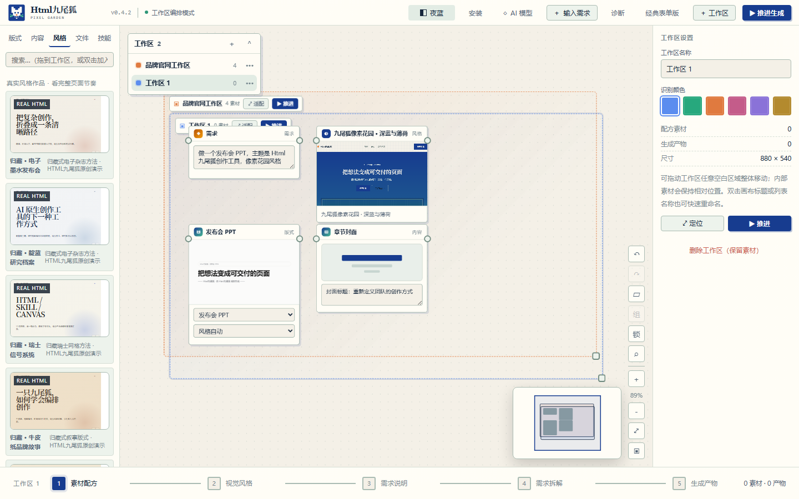

<div align="center">
  
  <h1>HtmlNineFox · Visual HTML Creation Workbench</h1>
  <p><strong>Bring text, files, images, reusable HTML templates, and skills onto one infinite canvas. Analyze, recommend, compose, generate, and revise real single-file HTML deliverables.</strong></p>
  <p>A personal open-source project by <a href="https://github.com/KratosLee-6">KratosLee</a> · Offline rules included · AI is optional</p>
  <p><a href="README.md">简体中文</a> · <strong>English</strong></p>
</div>

<div align="center">

[](https://github.com/KratosLee-6/Html-ninefox/releases/tag/v0.4.2)
[](https://github.com/KratosLee-6/Html-ninefox/actions/workflows/build-release-packages.yml)
[](https://github.com/KratosLee-6/Html-ninefox/actions/workflows/test.yml)
[](docs/test-evidence/v0.4.2-pytest.txt)
[](docs/test-evidence/v0.4.2-chromium-e2e.txt)
[](pyproject.toml)
[](LICENSE)

</div>



## What it solves

HTML references, design templates, source files, and AI skills often live in separate folders. Many generators expose only template names or wireframes, forcing users to guess the final visual result.

HtmlNineFox turns the process into a visible workflow:

```text
Text / files / images / HTML
          ↓
     AI or offline analysis
          ↓
Recommended content type + real template + page recipe
          ↓
A. Accept and generate
B. Open the infinite canvas and compose layouts / content / styles / files / skills
          ↓
       Single-file HTML
          ↓
  Revise with natural language feedback, keeping rev history
```

## v0.4.2 Core Features

- **✅ Trustworthy release metadata**: Version, CLI, API, packages, Docker tag, test evidence, and Git tag stay aligned.
- **🎨 Pixel Garden Design System**: Unified design tokens (cobalt `#173C8F` + mint `#49B894` + warm paper `#F4F0E7`) across 5 visual artifacts.
- **🤖 Real LLM Integration**: MiniMax-M3 / Claude / GPT-4o with env auto-config; offline rules engine as fallback.
- **🖥️ Web Workbench**: `htmlninefox workbench` launches local Web UI with live preview, agent logs, and template selection.
- **🐳 Docker Image**: `docker run htmlninefox` for cross-platform deployment; multi-stage build with env injection.
- **Real HTML template library**: 6 complete templates with 34 individually previewable pages — no more wireframe guessing.
- **Unified input**: Text, TXT, Markdown, JSON, CSV, HTML, and common image formats.
- **Dual paths**: Accept recommendations directly, or compose layouts/pages/styles/files/skills on the canvas.
- **Infinite canvas workspaces**: Global coordinates, renaming, per-workspace colors, navigation, snapping, and port connections.
- **User-controlled AI**: OpenAI-compatible, Ollama, or custom endpoints; API keys stay local.
- **Offline capable**: Deterministic rules engine works without API keys.
- **Feedback iteration**: Natural language feedback → design token changes → re-render with `rev1 / rev2 / ...` history.
- **Cross-platform**: Windows installer/portable, Linux `.run/.tar.gz`, Python CLI, Web/PWA, Docker.

> The first [Export Center](docs/EXPORT-CENTER.md) milestone now ships PDF and PNG. High-fidelity PPTX comes next, followed by constrained editable PPTX/DOCX.
- 🎨 **Multiple PPT styles via Skill Alliance** (v0.3): baoyu-slide-deck (image) · frontend-slides (HTML, no AI gradient) · beautiful-html-templates (28 stable presets)

## See it in action

<table>
<tr>
<td width="50%"><br><b>Pixel Garden Unified Design</b><br>5 visual artifacts unified with cobalt + mint + warm paper.</td>
<td width="50%"><br><b>Web Workbench</b><br>htmlninefox workbench: live preview, agent logs, template selection.</td>
</tr>
<tr>
<td width="50%"><br><b>Real LLM Integration</b><br>MiniMax-M3 / Claude / GPT-4o with env auto-config; offline fallback preserved.</td>
<td width="50%"><br><b>Docker One-Click Deploy</b><br>docker run htmlninefox with multi-stage build and env injection.</td>
</tr>
</table>

### v0.4.2 Export Center


Output nodes can export PDF, paginated PNG, or a full-page image. Preflight shows pagination, compatibility, dynamic-content, and remote-resource risks; delivery includes the files and `export-report.json`.

### Six real output types

| Landing | Dashboard | Deck |
|---|---|---|
|  |  |  |

| Poster | Architecture document |
|---|---|
|  |  |

## Download & Install

Go to [v0.4.2 Release](https://github.com/KratosLee-6/Html-ninefox/releases/tag/v0.4.2) to download the latest version. See [RELEASE-NOTES-v0.4.2.md](docs/RELEASE-NOTES-v0.4.2.md).

| Platform | Recommended file | Usage |
|---|---|---|
| Windows 10/11 | `HtmlNineFox-Setup-0.4.2.exe` | Installer for regular users |
| Windows 10/11 | `HtmlNineFox-Windows-x64-0.4.2.zip` | Extract and run `HtmlNineFox.exe` |
| Linux | `HtmlNineFox-Linux-0.4.2.run` | `chmod +x` and run; installs to user directory |
| Linux / audit | `HtmlNineFox-Linux-0.4.2.tar.gz` | Inspectable full installation contents |
| Python 3.10+ | `htmlninefox-0.4.2-py3-none-any.whl` | Install with `pip install` |
| Docker | `htmlninefox:v0.4.2` | `docker run -p 8620:8620 -e MINIMAX_API_KEY=xxx htmlninefox` |

### Quick start

```bash
# 1. Install (choose one)
pip install htmlninefox
# or download release package
# or docker run htmlninefox

# 2. Configure LLM (optional; offline works too)
export MINIMAX_API_KEY="***"
# or export OPENAI_API_KEY="***"
# or export ANTHROPIC_API_KEY="***"

# 3. Launch Web workbench
htmlninefox workbench
# Open http://127.0.0.1:8620

# 4. Or direct CLI generation
htmlninefox expert "Build a SaaS landing page"

# 5. Export an existing workbench project
htmlninefox export PROJECT_NAME --format pdf
htmlninefox export PROJECT_NAME --format png --scope pages --pages 1-3
```

## Testing & Trust Evidence

Validation completed on **September 8, 2026**.

| Check | Result | Evidence |
|---|---:|---|
| Python / API / storage / security / browser tests | **159 passed** | [pytest log](docs/test-evidence/v0.4.2-pytest.txt) |
| Chromium generation and workbench acceptance | **22 / 22 passed** | [E2E log](docs/test-evidence/v0.4.2-chromium-e2e.txt) |
| JavaScript syntax | **4 / 4 passed** | [syntax log](docs/test-evidence/v0.4.2-js-syntax.txt) |
| Package smoke | Wheel and Windows portable export passed; Linux dual-architecture archive verified | [package smoke](docs/test-evidence/v0.4.2-package-smoke.txt) |
| Local release candidates | SHA256 recorded for wheel, Windows ZIP, Linux `.run`, and Linux `.tar.gz`; tag CI publishes official sidecars | [checksums](docs/test-evidence/v0.4.2-release-sha256.txt) |

See the full [v0.4.2 test report](docs/TEST-REPORT-v0.4.2.md) and [environment record](docs/test-evidence/v0.4.2-environment.txt).

### Run from source

```bash
git clone https://github.com/KratosLee-6/Html-ninefox.git
cd Html-ninefox
pip install -e .
htmlninefox --help
```

## Documentation

- [Architecture](docs/ARCHITECTURE.md)
- [Design guide](docs/DESIGN.md)
- [Examples](docs/EXAMPLES.md)
- [Roadmap](docs/ROADMAP.md)
- [Private template import](docs/PRIVATE-TEMPLATE-IMPORT.md)

## Contributing

Issues and pull requests are welcome. See [CONTRIBUTING.md](CONTRIBUTING.md).

## License

MIT License · See [LICENSE](LICENSE)

---

<div align="center">
  <p><strong>让灵感在 HTML 里生长。</strong></p>
  <p>Html九尾狐 · Pixel Garden · 个人开源项目</p>
</div>
