<div align="center">
  
  <h1>HtmlNineFox · Visual HTML Creation Workbench</h1>
  <p><strong>Bring text, files, images, reusable HTML templates, and skills onto one infinite canvas. Analyze, recommend, compose, generate, and revise real single-file HTML deliverables.</strong></p>
  <p>A personal open-source project by <a href="https://github.com/KratosLee-6">KratosLee</a> · Offline rules included · AI is optional</p>
  <p><a href="README.md">简体中文</a> · <strong>English</strong></p>
</div>

<div align="center">

[](https://github.com/KratosLee-6/Html-ninefox/releases/tag/v0.5.0)
[](https://github.com/KratosLee-6/Html-ninefox/releases/tag/dsh-htmlninefox-v0.1.0-preview.1)
[](https://github.com/KratosLee-6/Html-ninefox/actions/workflows/build-release-packages.yml)
[](https://github.com/KratosLee-6/Html-ninefox/actions/workflows/test.yml)
[](docs/TEST-REPORT-v0.5.0.md)
[](docs/test-evidence/v0.4.2-chromium-e2e.txt)
[](pyproject.toml)
[](LICENSE)

</div>

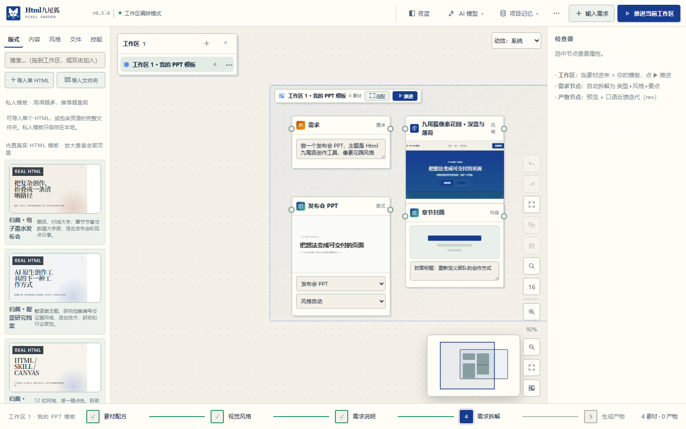

## What it solves

HTML references, design templates, source files, and AI skills often live in separate folders. Many generators expose only template names or wireframes, forcing users to guess the final visual result.

HtmlNineFox turns the process into a visible workflow:

```text
Text / files / images / HTML
          ↓
     AI or offline analysis
          ↓
Recommended content type + real template + page recipe
          ↓
A. Accept and generate
B. Open the infinite canvas and compose layouts / content / styles / files / skills
          ↓
       Single-file HTML
          ↓
  Revise with natural language feedback, keeping rev history
```

## Current release and latest progress (September 25, 2026)

The application version is `0.5.0`, published under the stable tag `v0.5.0`. v0.5.0 builds on the RC3 engineering baseline with shared application use cases, crash-recoverable Project commits with cross-process locking, and isolated browser lifecycle modules for Windows, Linux, and Python users.

| Track | Current state | Evidence |
|---|---|---|
| Application release | `v0.5.0` stable, available as installable packages | [release](https://github.com/KratosLee-6/Html-ninefox/releases/tag/v0.5.0) |
| Release verification | Full suite `238 passed, 1 skipped`; Chromium e2e `22/22` on bundled Chromium and the real system Edge engine; attachment checksums verified by download | [v0.5.0 test report](docs/TEST-REPORT-v0.5.0.md) |
| DeepSeek Harness plugin | Separately versioned `0.1.0-preview.1` | [plugin preview](https://github.com/KratosLee-6/Html-ninefox/releases/tag/dsh-htmlninefox-v0.1.0-preview.1) |

### Feature-to-screenshot map (real captures from v0.5.0)

All 18 shots below were taken on the released `v0.5.0` build (topbar badge reads `v0.5.0`), each mapping to a real feature:

**Workbench & canvas**

<table>
<tr>
<td width="50%"><br><b>Desktop workbench (Pixel Paper)</b><br>Three-column hierarchy: library · infinite-canvas workspaces · inspector.</td>
<td width="50%">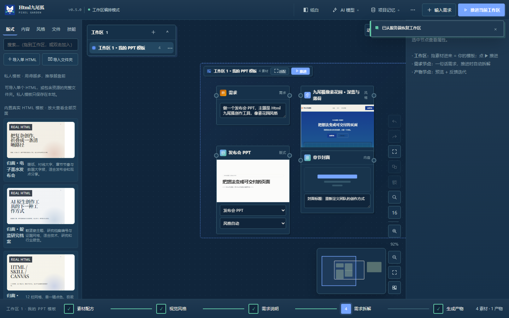<br><b>Desktop workbench (Pixel Night)</b><br>Full dark theme on the same component hierarchy and brand colors.</td>
</tr>
<tr>
<td width="50%">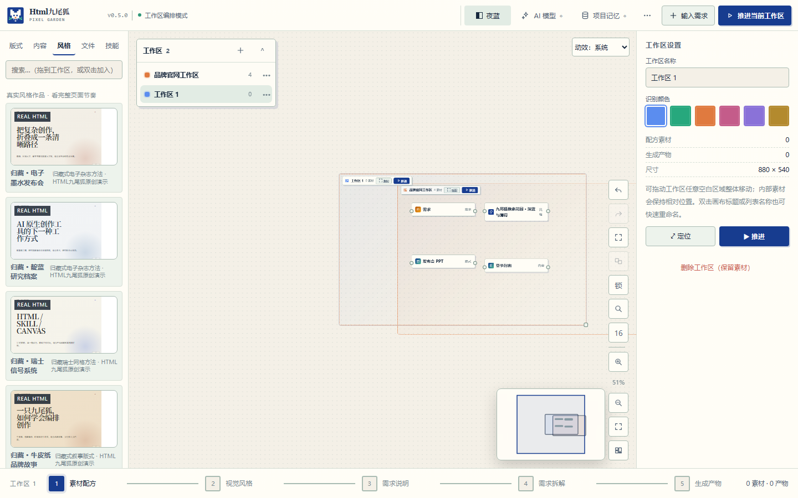<br><b>Workspace management</b><br>Workspace navigator, identity colors, per-workspace advance, group moves.</td>
<td width="50%">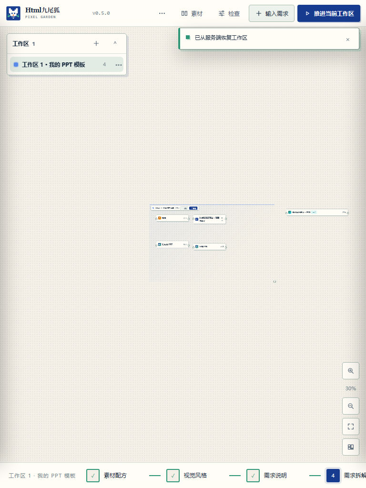<br><b>Tablet 768 layout</b><br>Sidebar folds into topbar drawers; canvas keeps semantic zoom.</td>
</tr>
<tr>
<td width="50%">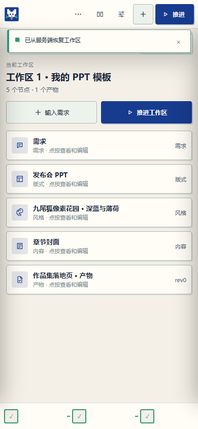<br><b>Mobile task view (390px)</b><br>Workspace actions and node cards replace an unreadable scaled canvas.</td>
<td width="50%">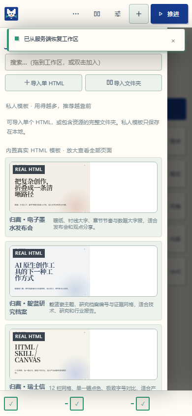<br><b>Mobile library drawer</b><br>REAL HTML template cards browse and drag on mobile.</td>
</tr>
</table>

**Input & inspectors**

<table>
<tr>
<td width="50%">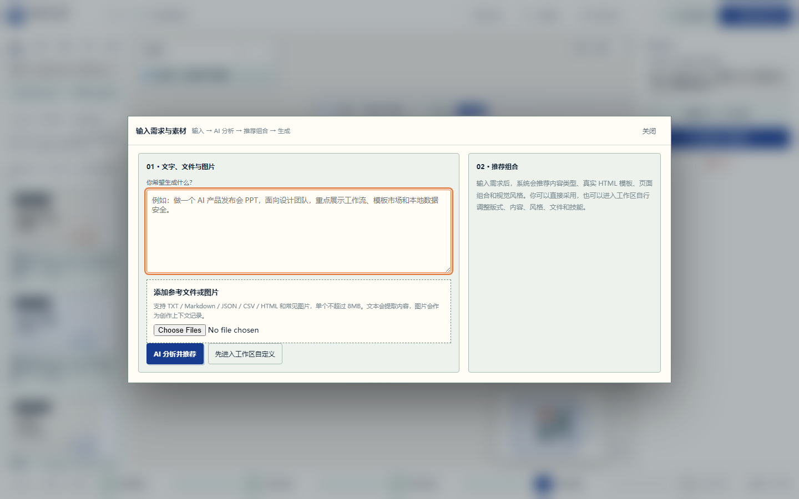<br><b>Guided requirement input</b><br>One entry for text, files, and images; AI analysis recommends a composition.</td>
<td width="50%">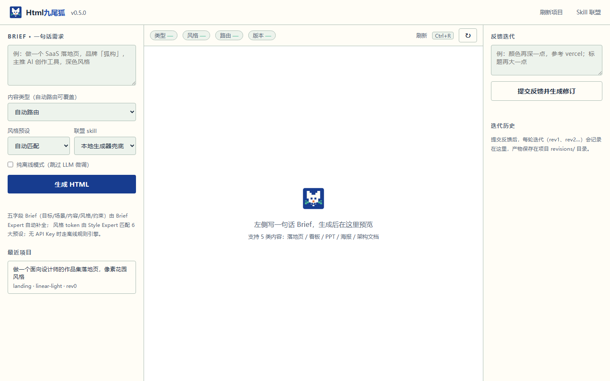<br><b>Classic form mode</b><br>One-line Brief quick generation on the same brand system.</td>
</tr>
<tr>
<td width="50%">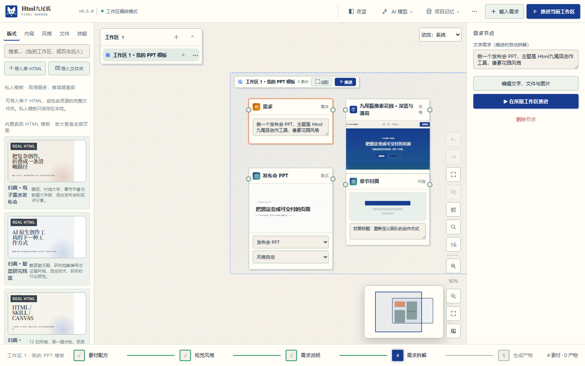<br><b>Requirement node inspector</b><br>Edit text and attachments on selection; advance to the workspace.</td>
<td width="50%">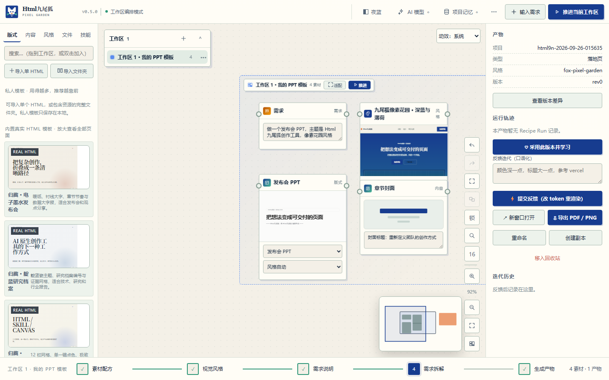<br><b>Output node inspector</b><br>Revision badge, recipe run, adoption, conversational feedback, export entry.</td>
</tr>
</table>

**Project Memory & command palette**

<table>
<tr>
<td width="50%">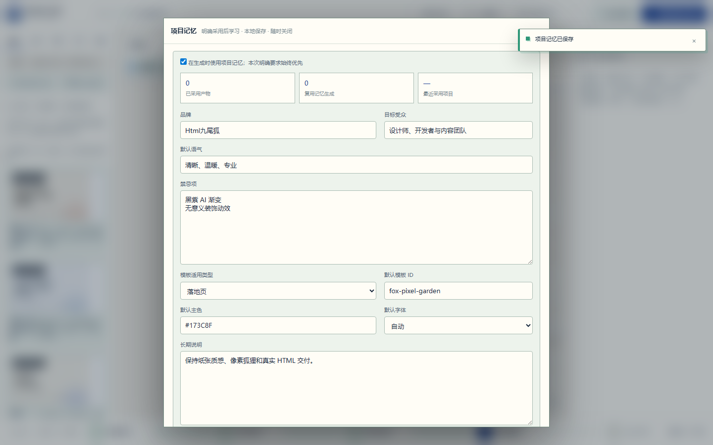<br><b>Project Memory</b><br>Brand, audience, tone, forbidden patterns, templates saved locally with visible success.</td>
<td width="50%">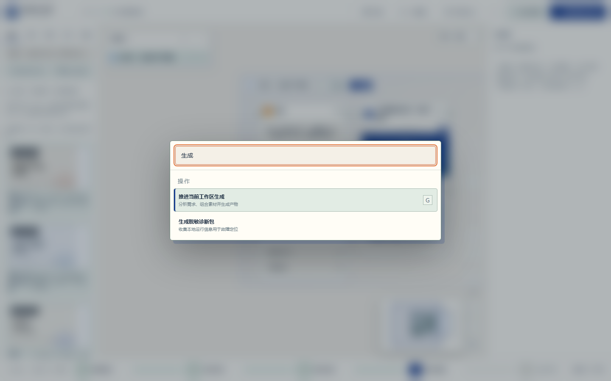<br><b>Command palette</b><br>Ctrl+K keyboard open, search, active result, shortcut hints.</td>
</tr>
</table>

**Export Center (real export flow)**

<table>
<tr>
<td width="50%">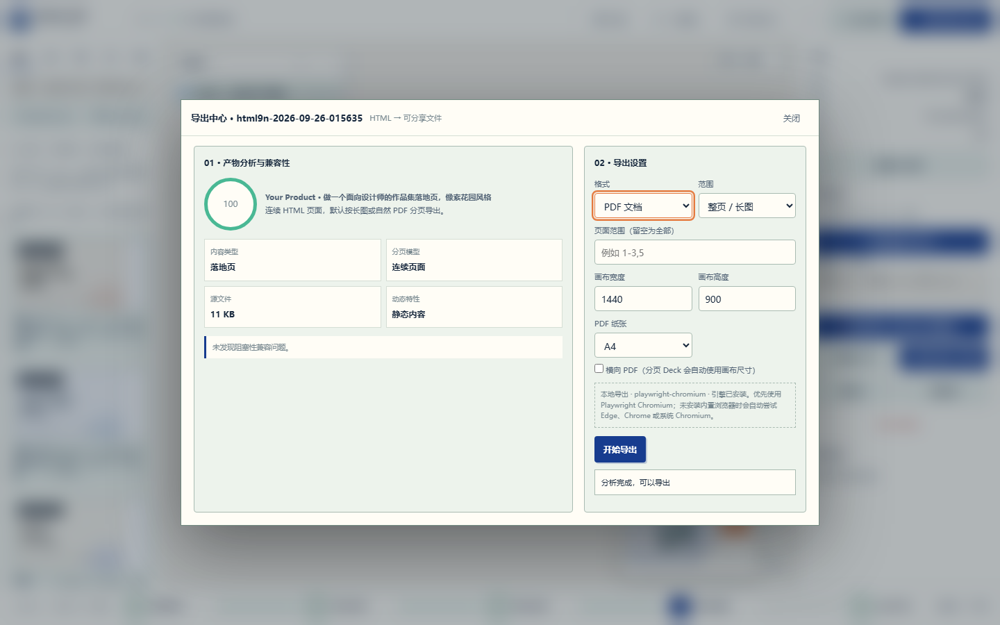<br><b>Export analysis ready</b><br>Compatibility score, page model, dynamic features, local engine status.</td>
<td width="50%">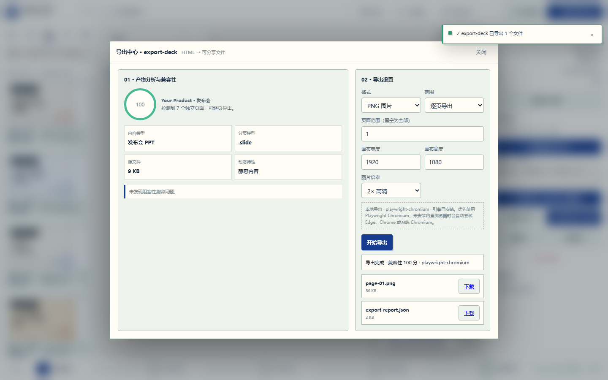<br><b>Real export result</b><br>Deck detects 7 pages; page-01.png and export-report.json produced and downloadable.</td>
</tr>
</table>

**Revisions, errors & cancel**

<table>
<tr>
<td width="50%">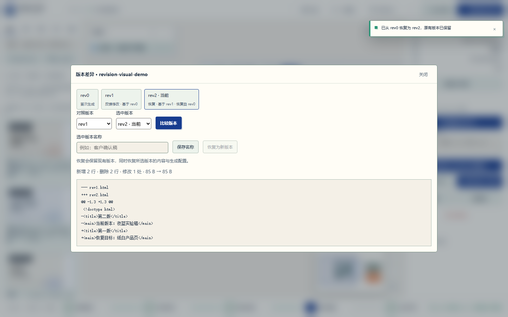<br><b>Revision restore</b><br>Real rev0 → rev2 restore with lineage, line diff, and success toast.</td>
<td width="50%">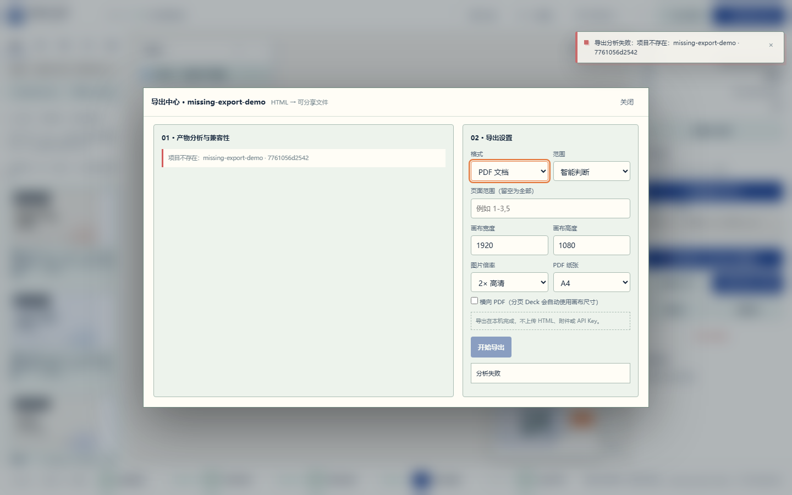<br><b>Controlled error</b><br>Missing project: button disabled with panel and toast feedback.</td>
</tr>
<tr>
<td width="50%">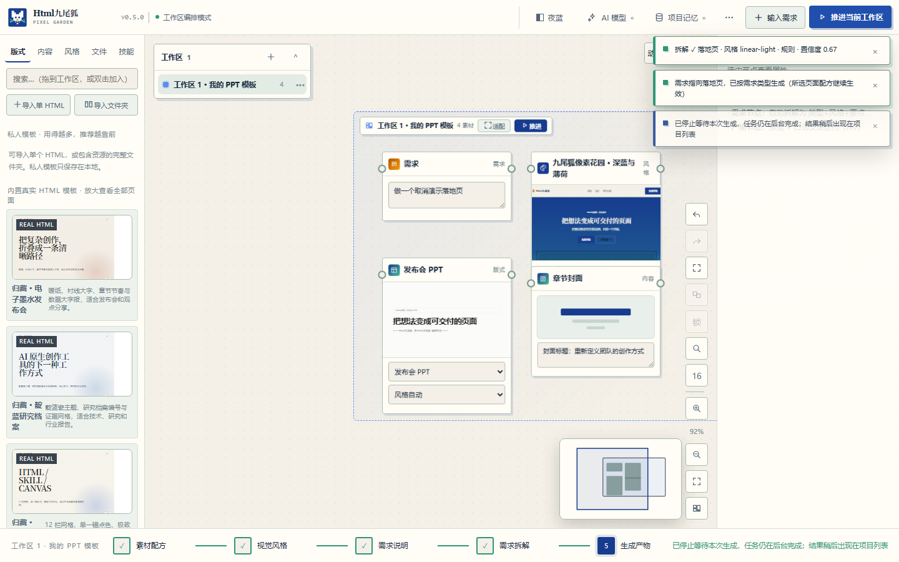<br><b>Cancel generation</b><br>Queued jobs cancel for real; running jobs honestly switch to stop-waiting.</td>
<td width="50%"><br><b>Generation progress rings</b><br>Real job.progress drives node rings; success collapses, failure turns terracotta.</td>
</tr>
</table>
Full set of 24 (including 6 real generated outputs) lives in [assets/screenshots/v0.5.0/](assets/screenshots/v0.5.0/); the list and reproduction commands are in [the screenshots README](assets/screenshots/README.md).

## v0.5.0 Stable Capabilities


- **🧠 Project Memory**: Brand, audience, tone, forbidden patterns, template, primary color, and font stay local and remain editable, disableable, and clearable.
- **♡ Learn only after adoption**: Long-term memory changes only when the user explicitly selects "Adopt this version and learn"; analysis, Recipe Run, and the inspector explain what was reused (explainable reuse).
- **🛡 Crash-recoverable Project commits**: One durable write primitive plus a commit journal — a killed process or power loss rolls back deterministically to the last consistent revision; a cross-process file lock turns concurrent CLI/server access into a stable `project_busy` conflict.
- **🧩 Browser lifecycle modules + generation cancel**: Project / Generation / Revision / Export are isolated modules; one in-flight generation per workspace, cancellable while waiting — queued jobs cancel for real, running jobs honestly switch to stop-waiting.
- **⏳ Revision history and restore**: Feedback, reruns, and restores keep HTML + generation-state snapshots; restoring creates a new revision and never overwrites history.
- **📤 Export Center**: Export PDF, paginated PNG, or a full-page image with a compatibility score and `export-report.json`.
- **🔒 Privacy boundary**: API keys, attachment bodies, and full private feedback text stay out of long-term memory and diagnostics.

## Complete Workbench Features

- **✅ Trustworthy release metadata**: Version, CLI, API, packages, Docker tag, test evidence, and Git tag stay aligned.
- **🎨 Pixel Garden Design System**: Unified design tokens (cobalt `#173C8F` + mint `#49B894` + warm paper `#F4F0E7`) across 5 visual artifacts.
- **🤖 Real LLM Integration**: MiniMax-M3 / Claude / GPT-4o with env auto-config; offline rules engine as fallback.
- **🤝 Skill Alliance**: baoyu-slide-deck (image-based PPT) · frontend-slides (no AI gradient) · beautiful-html-templates (28 stable presets).
- **🖥️ Web Workbench**: `htmlninefox app` launches local Web UI with live preview, agent logs, and template selection.
- **🐳 Docker Image**: `docker run htmlninefox` for cross-platform deployment; multi-stage build with env injection.
- **Real HTML template library**: 6 complete templates with 34 individually previewable pages — no more wireframe guessing.
- **Unified input**: Text, TXT, Markdown, JSON, CSV, HTML, and common image formats.
- **Dual paths**: Accept recommendations directly, or compose layouts/pages/styles/files/skills on the canvas.
- **Infinite canvas workspaces**: Global coordinates, renaming, per-workspace colors, navigation, snapping, and port connections.
- **User-controlled AI**: OpenAI-compatible, Ollama, or custom endpoints; API keys stay local.
- **Offline capable**: Deterministic rules engine works without API keys.
- **Feedback iteration**: Natural language feedback → design token changes → re-render with `rev1 / rev2 / ...` history.
- **Cross-platform**: Windows installer/portable, Linux `.run/.tar.gz`, Python CLI, Web/PWA, Docker.

> The first [Export Center](docs/EXPORT-CENTER.md) milestone now ships PDF and PNG. High-fidelity PPTX comes next, followed by constrained editable PPTX/DOCX.

## See it in action

<table>
<tr>
<td width="50%"><br><b>Pixel Garden Unified Design</b><br>5 visual artifacts unified with cobalt + mint + warm paper.</td>
<td width="50%"><br><b>Template preview dialog</b><br>Preview real HTML templates page by page; add the whole set or extract one page.</td>
</tr>
<tr>
<td width="50%"><br><b>AI model configuration</b><br>OpenAI-compatible endpoint, locally stored API key, connection test; offline rules without a key.</td>
<td width="50%"><br><b>Docker One-Click Deploy</b><br>docker run htmlninefox with multi-stage build and env injection.</td>
</tr>
</table>

### Six real output types

Generated by the e2e acceptance flow of the released `v0.5.0`:

| Landing | Dashboard | Deck |
|---|---|---|
|  | 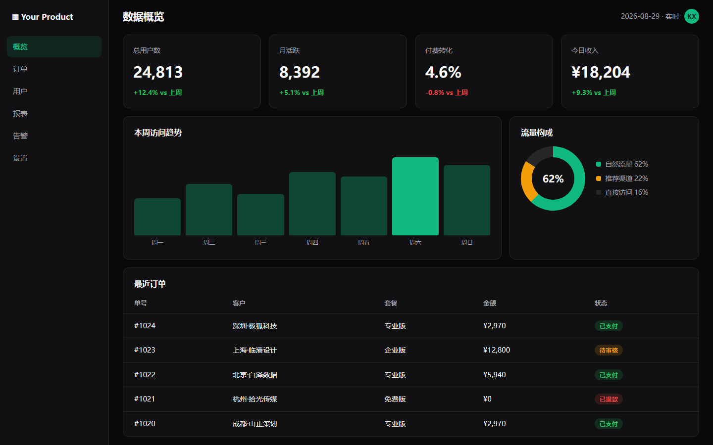 |  |

| Deck page 2 | Poster | Architecture document |
|---|---|---|
| 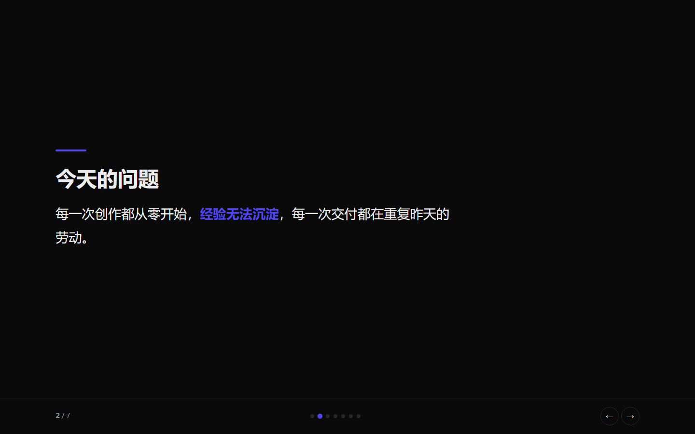 | 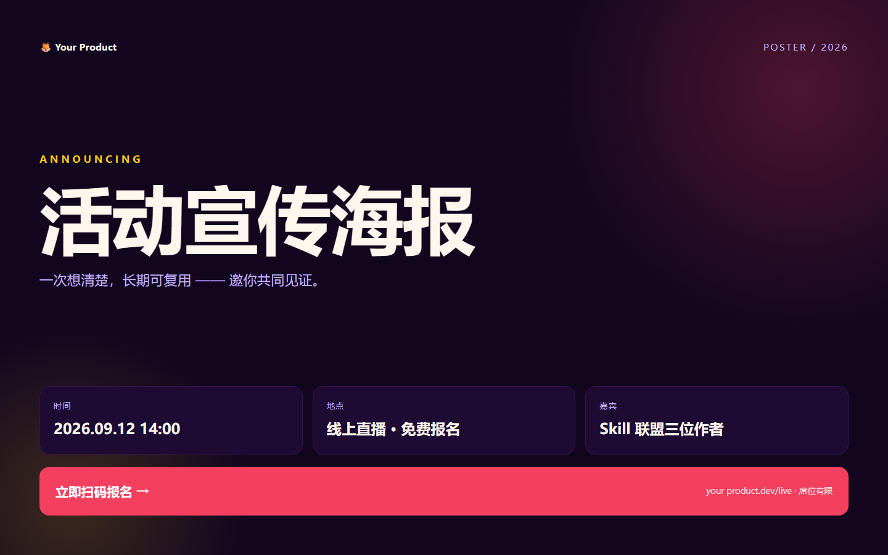 |  |

## Download & Install

Download application packages from the [v0.5.0 Release](https://github.com/KratosLee-6/Html-ninefox/releases/tag/v0.5.0). This is the current stable release. The [DeepSeek Harness plugin preview](https://github.com/KratosLee-6/Html-ninefox/releases/tag/dsh-htmlninefox-v0.1.0-preview.1) is versioned separately.

| Platform | Recommended file | Usage |
|---|---|---|
| Windows 10/11 | `HtmlNineFox-Setup-0.5.0.exe` | Per-user installer with a Start menu entry |
| Windows 10/11 | `HtmlNineFox-Windows-x64-0.5.0.zip` | Extract and run `HtmlNineFox.exe` |
| Linux | `HtmlNineFox-Linux-0.5.0.run` | `chmod +x` and run; installs to user directory |
| Linux / audit | `HtmlNineFox-Linux-0.5.0.tar.gz` | Inspectable full installation contents |
| macOS 14+ (Apple Silicon) | `HtmlNineFox-macOS-arm64-0.5.0.zip` | Extract, then right-click HtmlNineFox.app → Open to bypass Gatekeeper (unsigned) |
| Python 3.10+ | `htmlninefox-0.5.0-py3-none-any.whl` | `python -m pip install ./htmlninefox-0.5.0-py3-none-any.whl` |
| Docker | Build from source | `docker compose up --build`; tag CI verifies but does not publish the image |

### Quick start

```bash
# 1. Install (choose one)
pip install htmlninefox
# or download release package
# or docker run htmlninefox

# 2. Configure LLM (optional; offline works too)
export MINIMAX_API_KEY="***"
# or export OPENAI_API_KEY="***"
# or export ANTHROPIC_API_KEY="***"

# 3. Launch Web workbench
htmlninefox app
# Open http://127.0.0.1:8620

# 4. Or direct CLI generation
htmlninefox expert "Build a SaaS landing page"

# 5. Revise or restore an existing Project
htmlninefox feedback --project ./output/ACTUAL-PROJECT --note "Make the title larger"
htmlninefox restore --project ./output/ACTUAL-PROJECT --revision 0 --expected-revision 2

# 6. Export an existing workbench project
htmlninefox export ./output/ACTUAL-PROJECT --format pdf
htmlninefox export ./output/ACTUAL-PROJECT --format png --scope pages --pages 1-3
```

## Version history

RC3-A through E completed the architecture hardening following the [`mattpocock/skills`](https://github.com/mattpocock/skills) research, domain-modeling, codebase-design, TDD, and code-review methods, and shipped as the stable `v0.5.0`.

| Version | Date | Delivered | Record |
|---|---|---|---|
| **v0.5.0 stable** | 2026-09-25 | RC3 wrap-up; Windows / Linux / wheel / Docker attachments with SHA-256 | [Release](https://github.com/KratosLee-6/Html-ninefox/releases/tag/v0.5.0) · [test report](docs/TEST-REPORT-v0.5.0.md) |
| RC3-E | 2026-09-25 | Browser lifecycle modules, generation cancel, export race guards | [iteration record](docs/ITERATION-RC3-E-20260925.md) |
| RC3-D | 2026-09-25 | Crash-recoverable Project commits (journal rollback), cross-process file locking, atomic generation publication | [iteration record](docs/ITERATION-RC3-D-20260925.md) |
| RC3-B2 / C | 2026-09-24 | Shared Generation / Feedback / Restore / Export use cases, CLI Restore | [RC3-C record](docs/ITERATION-RC3-C-20260924.md) |
| RC3 visual convergence | 2026-09-24 | Dual primary actions, four responsive tiers, semantic zoom, unified component states, classic mode back on Pixel Garden | [convergence record](docs/ITERATION-RC3-VISUAL-CONVERGENCE-20260924.md) |
| v0.5.0rc2 | 2026-09-18 | Revision history and restore, three-tier native motion, 100-node gate, accessibility, DSH plugin preview | [RC2 report](docs/TEST-REPORT-RC2-20260918.md) |
| v0.5.0rc1 | 2026-09-14 | Project Memory, command palette, Recipe Run, interaction system | [RC1 notes](docs/RELEASE-NOTES-v0.5.0rc1.md) |
| v0.4.2 stable | 2026-09-08 | Export Center (PDF / PNG with compatibility report) | [release notes](docs/RELEASE-NOTES-v0.4.2.md) |

Real evidence screenshots from historical releases:

<table>
<tr>
<td width="50%"><br><b>DSH plugin enabled (rc2)</b><br>The final tarball installed into a fresh web profile; the plugin list shows htmlninefox as an enabled global plugin.</td>
<td width="50%"><br><b>Generate, revise, export chain (rc2)</b><br>Offline Chinese poster with dry-run and real feedback, then PDF and full-page PNG export; compatibility 100.</td>
</tr>
<tr>
<td width="50%"><br><b>Revision history and restore (rc2)</b><br>Parent revision, restore source, labels, and line diffs; restoring creates a new revision.</td>
<td width="50%"><br><b>Motion lab (rc2)</b><br>Six sample interactions: feedback, selection, linking, stage changes, output ready, restore complete.</td>
</tr>
</table>

## Testing & Trust Evidence

The stable `v0.5.0` was verified locally on **September 25, 2026** (full gates plus a real system Edge run) and released with installable packages for Windows, Linux, and Python.

| Check | Result | Evidence |
|---|---:|---|
| Full Python / API / storage / security / browser suite (release build) | **238 passed, 1 skipped** | [v0.5.0 test report](docs/TEST-REPORT-v0.5.0.md) |
| Chromium e2e on bundled Chromium and the real system Edge engine | **22 / 22 · 22 / 22** | [same report](docs/TEST-REPORT-v0.5.0.md) |
| DSH registry and final tarball integration | **2 / 2 passed** | [integration record](docs/DEEPSEEK-HARNESS-INTEGRATION.md) |
| Release attachments | 5 packages + SHA-256; wheel and Windows zip checksums verified by download; wheel clean-venv install smoke passed | [v0.5.0 Release](https://github.com/KratosLee-6/Html-ninefox/releases/tag/v0.5.0) |
| Windows portable real-machine smoke | Packaged exe: launch → generate → real PNG export | [same report](docs/TEST-REPORT-v0.5.0.md) |
| Docker image | Dedicated tag-CI job builds and verifies | [build workflow](.github/workflows/build-release-packages.yml) |

Remaining known gap: Safari real-machine validation needs macOS; WebView2/Edge device-level validation is complete (22/22).

### Run from source

```bash
git clone https://github.com/KratosLee-6/Html-ninefox.git
cd Html-ninefox
pip install -e .
htmlninefox --help
```

## Documentation

- [Architecture](docs/ARCHITECTURE.md)
- [Design philosophy](docs/DESIGN.md)
- [Pixel Garden UI guide](docs/UI-GUIDE.md)
- [RC3 visual convergence record](docs/ITERATION-RC3-VISUAL-CONVERGENCE-20260924.md)
- [RC3-B2 shared Generation use case](docs/ITERATION-RC3-B2-20260924.md)
- [RC3-C shared Feedback, Restore, and Export use cases](docs/ITERATION-RC3-C-20260924.md)
- [RC3-D crash-recoverable commits and process locking](docs/ITERATION-RC3-D-20260925.md)
- [RC3-E isolated workbench lifecycle modules](docs/ITERATION-RC3-E-20260925.md)
- [v0.5.0 stable delivery plan](docs/PLAN-v0.5.0-STABLE-20260924.md)
- [Examples](docs/EXAMPLES.md)
- [Roadmap](docs/ROADMAP.md)
- [Private template import](docs/PRIVATE-TEMPLATE-IMPORT.md)

## Contributing

Issues and pull requests are welcome. See [CONTRIBUTING.md](CONTRIBUTING.md).

## License

MIT License · See [LICENSE](LICENSE)

---

<div align="center">
  <p><strong>让灵感在 HTML 里生长。</strong></p>
  <p>Html九尾狐 · Pixel Garden · 个人开源项目</p>
</div>
