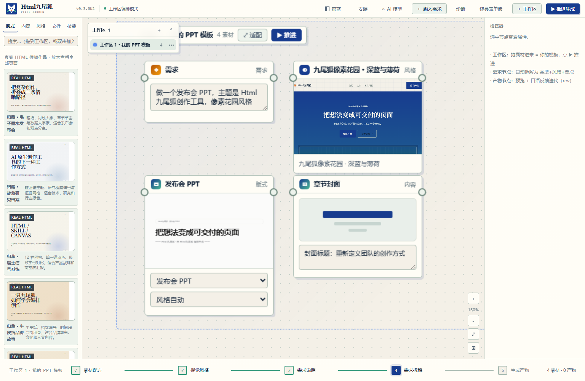
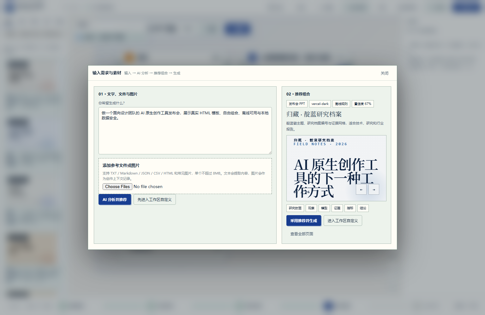
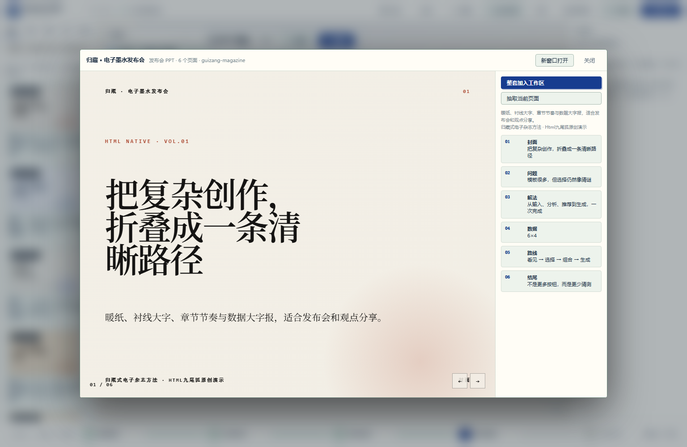
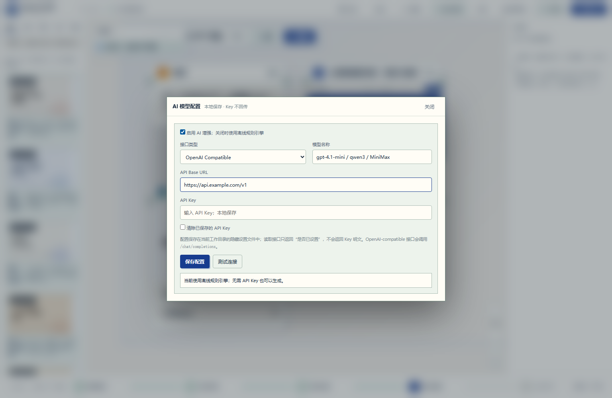
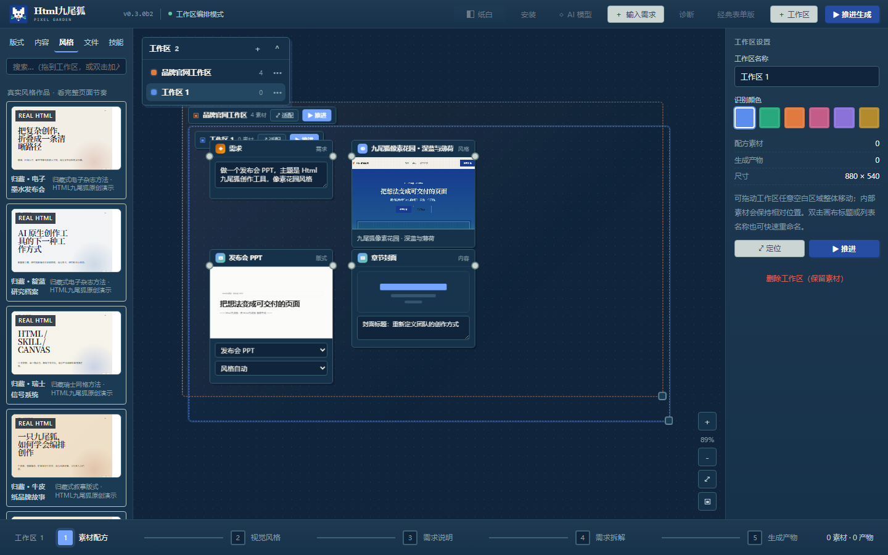
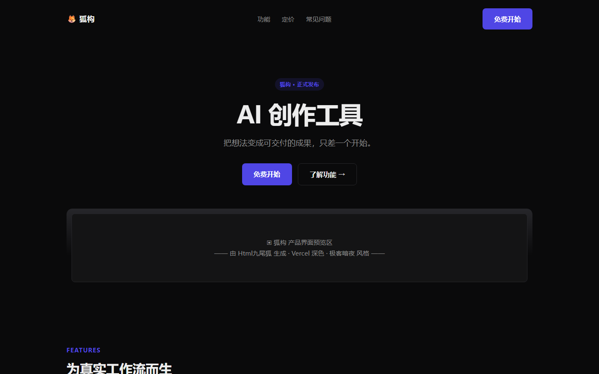
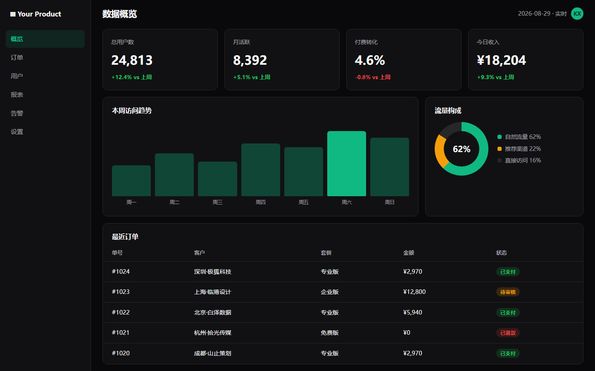
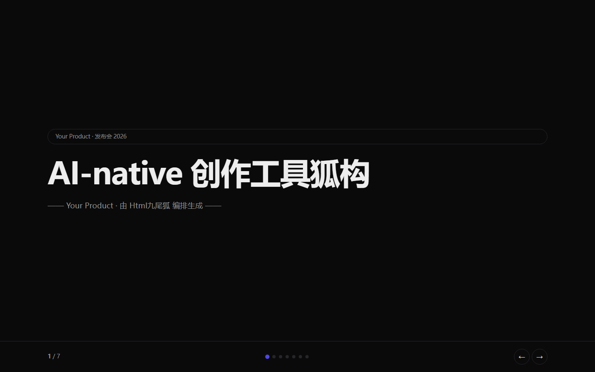
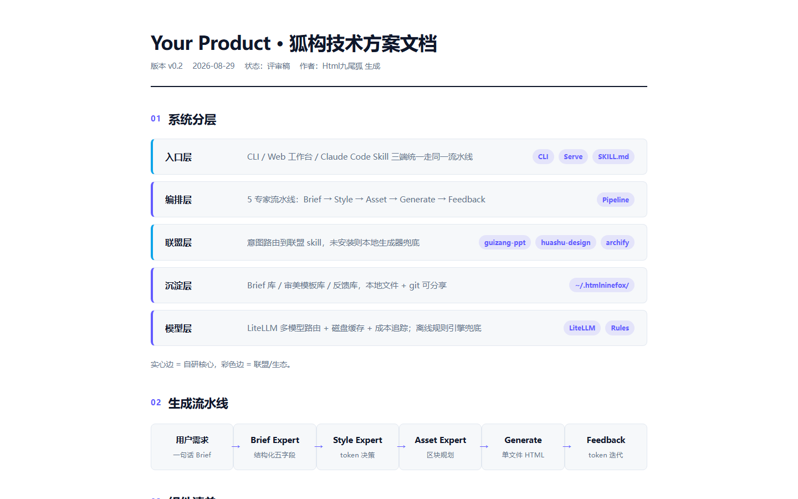

<div align="center">
  
  <h1>HtmlNineFox · Visual HTML Creation Workbench</h1>
  <p><strong>Bring text, files, images, reusable HTML templates, and skills onto one infinite canvas. Analyze, recommend, compose, generate, and revise real single-file HTML deliverables.</strong></p>
  <p>A personal open-source project by <a href="https://github.com/KratosLee-6">KratosLee</a> · Offline rules included · AI is optional</p>
  <p><a href="README.md">简体中文</a> · <strong>English</strong></p>
</div>

<div align="center">

[](https://github.com/KratosLee-6/Html-ninefox/releases/tag/v0.3.0b2)
[](https://github.com/KratosLee-6/Html-ninefox/actions/workflows/build-release-packages.yml)
[](https://github.com/KratosLee-6/Html-ninefox/actions/workflows/test.yml)
[](docs/test-evidence/v0.3.0b2-pytest.txt)
[](docs/test-evidence/v0.3.0b2-chromium-e2e.txt)
[](pyproject.toml)
[](LICENSE)

</div>



## What it solves

HTML references, design templates, source files, and AI skills often live in separate folders. Many generators expose only template names or wireframes, forcing users to guess the final visual result.

HtmlNineFox turns the process into a visible workflow:

```text
Text / files / images / HTML
          ↓
     AI or offline analysis
          ↓
Recommended content type + real template + page recipe
          ↓
A. Accept and generate
B. Open the infinite canvas and compose layouts / content / styles / files / skills
          ↓
       Single-file HTML
          ↓
Natural-language revision with version history
```

## Beta 2 highlights

- **Real HTML gallery:** six complete templates and 34 individually previewable and extractable pages.
- **Unified creation entry:** text, TXT, Markdown, JSON, CSV, HTML, and common image formats.
- **Two creation paths:** accept a recommendation or customize every part on the canvas.
- **Infinite canvas workspaces:** move, rename, color-code, navigate, snap, and connect nodes.
- **Bring your own model:** OpenAI-compatible endpoints, Ollama, or a custom compatible API.
- **Offline-first fallback:** deterministic rules keep generation available without an API key.
- **Token-based revisions:** natural-language feedback updates design tokens and preserves revisions.
- **Multiple delivery options:** Windows, Linux, Python CLI, local Web UI, and installable PWA.

## Product evidence

<table>
<tr>
<td width="50%"><br><b>Guided analysis and recommendation</b><br>The workbench recommends a content type, a real template, pages, and a visual system.</td>
<td width="50%"><br><b>Full template and page extraction</b><br>Preview the complete work and extract one page or the entire template.</td>
</tr>
<tr>
<td width="50%"><br><b>User-managed AI configuration</b><br>Model, base URL, and API key stay under the user's control.</td>
<td width="50%"><br><b>Pixel Garden themes</b><br>Warm paper and night-blue themes with persisted preference.</td>
</tr>
</table>

### Real generated outputs

| Landing page | Dashboard | Presentation deck |
|---|---|---|
|  |  |  |

| Poster | Architecture document |
|---|---|
|  |  |

## Download and install

Download the current build from **[v0.3.0 Beta 2](https://github.com/KratosLee-6/Html-ninefox/releases/tag/v0.3.0b2)**.

| Platform | Recommended asset | Usage |
|---|---|---|
| Windows 10/11 | `HtmlNineFox-Setup-0.3.0b2.exe` | Standard per-user installer |
| Windows 10/11 | `HtmlNineFox-Windows-x64-0.3.0b2.zip` | Extract and launch `HtmlNineFox.exe` |
| Linux | `HtmlNineFox-Linux-0.3.0b2.run` | Self-extracting user-level installer |
| Linux / audit | `HtmlNineFox-Linux-0.3.0b2.tar.gz` | Inspectable package contents |
| Python 3.10+ | `htmlninefox-0.3.0b2-py3-none-any.whl` | Install with `pip` |

### Run from source

```bash
git clone https://github.com/KratosLee-6/Html-ninefox.git
cd Html-ninefox

uv sync
uv run htmlninefox app
```

Traditional Python installation is also supported:

```bash
python -m pip install -e .
htmlninefox app
```

CLI examples:

```bash
htmlninefox expert "Create an AI product launch deck"
htmlninefox expert --type landing --template fox-pixel-garden "Creative tool website"
htmlninefox feedback --project output/html9n-<timestamp> --note "Use a larger title and calmer colors"
```

Documentation: [Installation](docs/INSTALL.md) · [Running options](docs/RUNNING-OPTIONS.md) · [UI guide](docs/UI-GUIDE.md) · [Visual identity](docs/VI.md)

## Templates and visual systems

The gallery contains six original HtmlNineFox demonstrations: Editorial Ink, Indigo Research, Swiss Signal, Kraft Story, Dune Portfolio, and Pixel Garden Product. Together they provide **34 extractable pages**.

The native generators cover `deck`, `doc`, `poster`, `landing`, `dashboard`, and `archdoc`. Eleven visual presets include both foundational themes and structural systems such as Pixel Garden, Duotone Studio, Editorial Ink, Swiss Signal, and Soft Silver.

## AI and privacy

- AI is an enhancement, not a runtime requirement.
- API settings are stored locally in `.settings/ai.json`.
- The settings API reports only whether a key exists and never returns the plaintext key.
- Inputs are stored locally under `.inputs/`; the default per-file limit is 8 MB.
- Offline rules remain available when AI is disabled, unavailable, or not configured.
- API keys, full prompts, generated HTML, briefs, and feedback content are excluded from diagnostic archives.

## Verification and trust

Verification completed on **September 1, 2026**:

| Check | Result | Evidence |
|---|---:|---|
| Python, API, storage, security, and browser tests | **146 passed** | [Raw pytest log](docs/test-evidence/v0.3.0b2-pytest.txt) |
| Real Chromium generation and interaction acceptance | **20 / 20 passed** | [Raw E2E log](docs/test-evidence/v0.3.0b2-chromium-e2e.txt) |
| Native generators | Landing, dashboard, deck, poster, and architecture document passed | [Test report](docs/TEST-REPORT-v0.3.0b2.md) |
| Revision flow | Token revision and preset-switch revision passed | [Raw E2E log](docs/test-evidence/v0.3.0b2-chromium-e2e.txt) |
| Workbench | Drag, rename, colors, multiple workspaces, themes, and zero JS errors | [Raw E2E log](docs/test-evidence/v0.3.0b2-chromium-e2e.txt) |
| Release packages | Windows, Linux, and wheel SHA256 values recorded | [Checksums](docs/test-evidence/v0.3.0b2-release-sha256.txt) |

Environment details: [v0.3.0b2-environment.txt](docs/test-evidence/v0.3.0b2-environment.txt).

```bash
python -m pytest tests -q -p no:cacheprovider
python e2e_verify.py
```

## Project output

```text
output/html9n-<timestamp>/
├── output.html
├── brief.json / brief.md
├── style.md
├── assets.json
├── .foxstate.json
├── revisions/
└── feedback.md
```

The state file preserves template, page blocks, attachments, skills, and selection mode so later revisions continue from explicit choices instead of guessing again.

## Status and roadmap

`v0.3.0b2` is a public beta. Windows and Linux packages are available now. The Web/PWA client can be used from Windows, macOS, iOS, and mobile browsers. Native macOS, iOS, Android, and mini-program clients remain on the roadmap.

See [ROADMAP](docs/ROADMAP.md) and [CHANGELOG](CHANGELOG.md).

## Contributing and acknowledgements

Issues, templates, visual systems, tests, and Skill Alliance integrations are welcome. The design process was inspired by work from the Guizang, Huashu Design, and Archify open-source communities. See [DESIGN-SOURCES](docs/DESIGN-SOURCES.md) for attribution and license notes.

## License

[MIT License](LICENSE) © 2026 **KratosLee · Html九尾狐项目组**