<div align="center">
  
  <h1>HtmlNineFox · Visual HTML Creation Workbench</h1>
  <p><strong>Bring text, files, images, reusable HTML templates, and skills onto one infinite canvas. Analyze, recommend, compose, generate, and revise real single-file HTML deliverables.</strong></p>
  <p>A personal open-source project by <a href="https://github.com/KratosLee-6">KratosLee</a> · Offline rules included · AI is optional</p>
  <p><a href="README.md">简体中文</a> · <strong>English</strong></p>
</div>

<div align="center">

[](https://github.com/KratosLee-6/Html-ninefox/releases/tag/v0.6.0)
[](https://github.com/KratosLee-6/Html-ninefox/releases/tag/dsh-htmlninefox-v0.1.0-preview.1)
[](https://github.com/KratosLee-6/Html-ninefox/actions/workflows/build-release-packages.yml)
[](https://github.com/KratosLee-6/Html-ninefox/actions/workflows/test.yml)
[](docs/TEST-REPORT-v0.6.0.md)
[](docs/TEST-REPORT-v0.6.0.md)
[](pyproject.toml)
[](LICENSE)

</div>

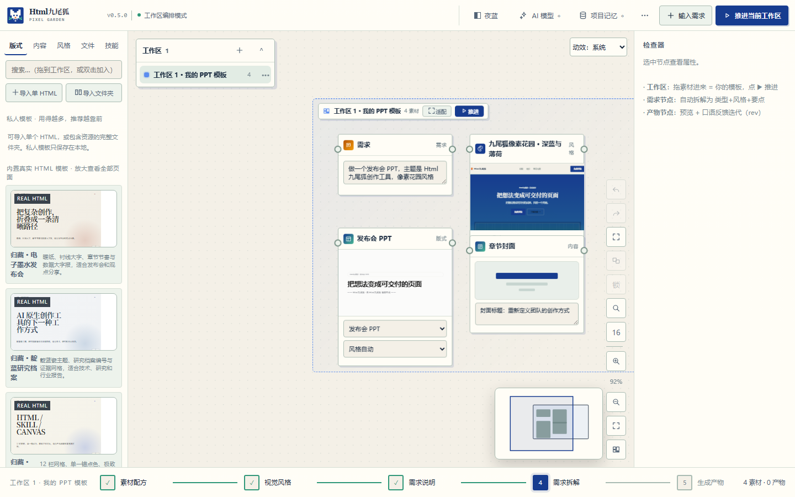

## HtmlNineFox in 30 seconds

[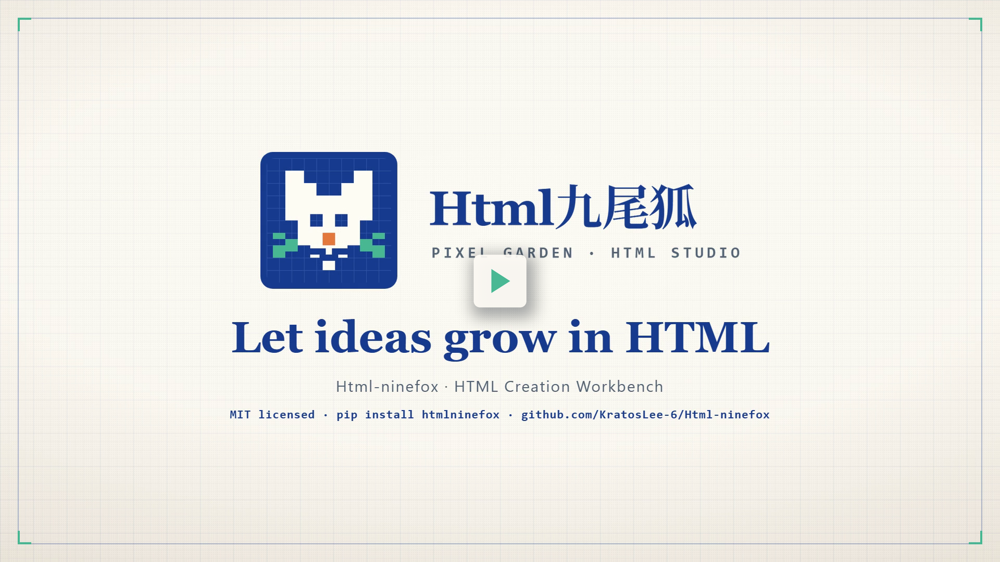](https://raw.githubusercontent.com/KratosLee-6/Html-ninefox/main/assets/promo/htmlninefox-brand-film-30s-16x9-en.mp4)

**English** 1920×1080 · 30s · no voiceover · [**中文版**](https://raw.githubusercontent.com/KratosLee-6/Html-ninefox/main/assets/promo/htmlninefox-brand-film-30s-16x9.mp4) · [all files](assets/promo)

> Every UI frame, exported artifact, and export-center shot in the film is a real screenshot captured from the `v0.5.0` release. The slogan and the Pixel Garden visuals follow [`docs/VI.md`](docs/VI.md).

## What it solves

HTML references, design templates, source files, and AI skills often live in separate folders. Many generators expose only template names or wireframes, forcing users to guess the final visual result.

HtmlNineFox turns the process into a visible workflow:

```text
Text / files / images / HTML
          ↓
     AI or offline analysis
          ↓
Recommended content type + real template + page recipe
          ↓
A. Accept and generate
B. Open the infinite canvas and compose layouts / content / styles / files / skills
          ↓
       Single-file HTML
          ↓
  Revise with natural language feedback, keeping rev history
```

## Current release and latest progress (v0.6.0, preparing release)

The application version is `0.6.0`, shipping under the tag `v0.6.0` (all release gates green; packages are built by the same-tag workflow). v0.6.0 delivers two headline pillars:

1. **Design intake pipeline** — turn the best designs on the web into your own assets: manual multi-URL / ZIP import plus 12 built-in design sources with three license tiers (open / reference / inspiration-only), an SSRF-safe fetcher, a CSP-sandboxed review workbench with batch adopt/reject and source filtering, an AI design-analysis channel, and an intake metrics panel. All six asset layers — templates, styles, components, decorations, motion, content — now share one absorb → review → ingest → use path.
2. **Editable PPTX** — deck artifacts export to a standards-compliant `.pptx` through python-pptx with genuinely editable text frames and an honest degradation report; the workbench also gained an in-workbench slide editor (`PUT /slides` with `expected_revision` conflict protection plus a structured slides dialog in the output inspector), so edit → write back → export preserves your edits.

| Track | Current state | Evidence |
|---|---|---|
| Application release | `v0.6.0`, preparing release with all gates green | [release page](https://github.com/KratosLee-6/Html-ninefox/releases/tag/v0.6.0) · [last published stable v0.5.0](https://github.com/KratosLee-6/Html-ninefox/releases/tag/v0.5.0) |
| Release verification | Full suite `303 passed, 1 skipped`; JS syntax clean across 13 files plus the inline check; Chromium acceptance `22/22`; WebKit (Safari engine) acceptance `22/22`; release metadata consistent | [v0.6.0 gate evidence](docs/test-evidence/v0.6.0-s17-20260929/README.md) |
| DeepSeek Harness plugin | `0.1.0-preview.1`, versioned separately from the app; `2/2` passing this round | [plugin preview](https://github.com/KratosLee-6/Html-ninefox/releases/tag/dsh-htmlninefox-v0.1.0-preview.1) |

> **Fixed**: the gate run found that `deck` had been aliased to `templates/landing.html`, so in any environment with the optional `templates` extra (jinja2) installed a deck request rendered as a landing page and silently broke the whole editable-PPTX chain. Deck is now intent-faithful and falls through to the native generator (7 slides / 24 editable elements), with or without jinja2. The Chromium acceptance doctype assertion is now case-insensitive as well. CI only installs `.[dev]` (no templates extra), which is why this never showed up there.

### Feature-to-screenshot map (real captures from v0.5.0)

All 18 shots below were taken on the released `v0.5.0` build (topbar badge reads `v0.5.0`) — the workbench shell and its interaction semantics are unchanged in v0.6.0, so they still stand. The v0.6.0 additions (design intake and editable PPTX) use real captures taken in this round, 7 of them in `assets/screenshots/v0.6.0/`, shown in the [Design intake pipeline](#design-intake-pipeline-new-in-v06) and [Editable PPTX](#editable-pptx-new-in-v06) sections. Each maps to a real feature:

**Workbench & canvas**

<table>
<tr>
<td width="50%"><br><b>Desktop workbench (Pixel Paper)</b><br>Three-column hierarchy: library · infinite-canvas workspaces · inspector.</td>
<td width="50%">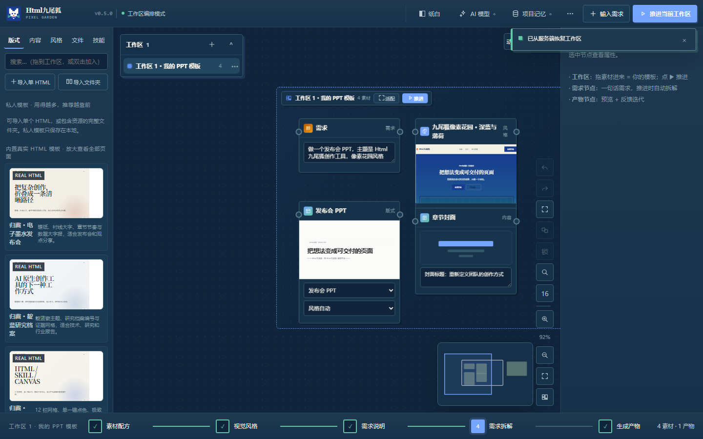<br><b>Desktop workbench (Pixel Night)</b><br>Full dark theme on the same component hierarchy and brand colors.</td>
</tr>
<tr>
<td width="50%">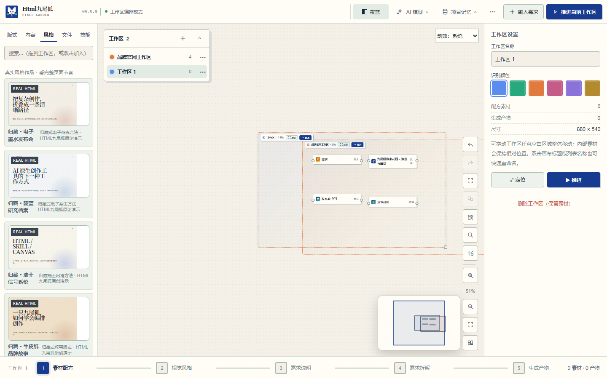<br><b>Workspace management</b><br>Workspace navigator, identity colors, per-workspace advance, group moves.</td>
<td width="50%">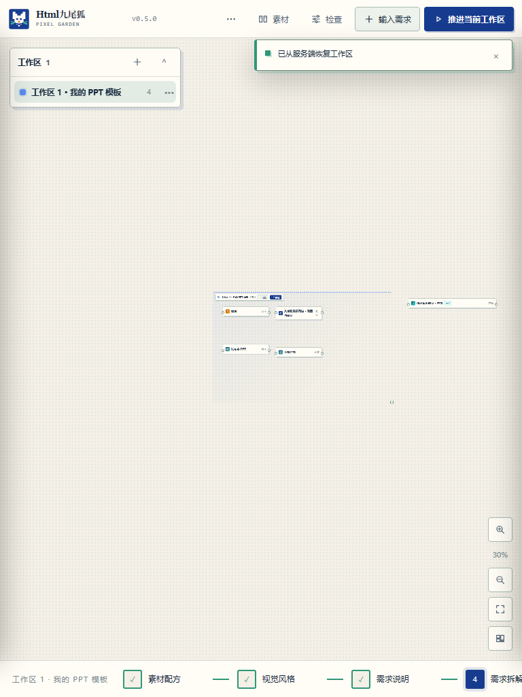<br><b>Tablet 768 layout</b><br>Sidebar folds into topbar drawers; canvas keeps semantic zoom.</td>
</tr>
<tr>
<td width="50%">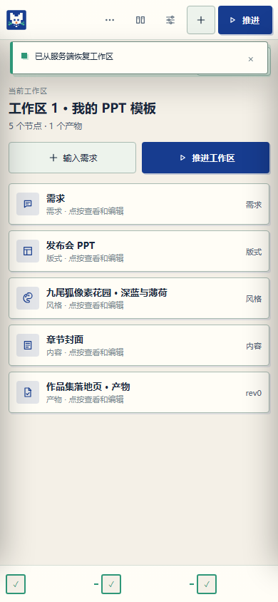<br><b>Mobile task view (390px)</b><br>Workspace actions and node cards replace an unreadable scaled canvas.</td>
<td width="50%">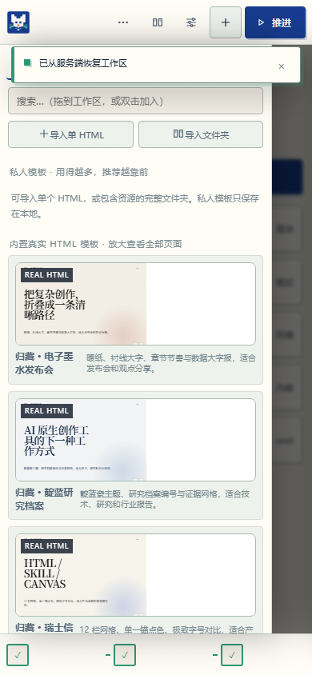<br><b>Mobile library drawer</b><br>REAL HTML template cards browse and drag on mobile.</td>
</tr>
</table>

**Input & inspectors**

<table>
<tr>
<td width="50%">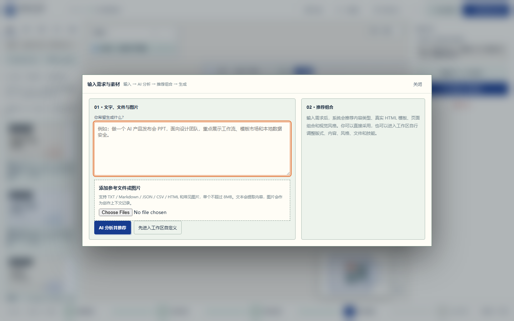<br><b>Guided requirement input</b><br>One entry for text, files, and images; AI analysis recommends a composition.</td>
<td width="50%">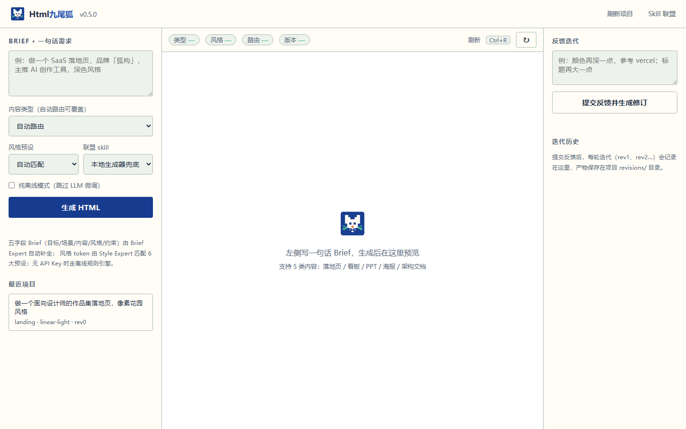<br><b>Classic form mode</b><br>One-line Brief quick generation on the same brand system.</td>
</tr>
<tr>
<td width="50%">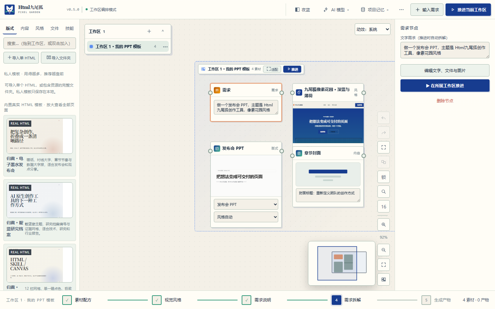<br><b>Requirement node inspector</b><br>Edit text and attachments on selection; advance to the workspace.</td>
<td width="50%">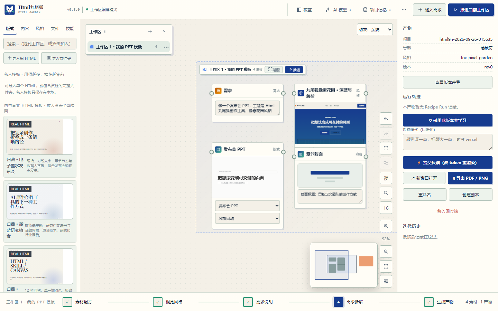<br><b>Output node inspector</b><br>Revision badge, recipe run, adoption, conversational feedback, export entry.</td>
</tr>
</table>

**Project Memory & command palette**

<table>
<tr>
<td width="50%">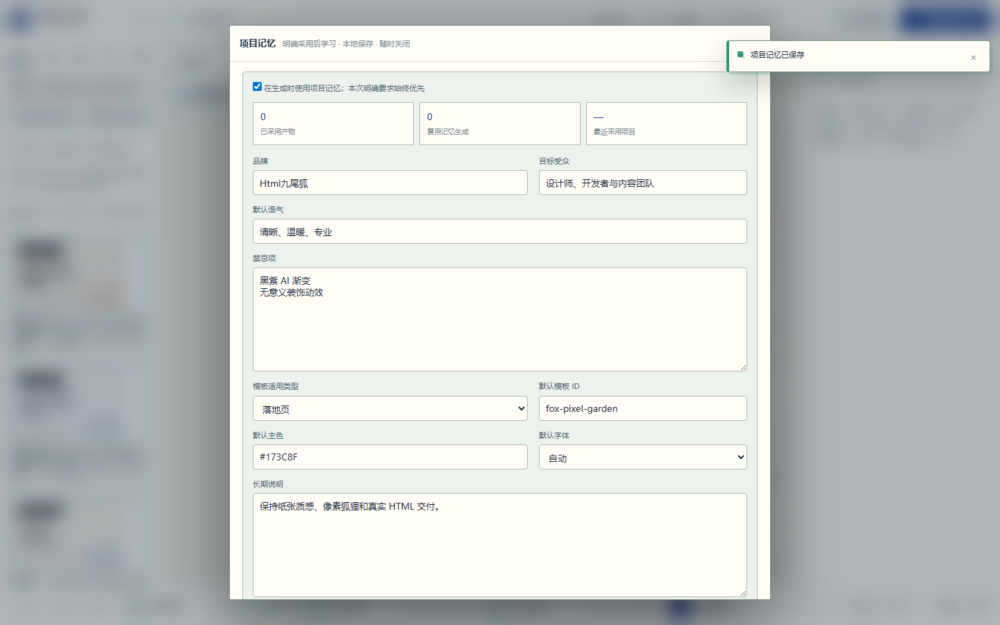<br><b>Project Memory</b><br>Brand, audience, tone, forbidden patterns, templates saved locally with visible success.</td>
<td width="50%">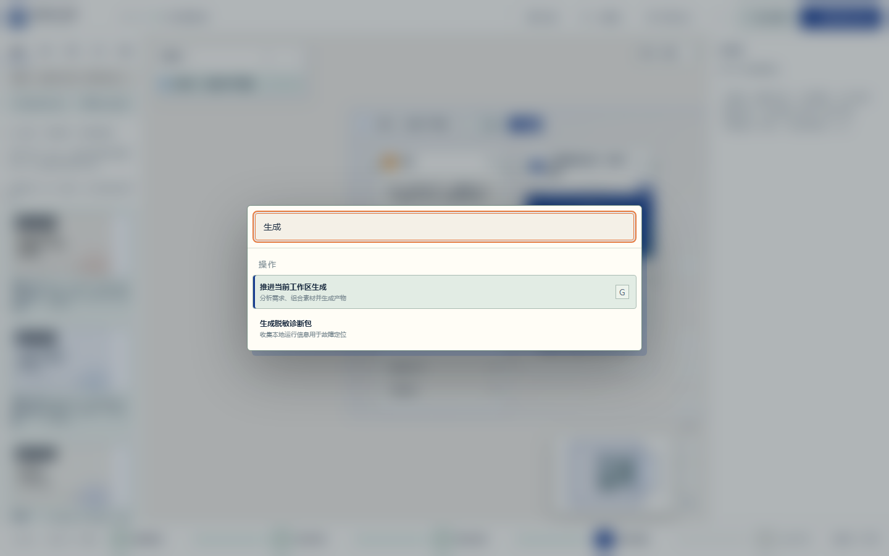<br><b>Command palette</b><br>Ctrl+K keyboard open, search, active result, shortcut hints.</td>
</tr>
</table>

**Export Center (real export flow)**

<table>
<tr>
<td width="50%">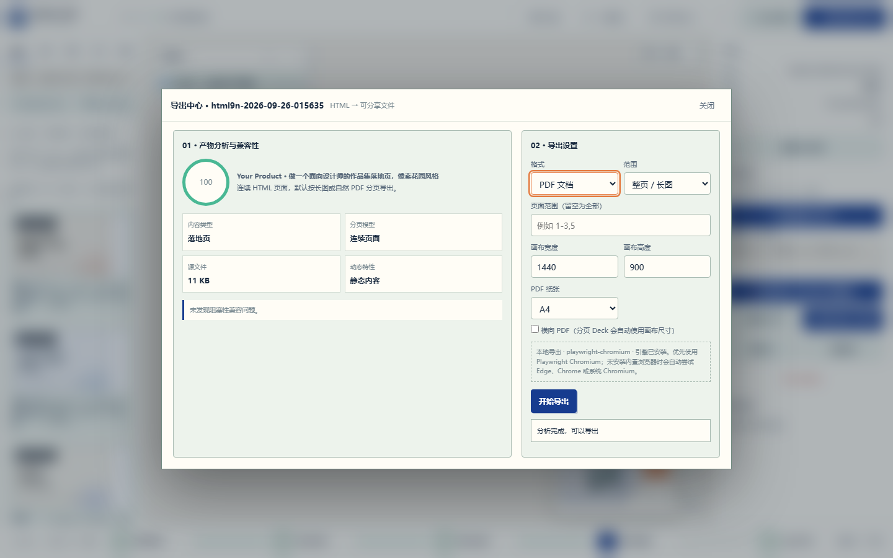<br><b>Export analysis ready</b><br>Compatibility score, page model, dynamic features, local engine status.</td>
<td width="50%">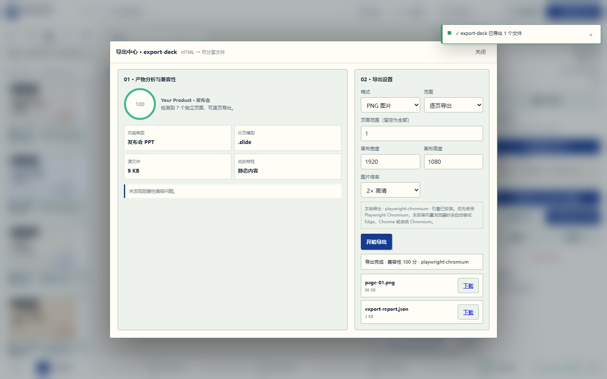<br><b>Real export result</b><br>Deck detects 7 pages; page-01.png and export-report.json produced and downloadable.</td>
</tr>
</table>

**Revisions, errors & cancel**

<table>
<tr>
<td width="50%">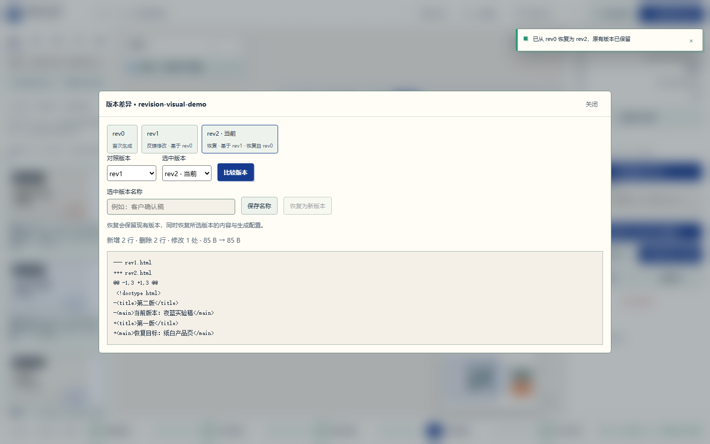<br><b>Revision restore</b><br>Real rev0 → rev2 restore with lineage, line diff, and success toast.</td>
<td width="50%">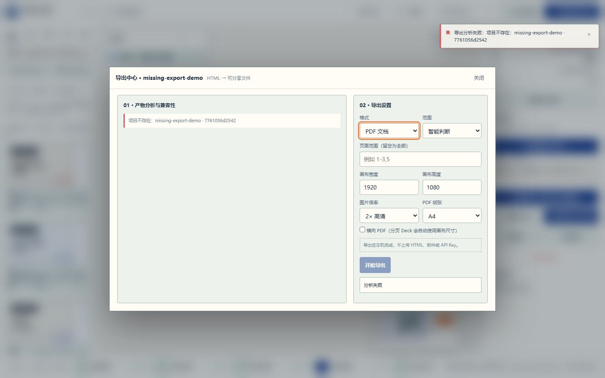<br><b>Controlled error</b><br>Missing project: button disabled with panel and toast feedback.</td>
</tr>
<tr>
<td width="50%">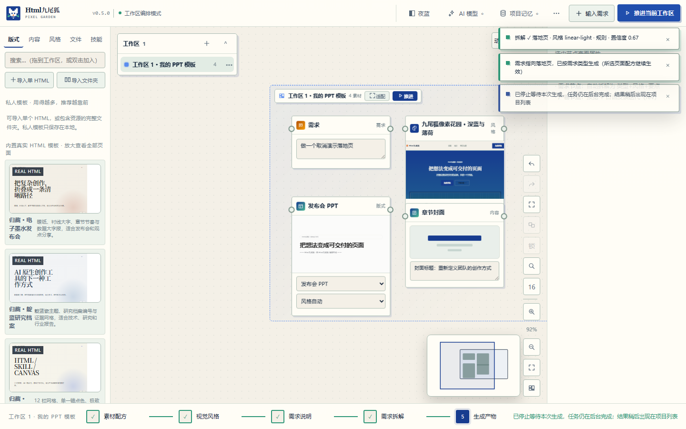<br><b>Cancel generation</b><br>Queued jobs cancel for real; running jobs honestly switch to stop-waiting.</td>
<td width="50%"><br><b>Generation progress rings</b><br>Real job.progress drives node rings; success collapses, failure turns terracotta.</td>
</tr>
</table>
Full set of 24 (including 6 real generated outputs) lives in [assets/screenshots/v0.5.0/](assets/screenshots/v0.5.0/); the list and reproduction commands are in [the screenshots README](assets/screenshots/README.md).

## v0.5.0 Stable Capabilities (history)


- **🧠 Project Memory**: Brand, audience, tone, forbidden patterns, template, primary color, and font stay local and remain editable, disableable, and clearable.
- **♡ Learn only after adoption**: Long-term memory changes only when the user explicitly selects "Adopt this version and learn"; analysis, Recipe Run, and the inspector explain what was reused (explainable reuse).
- **🛡 Crash-recoverable Project commits**: One durable write primitive plus a commit journal — a killed process or power loss rolls back deterministically to the last consistent revision; a cross-process file lock turns concurrent CLI/server access into a stable `project_busy` conflict.
- **🧩 Browser lifecycle modules + generation cancel**: Project / Generation / Revision / Export are isolated modules; one in-flight generation per workspace, cancellable while waiting — queued jobs cancel for real, running jobs honestly switch to stop-waiting.
- **⏳ Revision history and restore**: Feedback, reruns, and restores keep HTML + generation-state snapshots; restoring creates a new revision and never overwrites history.
- **📤 Export Center**: Export PDF, paginated PNG, or a full-page image with a compatibility score and `export-report.json`.
- **🔒 Privacy boundary**: API keys, attachment bodies, and full private feedback text stay out of long-term memory and diagnostics.

## Design intake pipeline (new in v0.6)

<table>
<tr>
<td width="50%">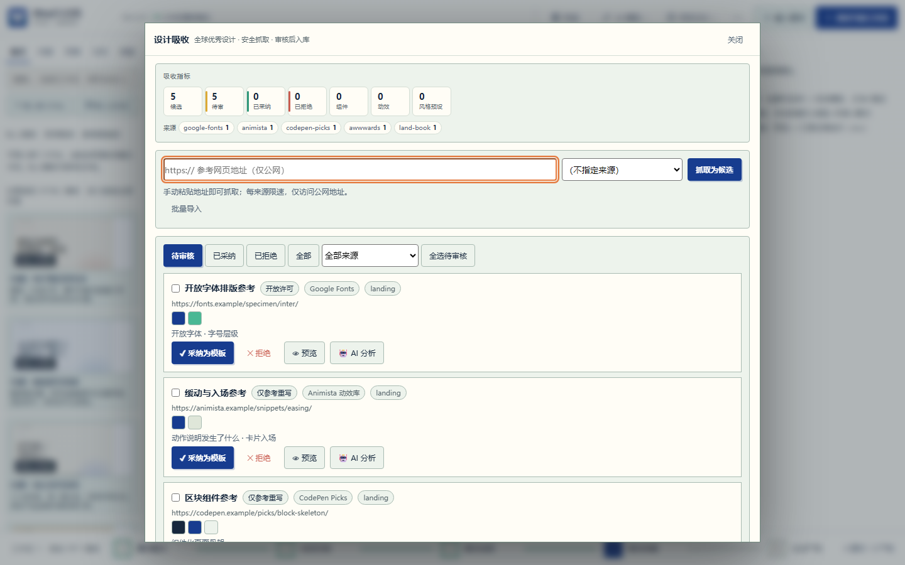<br><b>Review workbench · pending</b><br>All three license tiers, source badges, token swatches, outline and intake metrics.</td>
<td width="50%">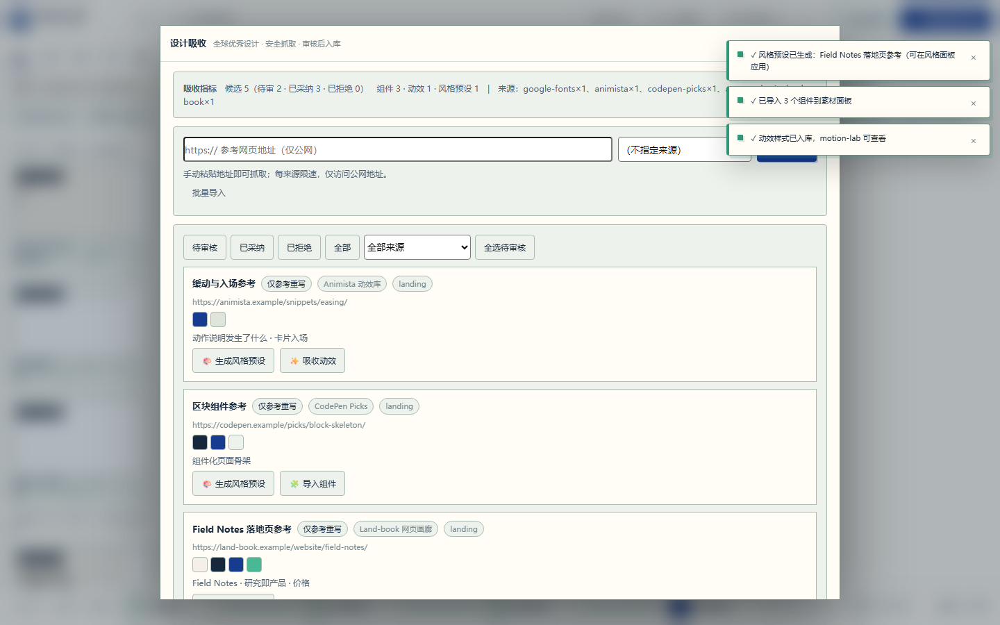<br><b>Approved · ingested</b><br>Style preset, component import and motion absorption, with metrics updating live.</td>
</tr>
<tr>
<td width="50%">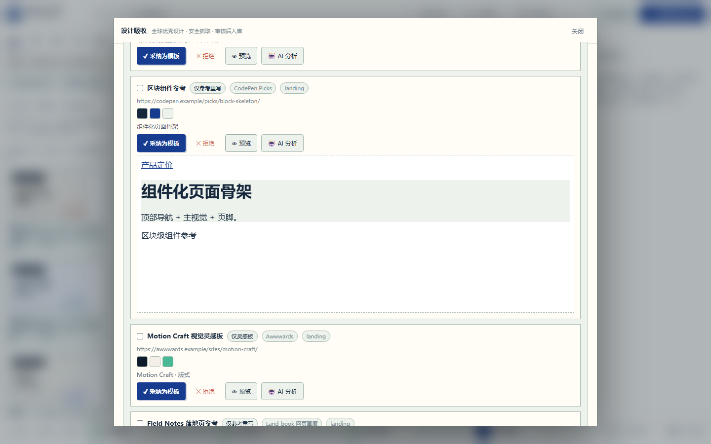<br><b>CSP sandbox preview</b><br>Candidate pages render in a scriptless sandbox; candidate scripts never run.</td>
<td width="50%">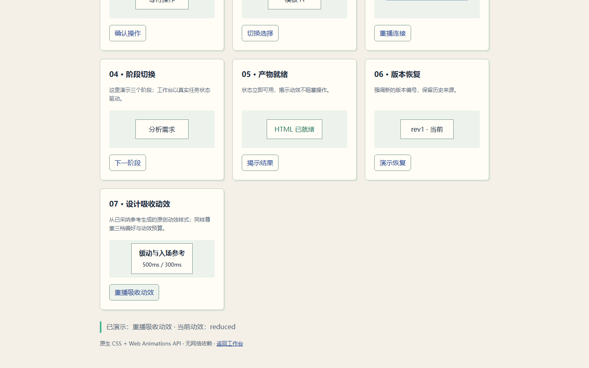<br><b>Motion lab</b><br>Absorbed original motion clamped to budget, honoring reduced-motion preferences.</td>
</tr>
</table>

Turn the world's best designs into your own assets across six layers — templates, styles, components, decorations, motion, and content — through three intake channels:

- **✋ Manual import**: paste single or batch URLs (up to 10), or import a ZIP template pack — everything lands in the review workbench
- **🕸 Built-in source registry**: 12 design sources (Land-book, Lapa.ninja, Landingfolio, Awwwards, Codrops, Animista, Google Fonts…) across gallery/component/motion/typography kinds, fetched safely (private-network and rebinding rejection, per-source rate limits)
- **🤖 AI analysis**: candidates get design descriptions, tags, layout notes and content recipes from your configured LLM (optional; everything works without a key)

Every asset passes a **review workbench** (CSP-sandboxed preview + three-tier license governance: open / reference / inspiration-only) before entering the library — with batch adopt/reject, per-source filtering, and an intake metrics panel tracking candidates and ingested assets. Styles appear in the style panel, components drag onto the canvas to feed generation, motion styles land in the motion lab, all honoring motion preferences and budgets. All six layers (templates, styles, components, decorations, motion, content) share the same absorb → review → ingest → use path.

## Editable PPTX (new in v0.6)

<table>
<tr>
<td width="50%">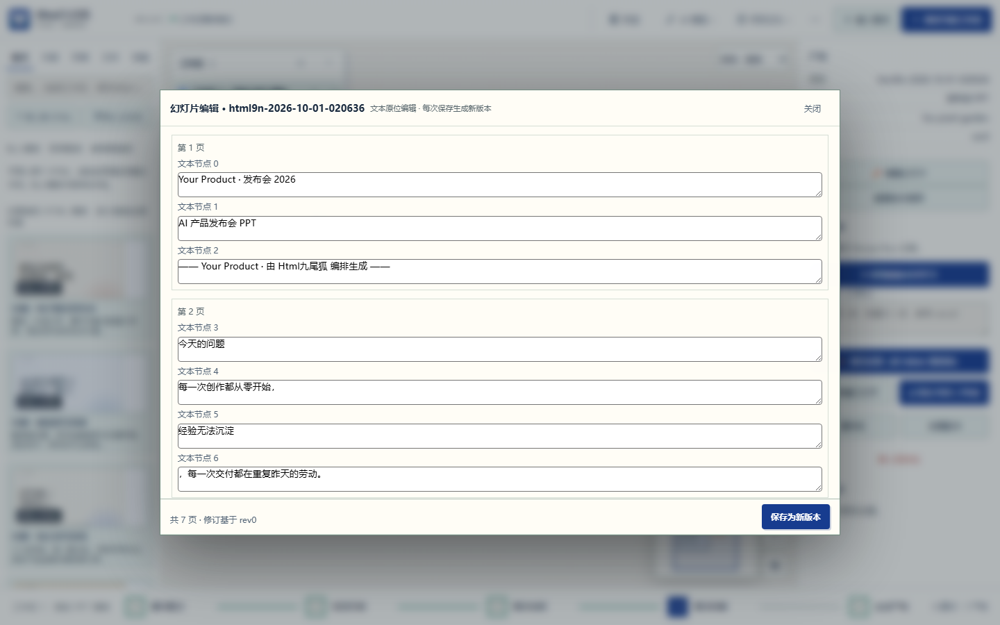<br><b>In-workbench slide editor</b><br>Every editable text node, page by page; saving creates a new revision.</td>
<td width="50%">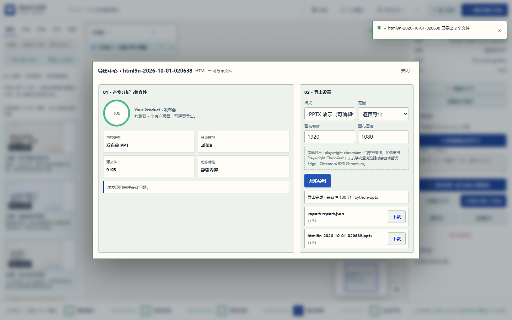<br><b>Export center · PPTX</b><br>PPTX is offered for deck artifacts; the run yields both the .pptx and its report.</td>
</tr>
</table>

- **📄 Standards-compliant .pptx export**: deck artifacts export through python-pptx into a standards-compliant `.pptx` whose text frames stay editable in PowerPoint / WPS; anything that cannot be mapped is listed honestly in the degradation report ([report as captured](assets/screenshots/v0.6.0/pptx-export-report.png)).
- **🖥️ In-workbench slide editing**: open the structured slides dialog in the output inspector to rewrite titles and bullets; `PUT /slides` writes back with `expected_revision`, so a version conflict is reported instead of silently overwritten.
- **🔁 A real edit loop**: export after writing back and your edits survive in the exported PPTX.

## Complete Workbench Features

- **✅ Trustworthy release metadata**: Version, CLI, API, packages, Docker tag, test evidence, and Git tag stay aligned.
- **🎨 Pixel Garden Design System**: Unified design tokens (cobalt `#173C8F` + mint `#49B894` + warm paper `#F4F0E7`) across 5 visual artifacts.
- **🤖 Real LLM Integration**: MiniMax-M3 / Claude / GPT-4o with env auto-config; offline rules engine as fallback.
- **🤝 Skill Alliance**: baoyu-slide-deck (image-based PPT) · frontend-slides (no AI gradient) · beautiful-html-templates (28 stable presets).
- **🖥️ Web Workbench**: `htmlninefox app` launches local Web UI with live preview, agent logs, and template selection.
- **🐳 Docker Image**: `docker run htmlninefox` for cross-platform deployment; multi-stage build with env injection.
- **Real HTML template library**: 6 complete templates with 34 individually previewable pages — no more wireframe guessing.
- **Unified input**: Text, TXT, Markdown, JSON, CSV, HTML, and common image formats.
- **Dual paths**: Accept recommendations directly, or compose layouts/pages/styles/files/skills on the canvas.
- **Infinite canvas workspaces**: Global coordinates, renaming, per-workspace colors, navigation, snapping, and port connections.
- **User-controlled AI**: OpenAI-compatible, Ollama, or custom endpoints; API keys stay local.
- **Offline capable**: Deterministic rules engine works without API keys.
- **Feedback iteration**: Natural language feedback → design token changes → re-render with `rev1 / rev2 / ...` history.
- **Cross-platform**: Windows installer/portable, Linux `.run/.tar.gz`, Python CLI, Web/PWA, Docker.

> The first [Export Center](docs/EXPORT-CENTER.md) milestone shipped PDF and PNG; v0.6 adds high-fidelity .pptx export and the in-workbench slide editing loop. Constrained editable DOCX is next.

## See it in action

<table>
<tr>
<td width="50%">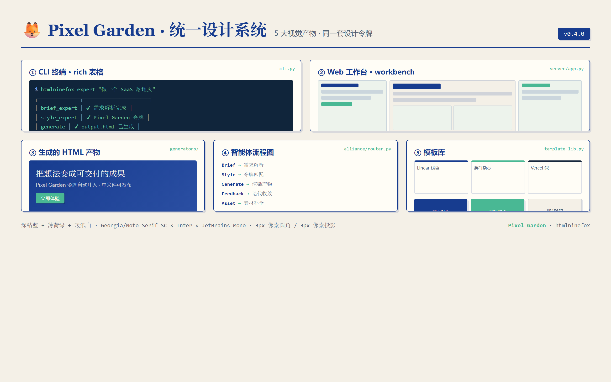<br><b>Pixel Garden Unified Design</b><br>5 visual artifacts unified with cobalt + mint + warm paper.</td>
<td width="50%">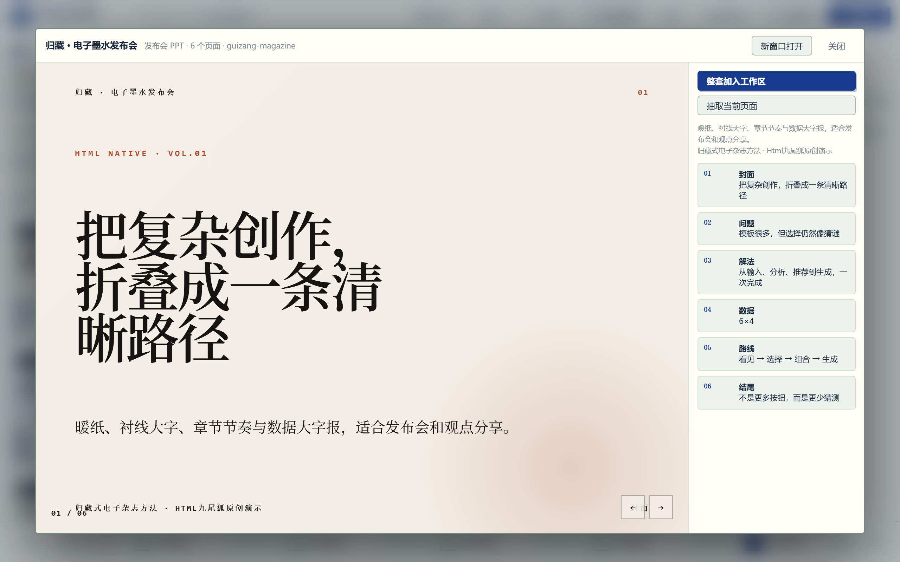<br><b>Template preview dialog</b><br>Preview real HTML templates page by page; add the whole set or extract one page.</td>
</tr>
<tr>
<td width="50%">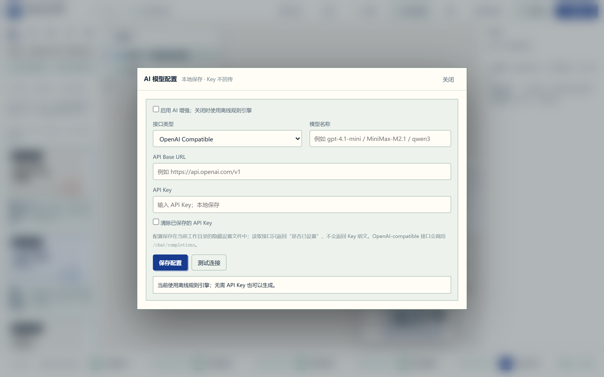<br><b>AI model configuration</b><br>OpenAI-compatible endpoint, locally stored API key, connection test; offline rules without a key.</td>
<td width="50%">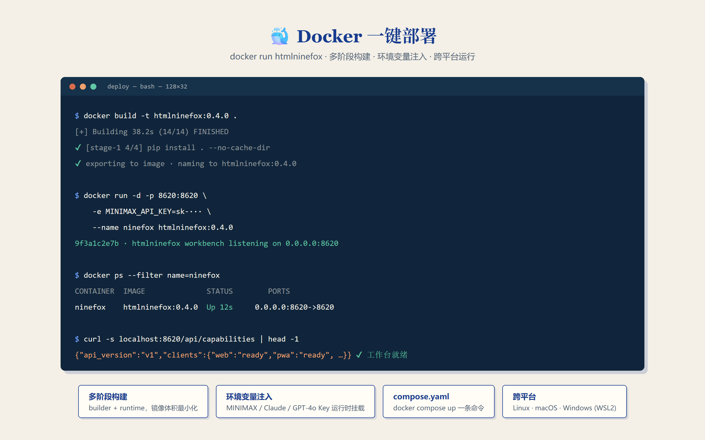<br><b>Docker One-Click Deploy</b><br>docker run htmlninefox with multi-stage build and env injection.</td>
</tr>
</table>

### Six real output types

Generated by the e2e acceptance flow of the released `v0.5.0` (the only published capture set so far):

| Landing | Dashboard | Deck |
|---|---|---|
|  | 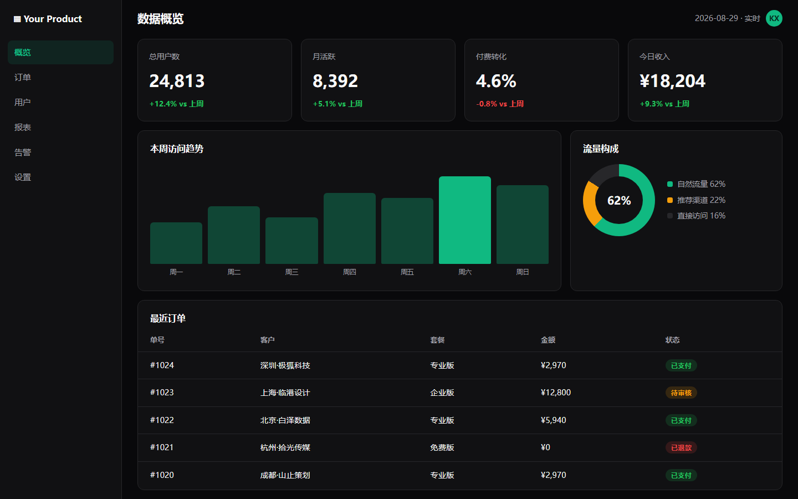 |  |

| Deck page 2 | Poster | Architecture document |
|---|---|---|
| 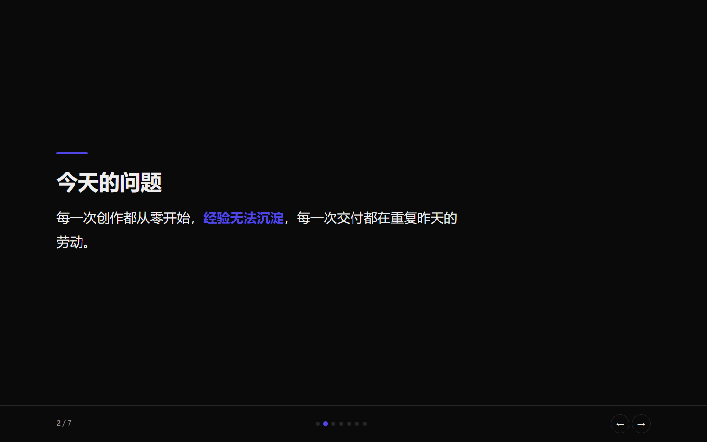 | 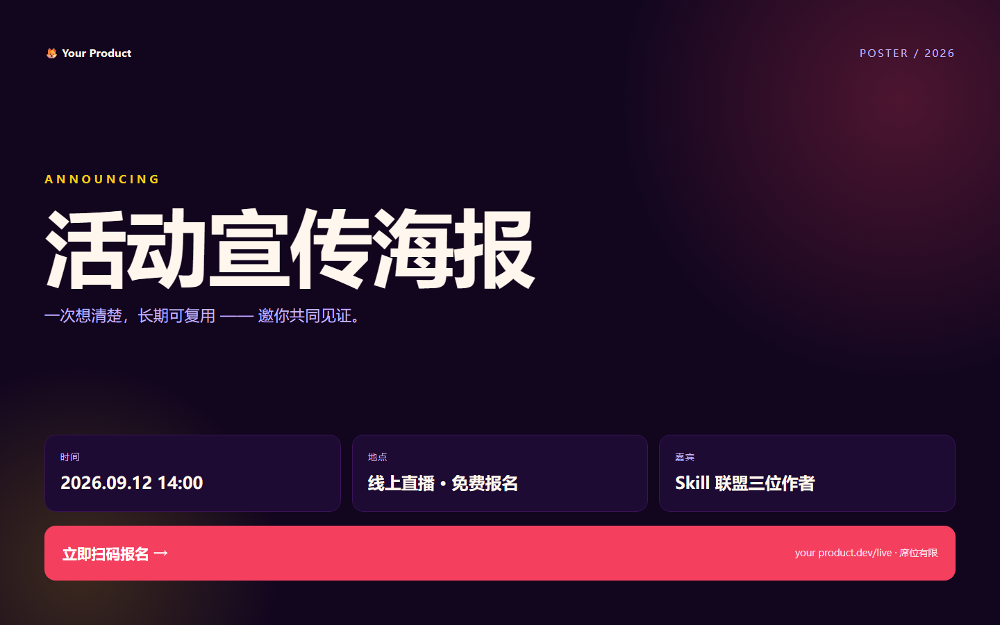 | 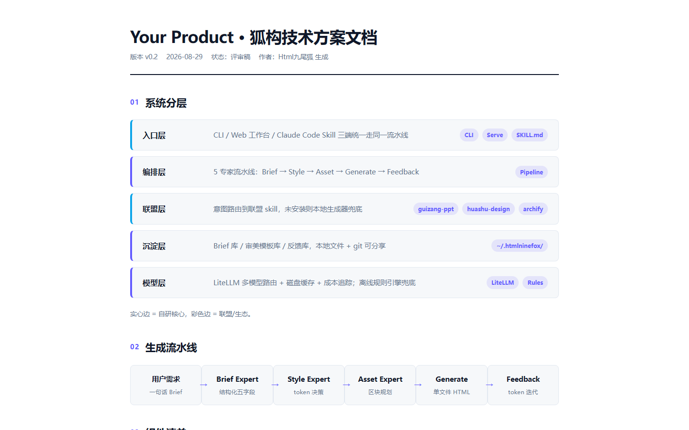 |

## Download & Install

v0.6.0 packages will ship from the [v0.6.0 Release](https://github.com/KratosLee-6/Html-ninefox/releases/tag/v0.6.0) (the repository is currently at `0.6.0`; until the release is published, install the most recent published [v0.5.0 Release](https://github.com/KratosLee-6/Html-ninefox/releases/tag/v0.5.0)). The [DeepSeek Harness plugin preview](https://github.com/KratosLee-6/Html-ninefox/releases/tag/dsh-htmlninefox-v0.1.0-preview.1) is versioned separately.

Package naming is unchanged and the version segment follows the release (the filenames below are the most recently published v0.5.0 artifacts):

| Platform | Recommended file | Usage |
|---|---|---|
| Windows 10/11 | `HtmlNineFox-Setup-0.5.0.exe` | Per-user installer with a Start menu entry |
| Windows 10/11 | `HtmlNineFox-Windows-x64-0.5.0.zip` | Extract and run `HtmlNineFox.exe` |
| Linux | `HtmlNineFox-Linux-0.5.0.run` | `chmod +x` and run; installs to user directory |
| Linux / audit | `HtmlNineFox-Linux-0.5.0.tar.gz` | Inspectable full installation contents |
| macOS 14+ (Apple Silicon) | `HtmlNineFox-macOS-arm64-0.5.0.zip` | Extract, then right-click HtmlNineFox.app → Open to bypass Gatekeeper (unsigned) |
| Python 3.10+ | `htmlninefox-0.5.0-py3-none-any.whl` | `python -m pip install ./htmlninefox-0.5.0-py3-none-any.whl` |
| Docker | Build from source | `docker compose up --build`; tag CI verifies but does not publish the image |

### Quick start

```bash
# 1. Install (choose one)
pip install htmlninefox
# or download release package
# or docker run htmlninefox

# 2. Configure LLM (optional; offline works too)
export MINIMAX_API_KEY="***"
# or export OPENAI_API_KEY="***"
# or export ANTHROPIC_API_KEY="***"

# 3. Launch Web workbench
htmlninefox app
# Open http://127.0.0.1:8620

# 4. Or direct CLI generation
htmlninefox expert "Build a SaaS landing page"

# 5. Revise or restore an existing Project
htmlninefox feedback --project ./output/ACTUAL-PROJECT --note "Make the title larger"
htmlninefox restore --project ./output/ACTUAL-PROJECT --revision 0 --expected-revision 2

# 6. Export an existing workbench project
htmlninefox export ./output/ACTUAL-PROJECT --format pdf
htmlninefox export ./output/ACTUAL-PROJECT --format png --scope pages --pages 1-3
```

## Version history

RC3-A through E completed the architecture hardening following the [`mattpocock/skills`](https://github.com/mattpocock/skills) research, domain-modeling, codebase-design, TDD, and code-review methods, and shipped as the stable `v0.5.0`; v0.6 builds on it with the design intake pipeline and editable PPTX.

| Version | Date | Delivered | Record |
|---|---|---|---|
| **v0.6.0 (preparing release)** | target 2026-11-08, not yet published | Design intake pipeline (multi-URL / ZIP import, 12 built-in design sources, three license tiers, CSP-sandboxed review workbench, AI design analysis, intake metrics); editable PPTX export plus the in-workbench slide editor; gates `303 passed, 1 skipped`, Chromium / WebKit `22/22` each | [gate evidence](docs/test-evidence/v0.6.0-s17-20260929/README.md) |
| **v0.5.0 stable** | 2026-09-25 | RC3 wrap-up; Windows / Linux / wheel / Docker attachments with SHA-256 | [Release](https://github.com/KratosLee-6/Html-ninefox/releases/tag/v0.5.0) · [test report](docs/TEST-REPORT-v0.5.0.md) |
| RC3-E | 2026-09-25 | Browser lifecycle modules, generation cancel, export race guards | [iteration record](docs/ITERATION-RC3-E-20260925.md) |
| RC3-D | 2026-09-25 | Crash-recoverable Project commits (journal rollback), cross-process file locking, atomic generation publication | [iteration record](docs/ITERATION-RC3-D-20260925.md) |
| RC3-B2 / C | 2026-09-24 | Shared Generation / Feedback / Restore / Export use cases, CLI Restore | [RC3-C record](docs/ITERATION-RC3-C-20260924.md) |
| RC3 visual convergence | 2026-09-24 | Dual primary actions, four responsive tiers, semantic zoom, unified component states, classic mode back on Pixel Garden | [convergence record](docs/ITERATION-RC3-VISUAL-CONVERGENCE-20260924.md) |
| v0.5.0rc2 | 2026-09-18 | Revision history and restore, three-tier native motion, 100-node gate, accessibility, DSH plugin preview | [RC2 report](docs/TEST-REPORT-RC2-20260918.md) |
| v0.5.0rc1 | 2026-09-14 | Project Memory, command palette, Recipe Run, interaction system | [RC1 notes](docs/RELEASE-NOTES-v0.5.0rc1.md) |
| v0.4.2 stable | 2026-09-08 | Export Center (PDF / PNG with compatibility report) | [release notes](docs/RELEASE-NOTES-v0.4.2.md) |

Real evidence screenshots from historical releases:

<table>
<tr>
<td width="50%">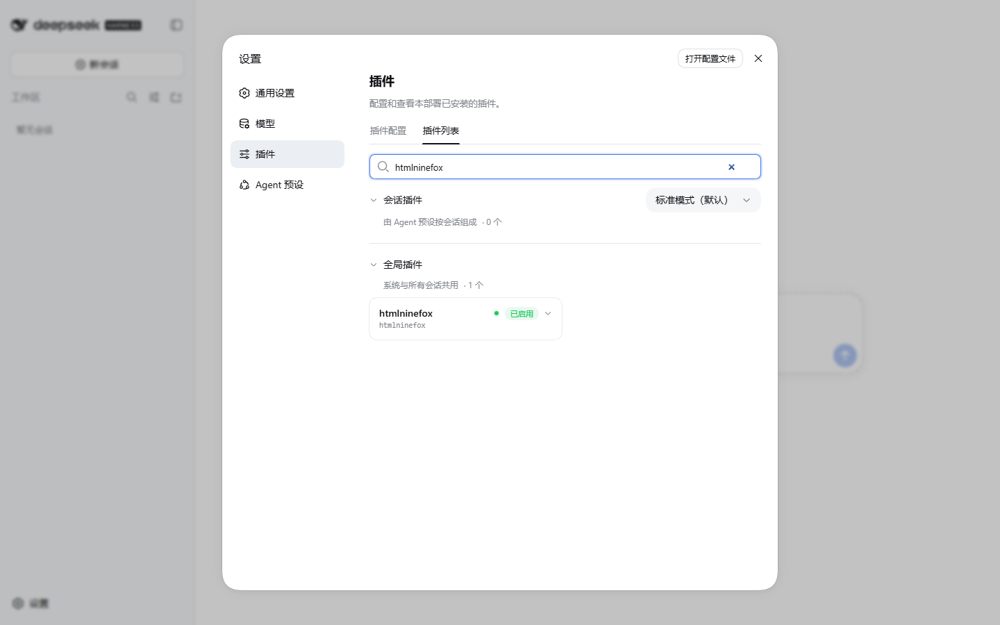<br><b>DSH plugin enabled (rc2)</b><br>The final tarball installed into a fresh web profile; the plugin list shows htmlninefox as an enabled global plugin.</td>
<td width="50%">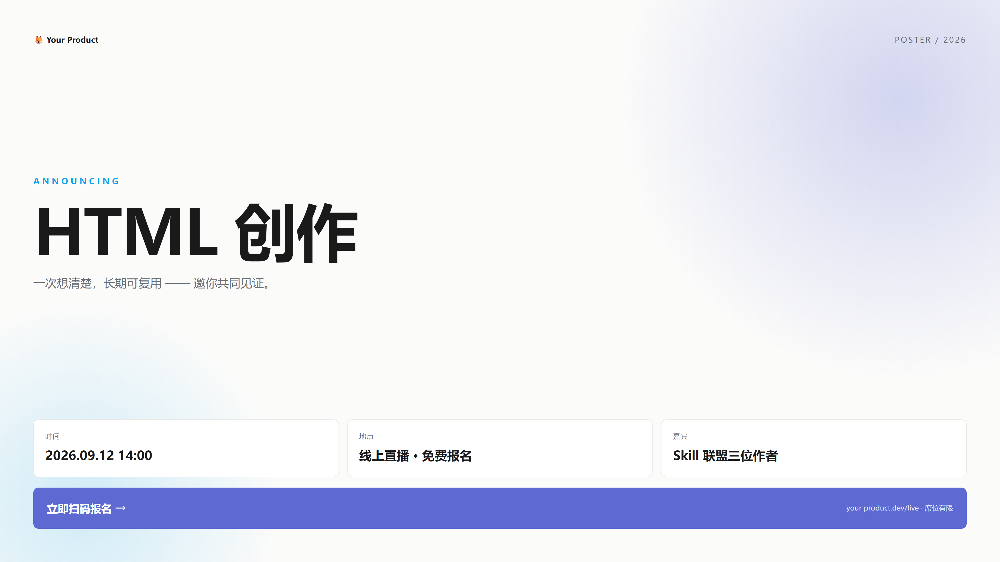<br><b>Generate, revise, export chain (rc2)</b><br>Offline Chinese poster with dry-run and real feedback, then PDF and full-page PNG export; compatibility 100.</td>
</tr>
<tr>
<td width="50%">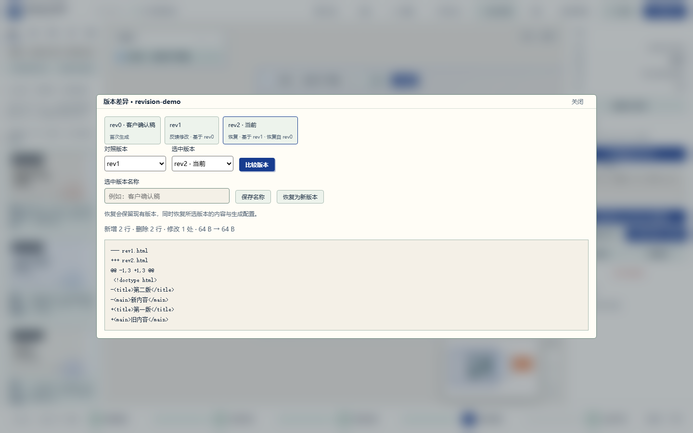<br><b>Revision history and restore (rc2)</b><br>Parent revision, restore source, labels, and line diffs; restoring creates a new revision.</td>
<td width="50%">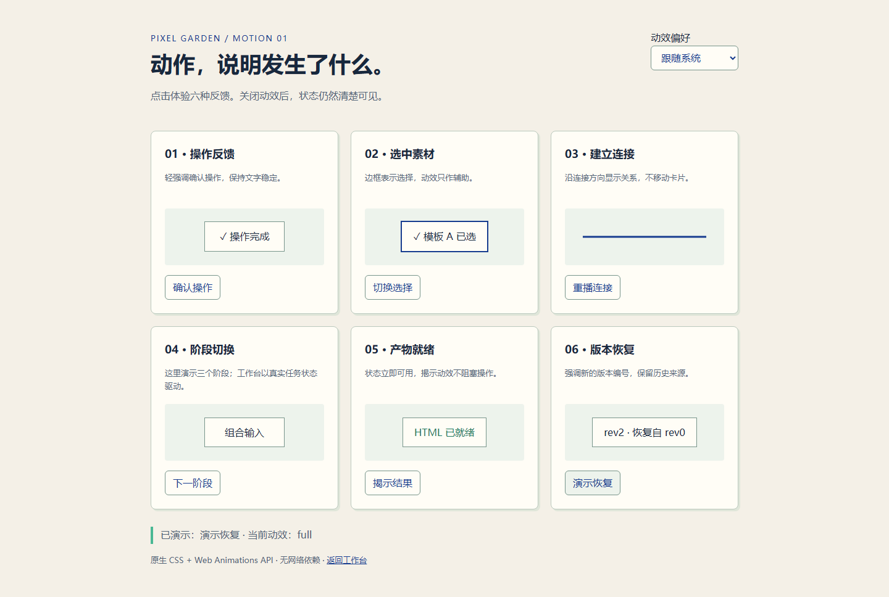<br><b>Motion lab (rc2)</b><br>Six sample interactions: feedback, selection, linking, stage changes, output ready, restore complete.</td>
</tr>
</table>

## Testing & Trust Evidence

All release gates for v0.6.0 were re-verified on commit `e5f3664` (September 29, 2026):

| Check | Result | Evidence |
|---|---:|---|
| Python + browser test suite | **303 passed, 1 skipped** | [v0.6.0 gate evidence](docs/test-evidence/v0.6.0-s17-20260929/README.md) |
| JavaScript syntax (13 static JS files + inline check) | **all pass** | [same evidence](docs/test-evidence/v0.6.0-s17-20260929/README.md) |
| Chromium acceptance (bundled Chromium) | **22 / 22** | [same evidence](docs/test-evidence/v0.6.0-s17-20260929/README.md) |
| WebKit (Safari engine) acceptance | **22 / 22** | [same evidence](docs/test-evidence/v0.6.0-s17-20260929/README.md) |
| Release metadata consistency (`check_release_version.py`) | **consistent** | [same evidence](docs/test-evidence/v0.6.0-s17-20260929/README.md) |
| DSH registry and final tarball integration | **2 / 2 passed** | [integration record](docs/DEEPSEEK-HARNESS-INTEGRATION.md) |
| Revision history, restore, and the 100-node gate | **passed** (covered by the pytest suite) | [RC2 report](docs/TEST-REPORT-RC2-20260918.md) |
| Docker image | Dedicated tag-CI job builds and verifies | [build workflow](.github/workflows/build-release-packages.yml) |

The published v0.5.0 release evidence — package attachments with SHA-256 and the Windows portable real-machine smoke — stays in the [v0.5.0 test report](docs/TEST-REPORT-v0.5.0.md); earlier evidence lives in the [v0.5.0rc3 test report](docs/TEST-REPORT-v0.5.0rc3.md) and [v0.4.2-environment.txt](docs/test-evidence/v0.4.2-environment.txt).

### Run from source

```bash
git clone https://github.com/KratosLee-6/Html-ninefox.git
cd Html-ninefox
pip install -e .
htmlninefox --help
```

## Documentation

- [Architecture](docs/ARCHITECTURE.md)
- [Design philosophy](docs/DESIGN.md)
- [Pixel Garden UI guide](docs/UI-GUIDE.md)
- [RC3 visual convergence record](docs/ITERATION-RC3-VISUAL-CONVERGENCE-20260924.md)
- [RC3-B2 shared Generation use case](docs/ITERATION-RC3-B2-20260924.md)
- [RC3-C shared Feedback, Restore, and Export use cases](docs/ITERATION-RC3-C-20260924.md)
- [RC3-D crash-recoverable commits and process locking](docs/ITERATION-RC3-D-20260925.md)
- [RC3-E isolated workbench lifecycle modules](docs/ITERATION-RC3-E-20260925.md)
- [v0.5.0 stable delivery plan](docs/PLAN-v0.5.0-STABLE-20260924.md)
- [Examples](docs/EXAMPLES.md)
- [Roadmap](docs/ROADMAP.md)
- [Private template import](docs/PRIVATE-TEMPLATE-IMPORT.md)

## PPT editing tribute (v0.6)

The editable-PPT capability in v0.6 stands on two prior works, with gratitude:

- 🪄 **[Univer](https://github.com/dream-num/univer) (dream-num)** — the Apache-2.0 in-browser office engine (Sheets / Docs / Slides / Canvas in one runtime). The in-workbench slide visual editor (near-1:1 PowerPoint fidelity, PPT/PPTX import & export) is built on Univer Slides, vendored locally to stay offline-first.
- 📄 **[python-pptx](https://github.com/scanny/python-pptx) (Steve Canny)** — the MIT PowerPoint library powering the server-side .pptx bridge, so exported decks are truly text-editable in PowerPoint / WPS.

## Contributing

Issues and pull requests are welcome. See [CONTRIBUTING.md](CONTRIBUTING.md).

## License

MIT License · See [LICENSE](LICENSE)

---

<div align="center">
  <p><strong>让灵感在 HTML 里生长。</strong></p>
  <p>Html九尾狐 · Pixel Garden · 个人开源项目</p>
</div>
