<div align="center">
  
  <h1>HtmlNineFox · HTML Creation Workbench</h1>
  <p><strong>Put text, files, images and scattered HTML templates on one infinite canvas — analyse, recommend, compose freely, iterate with feedback, and ship a truly deliverable single-file HTML.</strong></p>
  <p>Personal open-source project by <a href="https://github.com/KratosLee-6">KratosLee</a> · Offline rules engine included · AI optional</p>
  <p><a href="README.md">简体中文</a> · <strong>English</strong></p>
</div>

<div align="center">

[](https://github.com/KratosLee-6/Html-ninefox/releases/tag/v0.9.6)
[](docs/PLAN-v0.9.md)
[](docs/RELEASE-NOTES-v0.7.0.md)
[](pyproject.toml)
[](LICENSE)

</div>


> Current app version `0.9.6` (released 2026-11-14; 0.9.1→0.9.6 batched) · [release notes](https://github.com/KratosLee-6/Html-ninefox/releases/tag/v0.9.6) · full features below.
> **AI / Agent integration**: [Agent guide](docs/AGENT-GUIDE.md) — CLI / HTTP API / Skill, all commands verified against a live build.

---

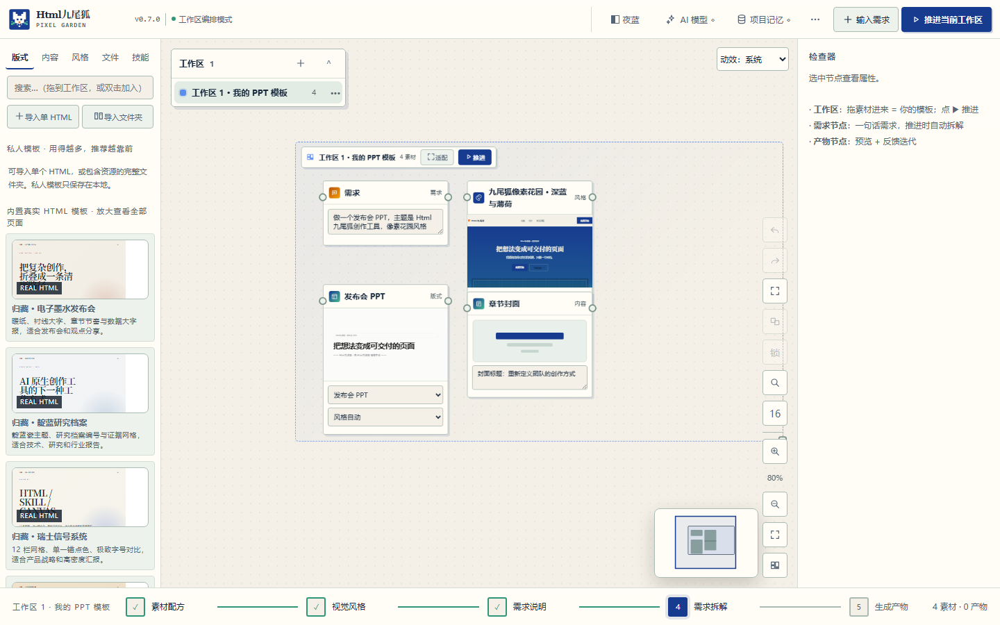
<p align="center"><b>HtmlNineFox workbench · Pixel Garden UI</b> (v0.7.0 capture: library · infinite canvas · inspector)</p>

## Video

The narrated cut ships with the v0.7.0 release and plays on the **release page**.

- **[Narrated cut · 79s (v0.7.0 release page)](https://github.com/KratosLee-6/Html-ninefox/releases/tag/v0.7.0)** — voice-over + keynote-style motion graphics + a real operating recording: paste example.com → review → adopt → decompose and generate → the page's own prose shows up in the output. Driven by the t2 keynote grammar of [huashu-art-motion](https://github.com/alchaincyf/huashu-art-motion).

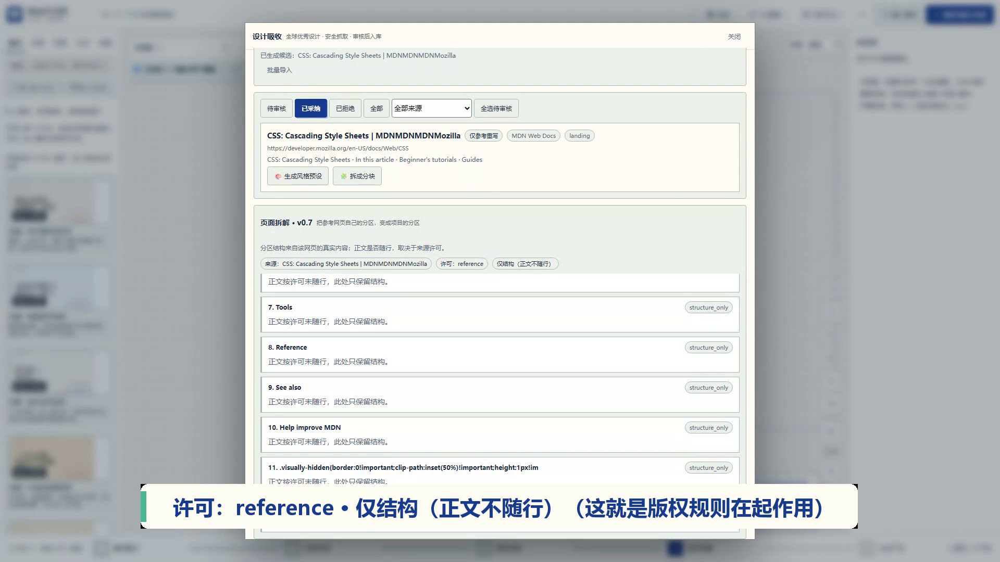

## 🆕 v0.9.1 → v0.9.6 · Mainline capabilities (released with v0.9.6)

> The five dev batches 0.9.1→0.9.5 shipped together with **v0.9.6
> (2026-11-14)**; full suite **933 passed / 4 skipped**, usability inspection
> 12/12 (`scripts/verify_mainline.py`). Slicing and decision records:
> [PLAN-v0.9.md](docs/PLAN-v0.9.md).

**Tone in your hands → AI suggests, you decide → AI keeps your voice →
multi-step plays are clickable and traceable → brand colors stay in range.**

<table>
<tr>
<td width="50%">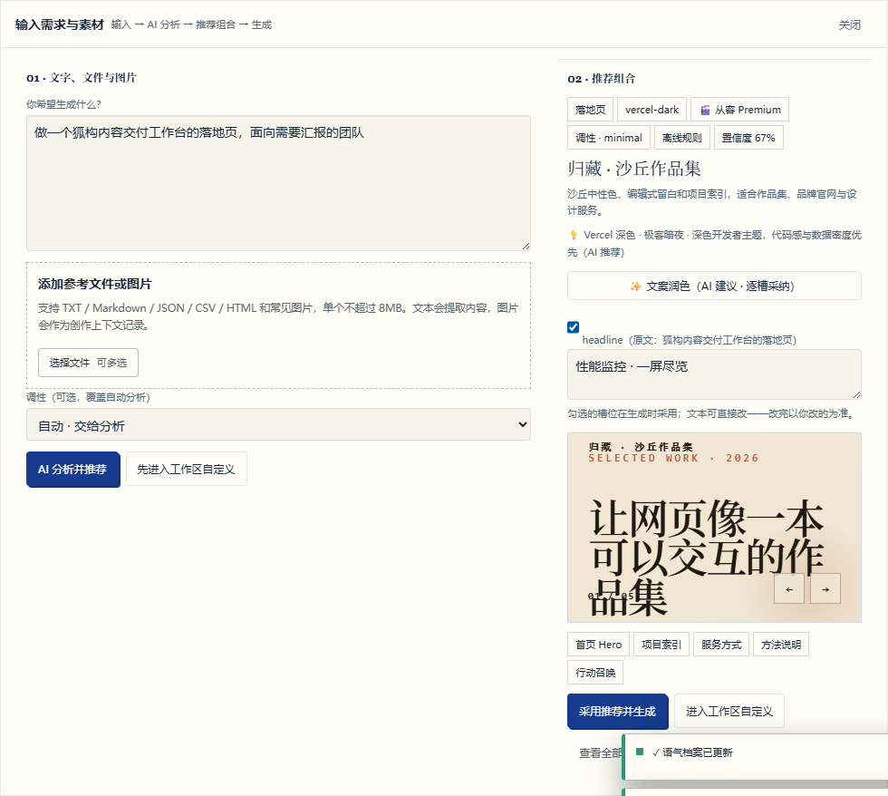<br><b>0.9.1+0.9.2 · Tone selector + copy polish</b><br>Pick a tone in the creation panel (auto / six-word list); recommendation cards carry a 🎬 archetype badge. "✨ Copy polish (AI suggestion, per-slot adoption)" shows original→suggestion per slot — check, edit the text, your wording always wins.</td>
<td width="50%">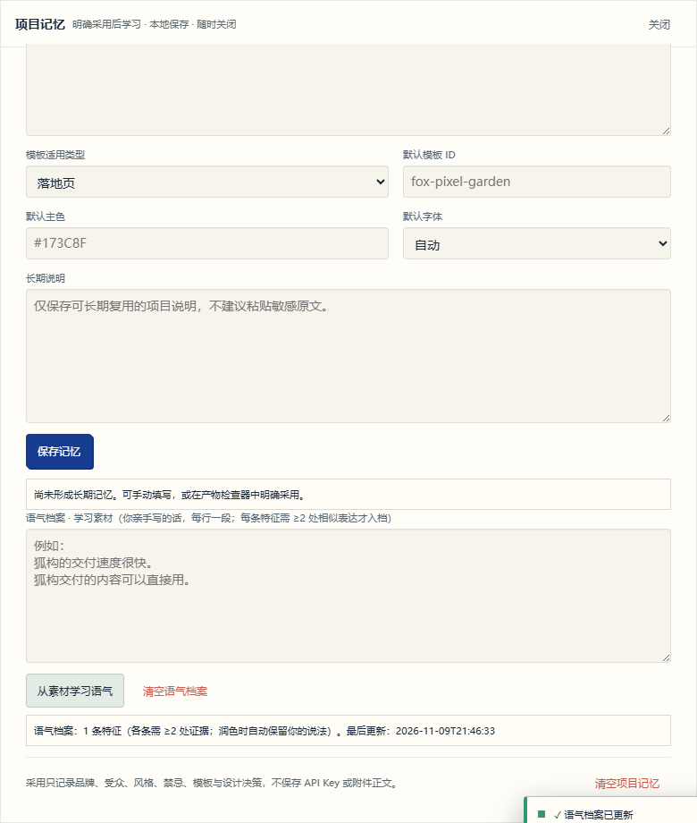<br><b>0.9.3 · Voice profile</b><br>Paste a few paragraphs written by you into project memory: each trait needs <b>≥2 similar occurrences to enter the profile</b>; polishing stacks your banned words and keeps your phrasing.</td>
</tr>
<tr>
<td width="50%">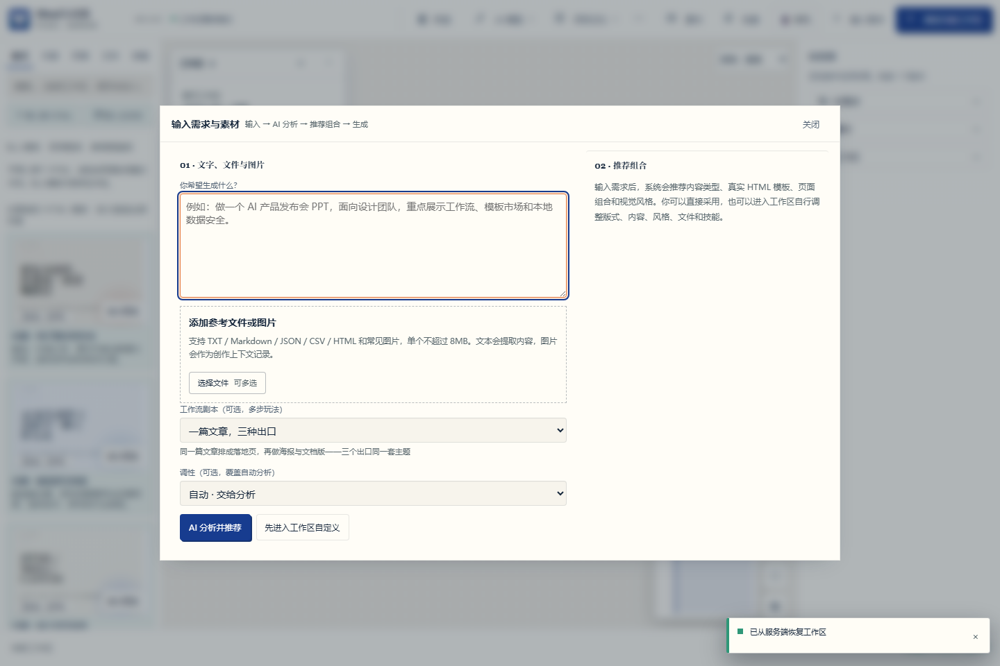<br><b>0.9.4 · Workflow plays</b><br>Pick a play in the creation panel: "one article, three outputs" and five more multi-step plays (page → poster → doc), description on selection; the recipe-run timeline records every step.</td>
<td width="50%"><b>0.9.5 · OKLCH brand-color constraint (measured)</b><br>Brand colors are no longer used raw — clamped into the current style's lightness/chroma range, hue kept, contrast guaranteed:<br><br><code>neon #00FF00 → #008800 in the vercel-dark range</code><br>lightness 0.87→0.51 · contrast 4.6:1 · green hue kept<br><br>Delivery bundles embed a <b>usage-subset</b> open-source font (<code>[font]</code> extra); without it, export proceeds and says so.</td>
</tr>
</table>

- **0.9.1 (second half) · Tone end-to-end**: creation-panel tone selector →
  analyze/generate chain → motion parameters in the artifact (vibrant→playful
  0.6s/14s · editorial→premium 0.9s/32s, locked by e2e gates); recipe timeline
  shows a 🤖 model / 📐 rules badge per stage — "which part used AI" is never a guess.
- **0.9.2 · AI generation deepening**: LLM compose recommendation (one of 11
  presets + a Chinese reason) + per-slot copy polish — a **two-way digit
  consistency gate** (no dropped digits, no invented digits); without AI it
  says so honestly, the rule engine never ghostwrites.
- **0.9.3 · Voice profile**: six trait classes, **≥2 evidence occurrences per
  trait**; consumed by copy_expert — polish and de-AI-flavor share the profile.
- **0.9.4 · Assembly layer, first batch**: family tags on presets/templates
  (one article, three outputs, one family) + six workflow plays (honoring
  dsh-guizang-design) — steps reference abilities, plays are clickable,
  traceable and recorded.
- **0.9.5 · OKLCH + font subsetting**: both brand-color entry points clamped
  into the anchor range (primary ≥4.5:1 · accent ≥3:1, reasons visible, all
  11 presets untouched); delivery-bundle **copies** embed woff subsets — the
  workspace original is never modified; dsh-guizang-design joins the alliance
  (AGPL red-lines documented, ideas only).

## v0.9.0 · Desktop shell + style axis

**From "a web tool" to "a desktop creative app": a Tauri shell coexisting with
the portable/installer forms, and a tone axis steering generated output.**

<table>
<tr>
<td width="50%">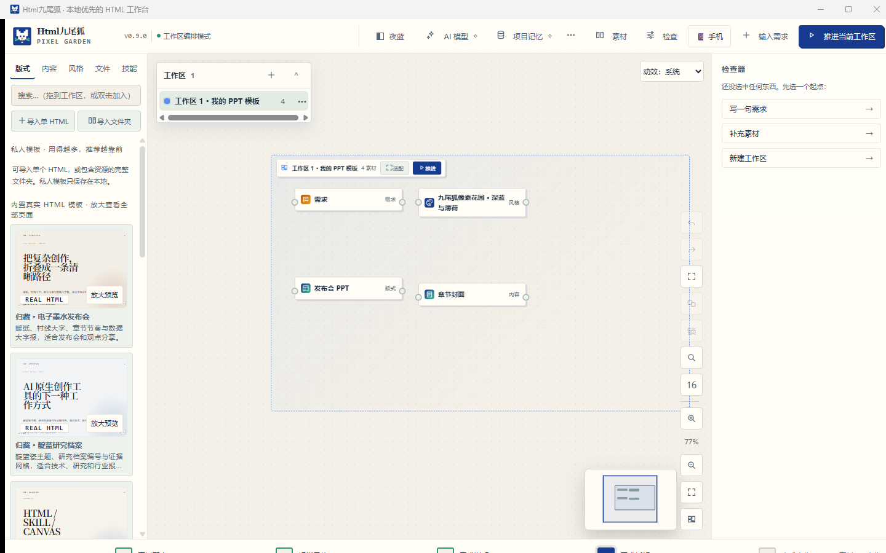<br><b>Desktop shell · double-click launch</b><br>The Tauri shell loads the local sidecar service and navigates the workbench: no browser, system tray, child process reclaimed on close; coexists with the portable/installer forms.</td>
<td width="50%"><br><b>Recommendation card · reasons visible</b><br>One-line brief → analysis → recommendation: intent chip, preset tag, 🎬 motion archetype badge (Energetic) and a 💡 plain-language reason (rule-engine mode included) — you decide whether to adopt.</td>
</tr>
</table>

- **Tauri shell**: double-click launch, no browser, system tray, child process
  reclaimed on close. The sidecar chain follows the verify_portable discipline
  (free port → HtmlNineFox.exe → /api/health polling → navigate); CI checks
  three platforms and the release pipeline ships an NSIS shell installer.
- **Style axis, first batch**: four motion archetypes (Playful/Premium/
  Corporate/Energetic) drive ink/stagger/ambient parameters; the
  6-intents × 4-archetypes coverage matrix is a release gate; recommendation
  cards show a 🎬 archetype badge + 💡 reason (rule-engine mode included).
- Bundle wiring (onedir → NSIS) and verify_shell acceptance; the AI×style
  master design (drive/decompose/generate/combine/assemble/present) lives in
  [EVAL-AI-STYLE-DEEPEN-20261103.md](docs/EVAL-AI-STYLE-DEEPEN-20261103.md).
- Full suite **885 passed / 4 skipped** (tested 2026-11-03).
- See the [v0.9.0 release notes](docs/RELEASE-NOTES-v0.9.0.md).

## v0.8.8 · Click-to-edit

**Click any text in the preview, type, press Enter — a new revision. WYSIWYG
for all six intents, not just decks.**

<table>
<tr>
<td width="50%">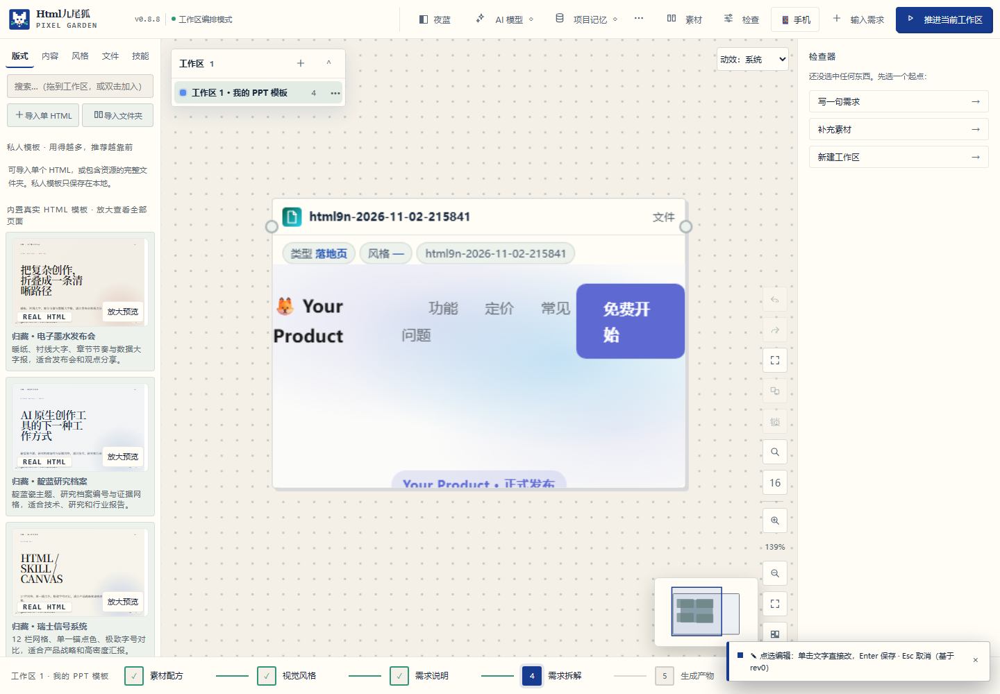<br><b>Hover · know what's editable first</b><br>Editable text in the preview hints on hover: click to edit in place, Enter saves, Esc cancels — real artifact text, not a mock.</td>
<td width="50%">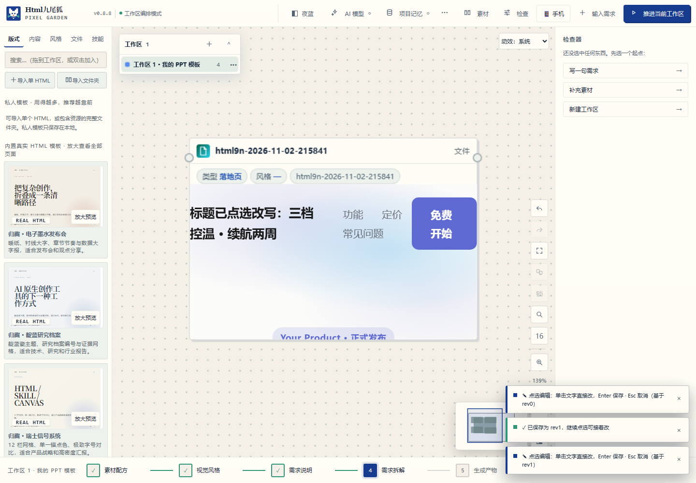<br><b>Save · every edit is a new revision</b><br>Enter on the edited headline → "saved as rev1, keep clicking to continue" — same versioning as verbal feedback, diffable and restorable.</td>
</tr>
</table>

- **Click-to-edit** (WYSIWYG A1): landing / dashboard / poster / doc artifacts
  join the deck slide editor in inline text editing.
- Every save is a new revision — diffable, restorable, same versioning as
  verbal feedback; optimistic locking plus a current-text guard so the wrong
  node can never be edited.
- The consistency gate (frontend enumeration vs server mapping, bit-for-bit
  on a real render) caught `title` and `&nbsp;` misalignment on its first
  run — fixed before release.
- Full suite **878 passed / 4 skipped** (tested 2026-11-02).
- See the [v0.8.8 release notes](docs/RELEASE-NOTES-v0.8.8.md).

## v0.8.7 · Motion quality layer

**LottieFiles motion-director principles adopted — AI-generated pages now
have their motion audited too.**

<table>
<tr>
<td width="50%">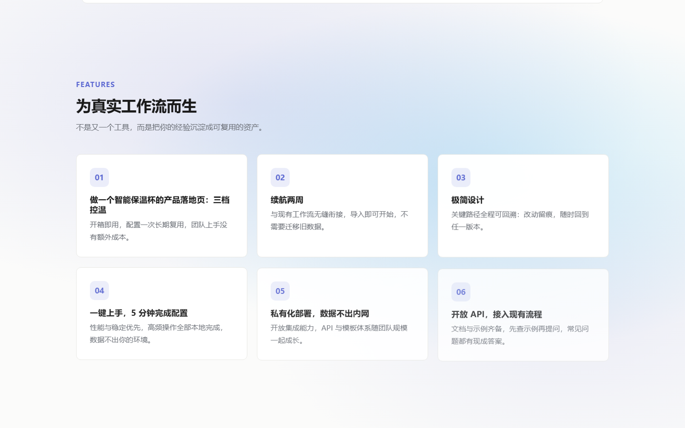<br><b>Reveal mid-frame · cards land one by one</b><br>The scroll reveal of the ink-on-paper motion layer in progress: elements enter one by one (never opacity-only), so the page never flashes in as a blank frame.</td>
<td width="50%">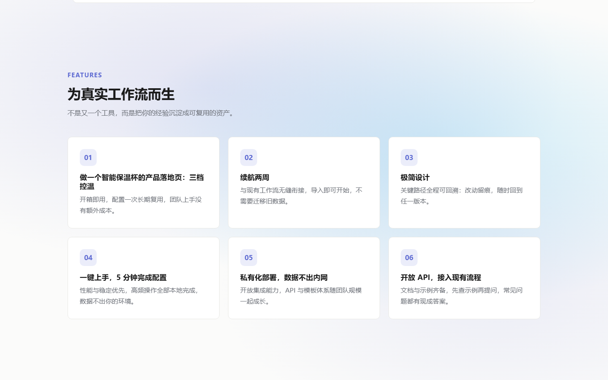<br><b>Settled · motion has an end state</b><br>Once revealed, the layout is stable; duration tokens match the element-type table, stagger stays in budget, ambient loops keep the easing law — gates only forbid regressions.</td>
</tr>
</table>

- **8th alliance member**: motion-design-skill (MIT) — the first
  guidance-source member (no CLI, no module; probed by skill-dir presence);
  local fallback unchanged without it.
- **5 motion gates**: duration tokens vs element-type table, linear-easing
  ban (spinner whitelist), no opacity-only reveals, stagger < 500ms budget,
  eased ambient loops; **triple mutation verification all CAUGHT**.
- Pre-integration audit found zero violations — gates lock in current
  invariants (no-regression discipline).
- Full suite **868 passed / 4 skipped** (tested 2026-11-01).
- See the [evaluation doc](docs/EVAL-motion-design-skill-20261101.md) ·
  [v0.8.7 release notes](docs/RELEASE-NOTES-v0.8.7.md).

## v0.8.6 · Phone preview + delivery bundle

**Check it on your phone right after generating; ship a delivery bundle in one
click — the last mile of output, now visible in the UI.**

<table>
<tr>
<td width="50%">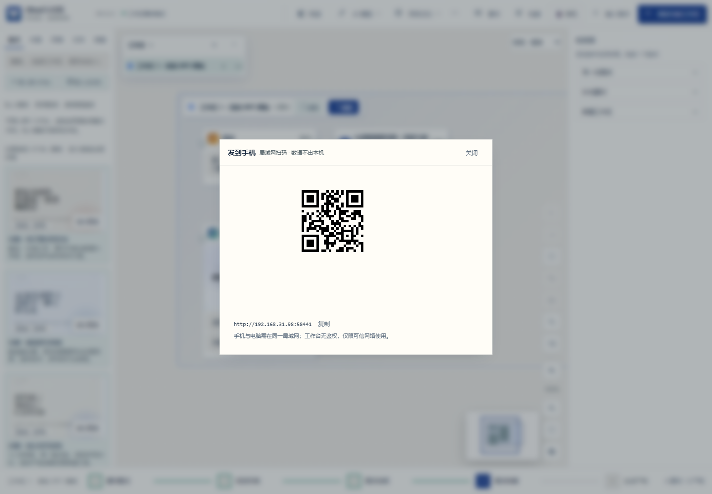<br><b>Phone preview · scan and view</b><br>The topbar 📱 dialog renders a QR code on the real listening LAN address; scan on the same network to view the artifact. The no-auth warning ships with the dialog (trusted LANs only), data stays on your machine.</td>
<td width="50%">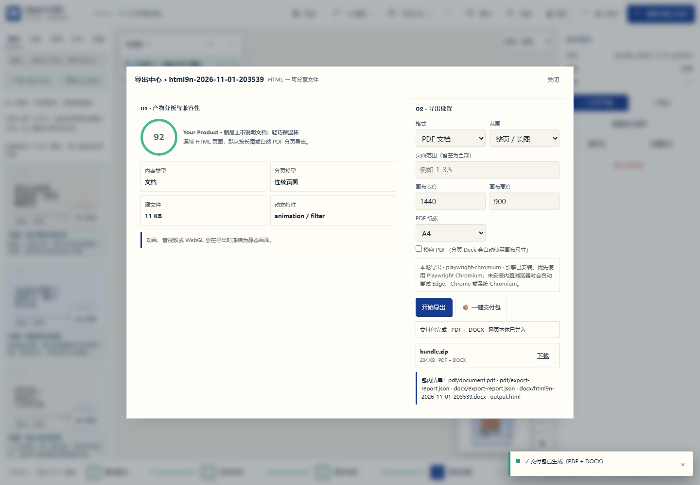<br><b>Delivery bundle · grouped by intent</b><br>Export center 📦 one click: doc intent = PDF + DOCX + the page itself zipped (204 KB) with an in-bundle manifest — real per-format exports, not renamed files.</td>
</tr>
</table>

- **Phone preview** (optional `[qr]` extra): the topbar 📱 button enumerates LAN
  addresses and renders a QR code on the real listening port; degrades to plain
  URLs without segno (never installs silently). No-auth warning ships with the
  response and the dialog (trusted LANs only).
- **Delivery bundle**: the export center 📦 button groups formats by intent —
  deck=HTML+PDF+PPTX · doc/archdoc=HTML+PDF+DOCX · others=HTML+PDF — real
  per-format exports zipped with the page itself and a manifest.
- 5 new gates (real port echo, QR SVG present, two-intent bundle chains, zip
  structure, error naming); full suite **861 passed / 4 skipped** (tested 2026-11-01).
- See the [v0.8.6 release notes](docs/RELEASE-NOTES-v0.8.6.md) · [v0.9 plan](docs/PLAN-v0.9.md).

## v0.8.5 · Agents as first-class citizens

**The workbench opens up as an MCP server: any MCP agent (Claude, Cursor, …) can drive the whole pipeline.**

- **MCP server** (`[mcp]` extra): stdio transport, 8 tools — `intake_decompose`
  (document → provenance-carrying proposal), `intake_adopt`, `generate`,
  `analyze`, `feedback`, `list_projects`, `export`, `capabilities`. Reuses the
  HTTP API, no second service.
- **Honest module names**: `intake_proposal` / `intake_adopt` (the docx-prefixed
  modules serve all four formats; old paths ship as compatibility shims).
- **Anti-pattern gates** (impeccable tier B, self-implemented): no overshoot
  easing, no cards inside cards, no pure black.
- Gates include a **real stdio MCP handshake smoke**; full suite **853 passed / 4 skipped**.
- See the [agent guide](docs/AGENT-GUIDE.md) · [v0.9 plan](docs/PLAN-v0.9.md).

## v0.8.4 · Paste in a PDF + image assets + design quality layer

**PDF now walks the same pipeline; image slots take real pictures; the alliance welcomes impeccable (88.7k★ design-quality layer, Apache-2.0).**

- **Reverse-intake matrix**: DOCX → PPTX → **PDF** (`[pdf]` extra) — text layer only, scanned pages reported honestly, no coordinate table reconstruction.
- **Image assets**: dimensions via stdlib, dominant colour via the `[image]` extra, both degradations stated; slot attachments ride into generation as real inputs.
- **Gates**: PDF contract 10 + API 13 + image 5+2; mutation suite seven 4/4; preflight seven suites green; full suite **847 passed / 4 skipped**.
- See the [v0.8.4 plan](docs/PLAN-v0.8.4.md) · [release notes](docs/RELEASE-NOTES-v0.8.4.md).

## v0.8.3 · Paste in a PPT + keyboard access

**A .pptx now walks the same pipeline Word does: parsed into provenance-carrying blocks, proposed for review, then generated — and the whole workbench is keyboard-operable.**

<table>
<tr>
<td width="50%">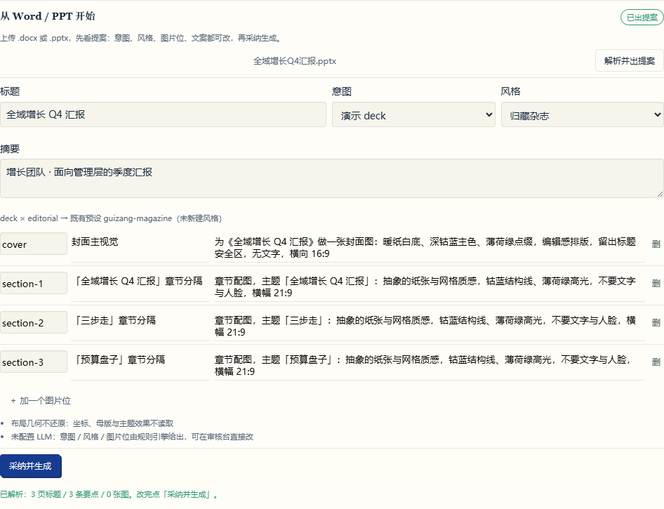<br><b>Review desk · takes .pptx</b><br>The same desk routes by extension: slide titles become sections, bullets become lists, speaker notes join the prose; "layout geometry is not reconstructed" is a standing limitation, charts are counted, merged cells are reported.</td>
<td width="50%">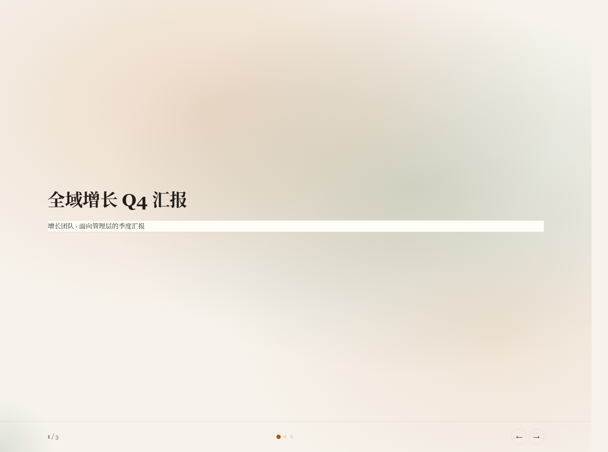<br><b>Adopt & generate · deck lands</b><br>Every block carries slide+shape evidence you can walk back; edit intent/style/copy before generating, with zero new render paths.</td>
</tr>
</table>

- **One more format on the shared contract**: `pptx_import` emits the same `intake_outline` — parsing, proposal, review desk and adoption are shared with Word; a deck source defaults to the deck intent (reason visible, overridable).
- **Keyboard accessibility**: the delegation layer grew a keydown path (`role=button` elements get Enter/Space via the same action table); sweep gates assert every visible control on both pages is keyboard-operable and the focus ring survives Tab. The sweep caught two real regressions: five classic controls dead since v0.7.8 (unconsumed data-action markers) and a permanently empty project history (undefined `esc` swallowed by a catch) — both fixed.
- **Gates**: PPTX parser 15 + API 13 (six-intent real chain) + browser 1; keyboard sweep 5; mutations `mutate_pptx_gates` 4/4 and the delegation suite extended to 6/6 CAUGHT (preflight now six suites); full suite **808 passed / 4 skipped**.
- See the [v0.8.3 plan](docs/PLAN-v0.8.3.md) · [reverse-intake design](docs/DESIGN-REVERSE-INTAKE.md).

## v0.8.2 · Interface pass: surfaces instead of outlines, one motion clock

**No theme change, no new brand colour.** This closes the execution layer of Pixel Garden:
structure comes from surfaces and two soft shadows instead of drawn borders, and buttons,
motion, empty states and icons all follow one scale that a gate can check.

<table>
<tr>
<td width="50%">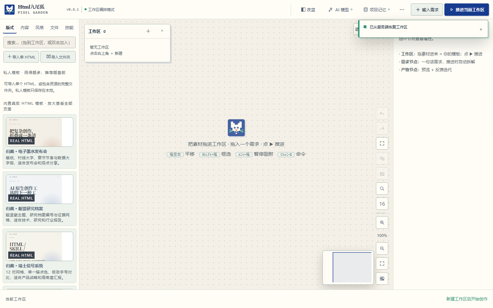<br><b>Workbench · surface hierarchy</b><br>Borders drop to 10/17/30% ink; icons settle at two sizes (16/20) with one 1.8 stroke.</td>
<td width="50%">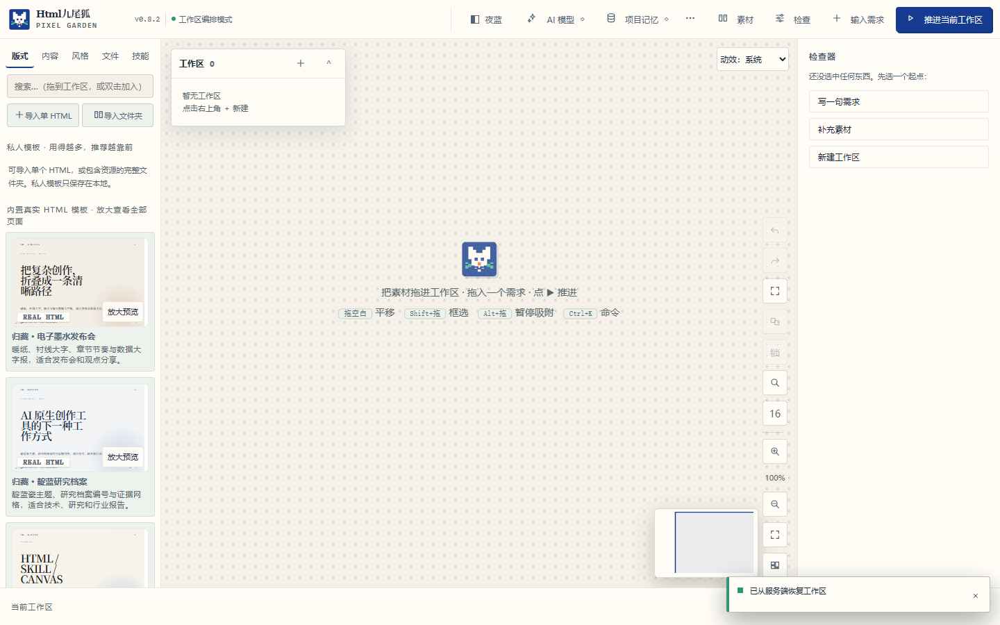<br><b>Empty states are starting points</b><br>One sentence plus three real entries — a gate clicks each one and asserts a panel opens.</td>
</tr>
</table>

- **Executable design contract**: `docs/design-contract.json` is checked both ways by `tests/test_design_contract.py`; sizes, radii, colours, spacing and the serif rule all fail loudly when they drift.
- **Button system**: 32 default / 36 top bar and dialogs / 40 on mobile; hover, active, disabled, busy and focus-visible are all explicit; one filled primary per view.
- **One motion clock**: instant 90 / feedback 140 / enter 180 / panel 200 / exit 140, every duration from a token; reduced motion measured at zero animations.
- **Accessibility**: the focus ring moved from clay (2.87:1 on paper, below the 3:1 minimum) to cobalt (9.92:1); icon-only buttons need a name and a 32×32 target.
- Gates: 14 design-contract, 5 surface, 8 motion, 4 button, 6 packaging; full suite 774 passed / 4 skipped, 5 mutation suites all caught.

## v0.8.1 · Word import: parse → proposal → adopt (v0.8.1 capability)

**Drop in a `.docx` and the workbench first shows how it understood the document — you edit the proposal, then it renders. Parsing is fully offline.**

<table>
<tr>
<td width="50%">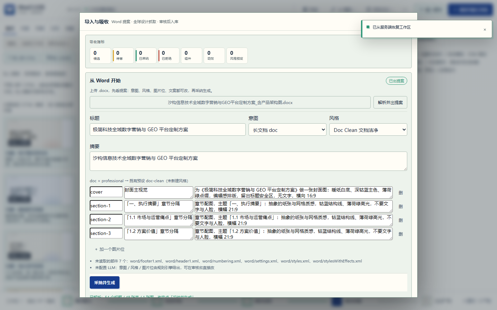<br><b>Review desk · the whole proposal</b><br>Intent, style, headline, summary and every image slot are editable; each recommendation carries its reason, and the parse limits sit on the same screen.</td>
<td width="50%">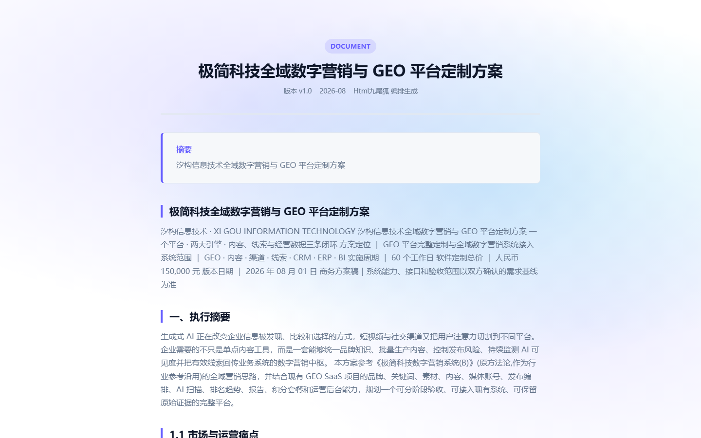<br><b>doc artifact · the document's own prose</b><br>A real 54-heading, 48-table business proposal becomes 45 sections and 25k+ characters; TOC lines and placeholders never leak in.</td>
</tr>
</table>

- Proposal before generation: rules first (labelled `rules` when no model is configured), a human approves, then it lands as a real project with revisions and exports.
- One contract (`intake_outline`) shared by parse, proposal and adoption — anything without a locator is rejected, and `limitations` travel with the proposal.
- No second rendering path: adoption feeds the existing `sections` block channel, so all six generators stay untouched.
- Limits shipped, not hidden: tables flatten to text, images stay assets, Word style sheets are not parsed.
- Gates: 56 DOCX gates (parse 11 · proposal 14 · adoption 13 · API 14 · schema 3 · browser 1), mutations 6/6 caught, full suite 741 passed / 4 skipped. See the [release notes](docs/RELEASE-NOTES-v0.8.1.md).

## v0.8.0 · Word export + paraphrase absorption (v0.8 mainline)

**The export matrix gains its Word cell: document-shaped artifacts become real .docx structure, and paraphrased blocks can be rewritten on demand.**

- Semantic mapping: h1–h6 → Heading 1–6, paragraphs, lists, tables, inline `data:` images with alt captions, quotes, rules, monospace blocks.
- An honest degradation list: external images are not fetched, CSS colours/fonts/layout are not mapped, unsupported container text is counted and reported.
- Visual intents get a 400 (`docx_intent_unsuited`) and the correct path instead of a malformed Word file.

## v0.7.0 · Page decomposition (v0.7 ability)

**Turn a real web page's sections into an editable project.**

<table>
<tr>
<td width="50%">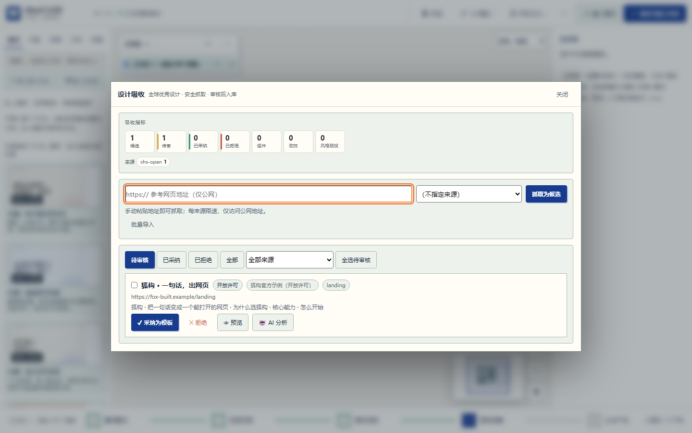<br><b>Paste a URL → review workbench</b><br>Candidates carry licence tags; open licences carry prose, reference-only carries structure.</td>
<td width="50%">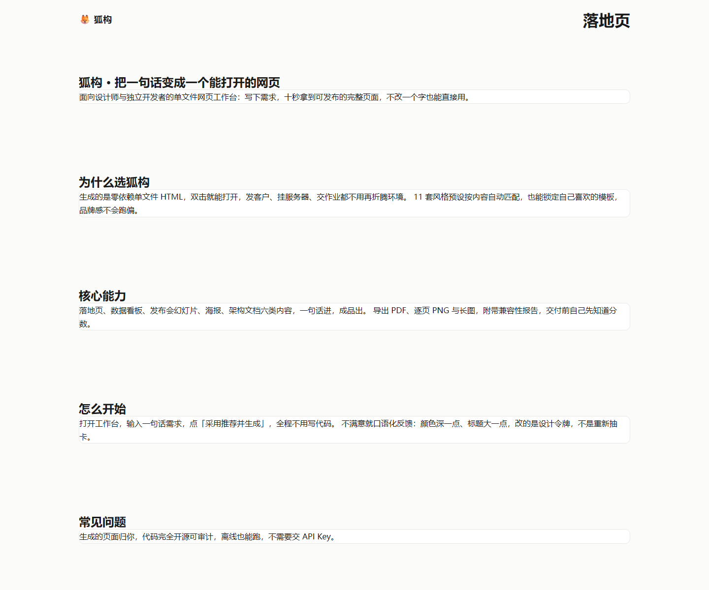<br><b>The sections you took → in the output</b><br>All six content types consume the block channel.</td>
</tr>
</table>

- `POST /api/intake/page-blocks` re-cuts an approved candidate into generation-ready blocks (nested sections included) — read-only, never written back.
- Copyright per field: only `open` carries prose; others contribute structure and the output falls back to its own copy.
- Gates: `596 passed / 2 skipped` on Windows (CI `597/1`), 16 mutation scripts all caught, browser 22/22, real-chain 15/15. See the [release notes](docs/RELEASE-NOTES-v0.7.0.md).

## Architecture

Generated with [Archify](https://github.com/tt-a1i/archify) — the interactive HTML ships with the repo: [docs/architecture-v070.html](docs/architecture-v070.html) (download and open locally to explore nodes, routes and the legend):

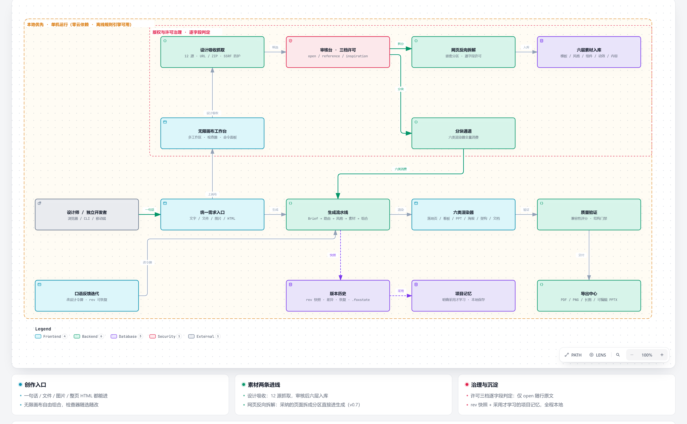

Screenshots for every module live on the [Chinese homepage](README.md) and in the [full archive](docs/HOMEPAGE-ARCHIVE.en.md).

| Module | Role |
|---|---|
| `intake.py` | Design intake: SSRF-guarded fetching (connection-level IP pinning), sources, review, page blocks |
| `pipeline.py` | Generation pipeline: brief → route → style → assets → compose → generate → verify, `.foxstate.json` state |
| `rules.py` + `generators/` | Offline rules engine and six renderers; all six consume the block channel |
| `server/app.py` | Zero-dependency local service: workbench API (intake / generate / feedback / revisions / export / slides) |
| `exporting.py` + `pptx_export.py` | PDF / PNG / long image + report; python-pptx mapped editable PPTX |
| `revisions.py` + `project_memory.py` | Revision snapshots and restore; learn-only-on-adoption local memory |

Full architecture: [docs/ARCHITECTURE.md](docs/ARCHITECTURE.md).

## Modules

| Module | In one line | Details |
|---|---|---|
| 🖼 Infinite-canvas workbench | Text, files, images, HTML templates on one canvas | [UI guide](docs/UI-GUIDE.md) |
| 🕸 Design intake | 12 built-in sources + URL/ZIP, human review, three-tier licence enforced in code | [v0.6.0 notes](docs/RELEASE-NOTES-v0.6.0.md) |
| 🔎 Page decomposition (new) | Adopted candidates decompose straight into generation | [v0.7.0 notes](docs/RELEASE-NOTES-v0.7.0.md) |
| 📊 Editable PPTX | Standard .pptx with real text frames; in-workbench slide editing | [Export centre](docs/EXPORT-CENTER.md) |
| 📤 Export centre | PDF / paginated PNG / long image + compatibility report | [Export centre](docs/EXPORT-CENTER.md) |
| 🧠 Memory + revisions | Learn only on adoption; everything snapshots | [full archive](docs/HOMEPAGE-ARCHIVE.en.md) |

## Quick start

```bash
pip install htmlninefox
htmlninefox app                   # http://127.0.0.1:8620
htmlninefox expert "Build a SaaS landing page"
```

Windows installer & portable (.exe/.zip), macOS Apple Silicon & Intel (.zip), Linux .deb / .tar.gz / .run, the pip wheel and Docker: all on the [**latest release**](https://github.com/KratosLee-6/Html-ninefox/releases/latest) (SHA-256 included; every artefact is booted in CI and byte-read back before publishing).

## Version history

| Version | Date | In one line |
|---|---|---|
| **v0.8.2** | 2026-10-20 | **Interface pass**: surfaces over outlines, button system, motion clock, empty states and icon scale; executable design contract |
| **v0.8.0** | 2026-10-17 | **DOCX semantic export**: doc/archdoc full-text / deck handout with honest degradation lists; paraphrased retry — the Word cell of the export matrix |
| **v0.7.8** | 2026-10-17 | **C6 closed**: all 106 inline onclick handlers migrated to data-action delegation with a typed signature table; also fixed the dead workspace-chip clicks the real-click gate exposed |
| **v0.7.7** | 2026-10-12 | **Rewrite absorption (paraphrased)**: with an LLM configured, reference pages' prose enters products in rewritten form (what you preview is what you get), gated by a fidelity check; offline behaviour unchanged |
| **v0.7.6** | 2026-10-12 | **Packaging matrix completed**: new macOS Intel portable and Linux .deb, both booted and verified for real, .deb in the byte-readback gate; app unchanged |
| **v0.7.5** | 2026-10-12 | **C7 closed**: the workbench's shared `state` gets a seven-key declared schema + read-only `FoxState`, locked by static bidirectional mirror, IIFE scope gate and an execution-level check; the structural backlog is now empty |
| **v0.7.4** | 2026-10-12 | **Structural patch**: C5 ExportError carries its status, C1 runner interfaces declare lock ownership, plus template rendering agreement (the jinja2 extra no longer hijacks landing generation) |
| **v0.7.3** | 2026-10-11 | **"Ink on paper" motion layer**: breathing light, ink titles, scroll reveal, cursor glow across all six outputs, with reduced-motion and export-settled paths |
| **v0.7.2** | 2026-10-09 | **Structural patch**: IntakeService extraction (P1-7) + candidate key unification (C8); zero behaviour change |
| **v0.7.1** | 2026-10-08 | **Experience fixes**: tablet stepper overflow, mobile badge hidden, landing card copy echo — each gated by CSS computed-style assertions |
| **v0.7.0** | 2026-10-07 | **Page decomposition**; three green-but-broken defects found by real-chain verification and fixed |
| v0.6.4 | 2026-10-06 | Gate hardening; artefacts re-hashed byte-for-byte before publishing |
| v0.6.0 | 2026-10-01 | Design intake pipeline + editable PPTX |
| v0.5.0 | 2026-09-25 | RC3 wrap-up, all-platform packages |

Full log: [CHANGELOG](CHANGELOG.md).

---

## 🙏 Credits & acknowledgements

Parts of this project are built on the following open-source work — credited here per licence requirements and courtesy (full source review in [DESIGN-SOURCES](docs/DESIGN-SOURCES.md)):

| Source | Licence | Used for |
|---|---|---|
| [Univer](https://github.com/dream-num/univer) (dream-num) | Apache-2.0 | The in-workbench slide editor (since v0.6) is built on Univer Slides |
| [python-pptx](https://github.com/scanny/python-pptx) (Steve Canny) | MIT | Server-side controlled mapping behind .pptx export |
| [huashu-art-motion](https://github.com/alchaincyf/huashu-art-motion) (Huashu) | MIT | The t2 keynote animation engine behind the v0.7.0 explainer film |
| [Archify](https://github.com/tt-a1i/archify) (tt-a1i) | MIT | The README architecture diagram is generated with Archify |
| [op7418/guizang-product-video-skill](https://github.com/op7418/guizang-product-video-skill) | AGPL-3.0 (methodology only; SFX are its original synthesized sounds, per its SOURCE.md) | Promo-film methodology; the `film/sfx` sounds originate there |
| [baoyu-slide-deck](https://github.com/JimLiu/baoyu-skills) (JimLiu) | MIT | Method reference for the v0.3 image-based PPT generator |
| [frontend-slides / beautiful-html-templates](https://github.com/zarazhangrui) (zarazhangrui) | MIT | The "avoid AI purple gradients, ship reliably" template philosophy |
| [edge-tts](https://github.com/rany2/edge-tts) | custom (non-standard) | Voice synthesis for the explainer film |
| GuiCang · Huashu Design · Archify and the wider community | — | Design methods and taste (itemised in [DESIGN-SOURCES](docs/DESIGN-SOURCES.md)) |

The long-form acknowledgements (with original citations) stay in [docs/HOMEPAGE-ARCHIVE.en.md](docs/HOMEPAGE-ARCHIVE.en.md#credits--acknowledgements).

[MIT License](LICENSE) © 2026 **KratosLee · Html九尾狐项目组**
