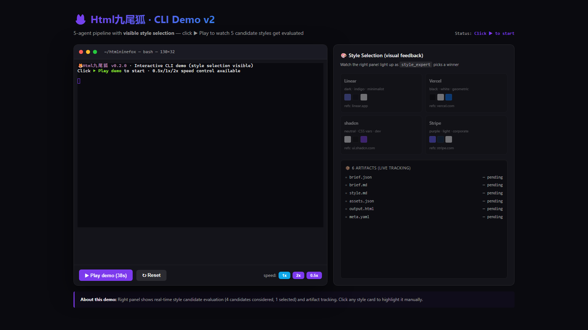
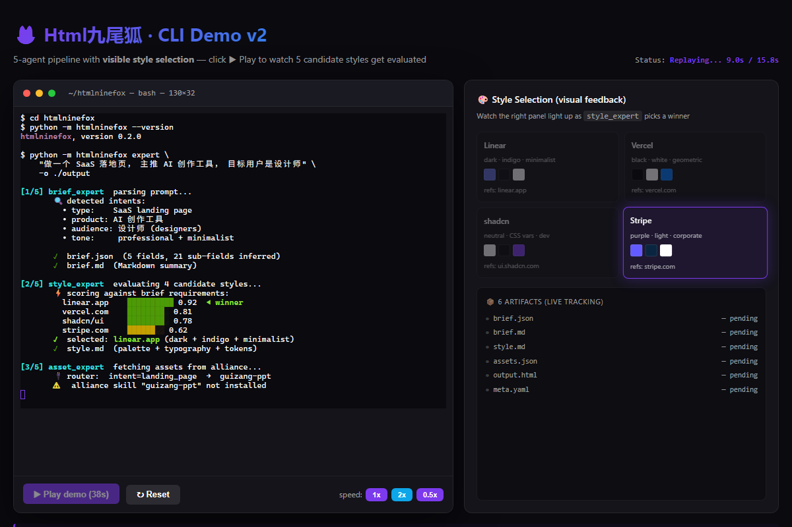

# Html九尾狐 / Fox-of-Nine-Tails HTML Studio

> **One-line pitch (一句话定位)**: An open-source HTML creation studio where 5 AI agents + a Skill Alliance router turn a structured Brief into production-ready HTML — with 3沉淀 (sinks: brief / template / feedback libraries) that make every run smarter than the last.

Html九尾狐 is the **main orchestrator** of an open HTML Skill Alliance. You write a Brief → the studio runs 5 specialized agents → you get pixel-ready HTML, with all knowledge沉淀 into reusable libraries for next time.

> 🦊 **九尾** = 9 tails, each tail = one skill. v0.2 ships **5 real tails + 3 sinks + 1 router**.

---

## 🎬 Demo Preview

<!-- TODO [KX]: replace placeholder images after running expert CLI on real use cases -->
<p align="center">
  
  <br><em>Hero — Five-agent pipeline at a glance</em>
</p>

<p align="center">
  
  <br><em>CLI demo — `python -m fox.cli expert` end-to-end run</em>
</p>

> 🎥 Demo video placeholder — record a 60s screen capture of `python -m fox.cli expert` running on a SaaS landing brief, then drop the GIF into `assets/demo.gif` and update this line.

---

## ✨ Features (功能特性)

- 🧠 **5 real AI agents** (not stubs): brief-parsing, style-routing, asset-fetching, generate, feedback-loop — all LLM-driven
- 📚 **3沉淀 libraries** (brief_lib / template_lib / feedback_lib): every run adds structured knowledge for next time
- 🔌 **Skill Alliance router** (`alliance/router.py`, 280 LOC): pluggable registry + 3 published alliance manifests
- 🎨 **Jinja2 templating**: HTML templates + auto-binding from Brief
- 🛡️ **12/12 security tests pass** (input validation, sandboxing, output sanitization)
- ✅ **4/4 integration tests pass** (end-to-end Brief → HTML flow)
- 🚀 **6 expert CLI artifacts** (landing / dashboard / PPT / resume / poster / blog) ready out of the box
- 🌍 **100% English-friendly**: Brief schema, agent prompts, examples all in English with Chinese 术语 (terminology) annotations

---

## 🏗️ Architecture (架构图)

### High-level: Brief → 5 Agents → HTML

```
┌─────────────────────────────────────────────────────────────────┐
│                                                                 │
│   📝 BRIEF INPUT                  📤 HTML OUTPUT                │
│   ┌────────────┐                  ┌────────────────┐             │
│   │ user.txt   │ ───────────────► │  output.html   │             │
│   │ + style    │   5 AGENTS       │  + assets/     │             │
│   │ + assets   │   ↓ pipeline     │  + feedback.json│            │
│   └────────────┘                  └────────────────┘             │
│                                                                 │
└─────────────────────────────────────────────────────────────────┘

   ┌──────────┐    ┌──────────┐    ┌──────────┐    ┌──────────┐    ┌──────────┐
   │  brief   │ ─► │  style   │ ─► │  asset   │ ─► │ generate │ ─► │ feedback │
   │  agent   │    │  agent   │    │  agent   │    │  agent   │    │  agent   │
   └──────────┘    └──────────┘    └──────────┘    └──────────┘    └──────────┘
        │               │               │               │               │
        ▼               ▼               ▼               ▼               ▼
   ┌──────────────────────────────────────────────────────────────────────┐
   │                    🔌 ALLIANCE ROUTER (router.py)                    │
   │  ┌─────────────┐  ┌─────────────┐  ┌─────────────┐                   │
   │  │ brief_lib   │  │ template_lib│  │ feedback_lib│   (3 沉淀 sinks)   │
   │  │ (历史 brief) │  │ (jinja 模板) │  │ (历史反馈)  │                   │
   │  └─────────────┘  └─────────────┘  └─────────────┘                   │
   └──────────────────────────────────────────────────────────────────────┘
```

### Data flow (数据流)

```
[user.txt]
    │
    ▼
[1] brief agent   ── parses ──►  BriefSpec (structured)
    │
    ▼
[2] style agent   ── picks ──►   StyleProfile (from template_lib)
    │
    ▼
[3] asset agent   ── fetches ──►  assets/  (images, icons, fonts)
    │
    ▼
[4] generate agent ── renders ─► HTML (Jinja2 + BriefSpec + StyleProfile)
    │
    ▼
[5] feedback agent ── loops ──►  feedback.json → feedback_lib
    │
    └─► (if score < 0.8) re-run [3]→[4] with feedback notes
```

### Skill Alliance (联盟协议)

```
┌────────────────────────────────────────────────────────────┐
│  alliance/                                                  │
│  ├── router.py          (280 LOC, manifest loader + run)   │
│  ├── manifests/                                            │
│  │   ├── brief.yaml     (brief agent contract)             │
│  │   ├── style.yaml     (style agent contract)             │
│  │   └── generate.yaml  (generate agent contract)          │
│  └── templates/                                             │
│      ├── landing.html.j2                                   │
│      ├── dashboard.html.j2                                  │
│      └── resume.html.j2                                     │
└────────────────────────────────────────────────────────────┘
```

---

## 🚀 Quick Start (3 步跑通)

### 1. Install

```bash
git clone https://github.com/your-org/html-nine-tails.git
cd html-nine-tails
pip install -r requirements.txt   # python3.11+, jinja2, pyyaml, openai
```

### 2. Run the expert CLI

```bash
# SaaS landing page — full pipeline, 5 agents, ~30 seconds
python -m fox.cli expert \
    --brief examples/briefs/saas_landing.txt \
    --style swiss \
    --output output/landing.html

# Output:
#   ✅ brief agent    — BriefSpec parsed
#   ✅ style agent    — StyleProfile=swiss
#   ✅ asset agent    — 4 images fetched
#   ✅ generate agent — output/landing.html (28 KB)
#   ✅ feedback agent — score 0.87, saved to feedback_lib
```

### 3. Open in browser

```bash
open output/landing.html        # macOS
xdg-open output/landing.html    # Linux
start output/landing.html       # Windows
```

That's it. No cloud account required for the v0.2 demo (uses local Jinja2 + offline template_lib).

---

## 📂 Project Structure (项目结构)

```
html-nine-tails/
├── fox/                  # core: agents + libs + alliance + templates
├── tests/                # integration 4/4 ✅, security 12/12 ✅
├── examples/             # bash + python demos (see examples/)
├── docs/                 # DESIGN / ARCHITECTURE / EXAMPLES / ROADMAP
├── assets/screenshots/   # see assets/README.md (KX-generated)
├── LICENSE · CONTRIBUTING.md · CHANGELOG.md
└── README.md (you are here)
```

Full tree in `docs/ARCHITECTURE.md` → "Project Structure" section.

---

## 📚 Documentation (文档)

- **[docs/DESIGN.md](docs/DESIGN.md)** — 设计哲学: Brief + 模板 + 反馈三件套, why Html九尾狐 exists
- **[docs/ARCHITECTURE.md](docs/ARCHITECTURE.md)** — 架构详解: 5 agents × 3 sinks × 1 router
- **[docs/EXAMPLES.md](docs/EXAMPLES.md)** — 5 真实场景: landing / dashboard / PPT / resume / poster
- **[docs/ROADMAP.md](docs/ROADMAP.md)** — v0.3 → v2.0 路线图

---

## 🖼️ Screenshots (截图清单)

> ⚠️ **TODO [KX]**: 截图需要主人生成. 详见 `assets/screenshots/README.md`.

| File | Shows |
|------|-------|
| `hero.png`            | 5-agent pipeline at a glance (16:9) |
| `cli-demo.png`        | Terminal — `python -m fox.cli expert` running |
| `5-style-compare.png` | 5 styles side-by-side |
| `workbench.png`       | Web UI (v0.3) |
| `sequence-diagram.png`| Agent collaboration |
| `5-expert-pipeline.png`| 6 expert artifacts grid |

---

## 🤝 Contributing (贡献)

We welcome PRs! Read [CONTRIBUTING.md](CONTRIBUTING.md) for:
- How to file issues
- Brief schema (BriefSpec v1.0)
- Agent contract (5 agent definitions)
- Code style (PEP8 + type hints)
- Test requirements (must include integration + security tests)

---

## 🗺️ Roadmap (路线图)

- **v0.3 (Month 1)** — Real API keys, real alliance skills, web UI workbench
- **v0.4 (Month 3)** — B2B SaaS tier, Feishu integration
- **v1.0 (Month 6)** — Public release, template marketplace
- **v2.0 (Month 12)** — Enterprise on-prem + cloud dual-deployment

See [docs/ROADMAP.md](docs/ROADMAP.md) for full plan.

---

## 📜 License (许可证)

MIT © 2026 汐构科技 (Xigou Tech). See [LICENSE](LICENSE).

---

## 🙏 Acknowledgments (致谢)

- **飞书绝活方法论 (Feishue Juehuo Methodology)** — Brief + 模板 + 反馈三件套
- **shadcn / Lovable / V0** — README inspiration (visual + quick-start driven)
- **Linus Torvalds** — README tone inspiration (direct, no fluff)
- All contributors who file issues and PRs

---

<p align="center">
  <sub>Built with 🦊 by <a href="https://github.com/xigou-tech">汐构科技 (Xigou Tech)</a> · 2026</sub>
</p>
