<div align="center">
  
  <h1>Html九尾狐 · HTML 创作工作台</h1>
  <p><strong>把文字、文件、图片和散落的 HTML 模板放进一张无限画布，经过分析、推荐、自由组合与反馈迭代，生成真正可交付的单文件 HTML。</strong></p>
  <p>个人开源项目 by <a href="https://github.com/KratosLee-6">KratosLee</a> · 默认中文 · 离线规则引擎可用 · AI 可选增强</p>
  <p><strong>简体中文</strong> · <a href="README.en.md">English</a></p>
</div>

<div align="center">

[](https://github.com/KratosLee-6/Html-ninefox/releases/tag/v0.5.0rc3)
[](https://github.com/KratosLee-6/Html-ninefox/releases/tag/dsh-htmlninefox-v0.1.0-preview.1)
[](https://github.com/KratosLee-6/Html-ninefox/actions/workflows/build-release-packages.yml)
[](https://github.com/KratosLee-6/Html-ninefox/actions/workflows/test.yml)
[](docs/ITERATION-RC3-C-20260924.md)
[](docs/test-evidence/v0.4.2-chromium-e2e.txt)
[](pyproject.toml)
[](LICENSE)

</div>

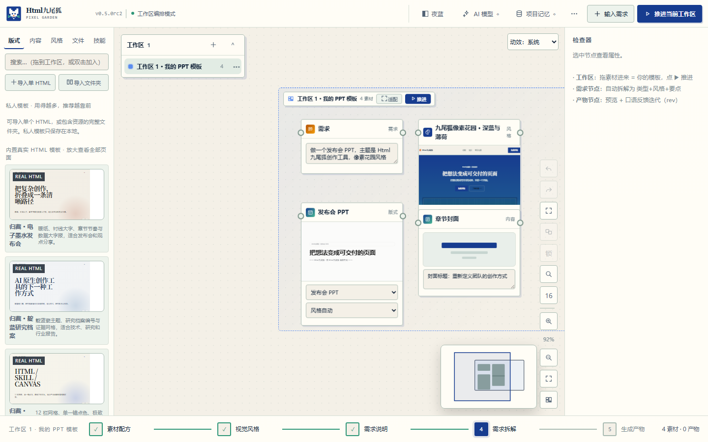

## 它解决什么问题

很多 HTML、设计模板、参考文件和 AI Skill 散落在不同目录里。传统生成工具又常常只给出模板名字或线框，让人必须“猜”最终效果。

Html九尾狐把创作路径收束成一条可视化流程：

```text
文字 / 文件 / 图片 / HTML
          ↓
      AI 或离线规则分析
          ↓
  推荐内容类型 + 真实模板 + 页面组合
          ↓
A. 采用推荐直接生成
B. 进入无限画布，自定义组合版式 / 内容 / 风格 / 文件 / Skill
          ↓
      生成单文件 HTML
          ↓
  导出 PDF / 逐页 PNG / 长图 + 兼容性报告
          ↓
  用自然语言反馈，按版本继续迭代
```

## 当前版本与 main 最新进展（2026-09-24）

当前应用包版本为 `0.5.0rc3`，对应预发布标签 `v0.5.0rc3`；稳定版仍是 `v0.4.2`。本次 RC3 预发布包含工程基线、共享测试 server fixture，以及 Pixel Garden 视觉与交互收敛；Windows、Linux 与 Python 安装包由同名标签工作流构建。

| 轨道 | 当前状态 | 查看 |
|---|---|---|
| 应用 Release | `v0.5.0rc3` 预发布版，可直接下载安装 | [下载与发布说明](https://github.com/KratosLee-6/Html-ninefox/releases/tag/v0.5.0rc3) |
| `main` 最新增量 | RC3-C 已完成：Generation、Feedback、Restore 与 Export 经过共享 `StudioApplication`；CLI 新增 Restore 命令 | [RC3-C 记录](docs/ITERATION-RC3-C-20260924.md) · [架构](docs/ARCHITECTURE.md) |
| RC3-C 应用用例复验 | `221 passed, 1 skipped`；四类应用 seam `20 passed`；JavaScript、Chromium `22/22`、DSH `2/2` 通过 | [本轮记录](docs/ITERATION-RC3-C-20260924.md) · [main Actions](https://github.com/KratosLee-6/Html-ninefox/actions?query=branch%3Amain) |
| DeepSeek Harness 插件 | `0.1.0-preview.1`，独立于应用版本 | [插件预览版](https://github.com/KratosLee-6/Html-ninefox/releases/tag/dsh-htmlninefox-v0.1.0-preview.1) |

### RC3 视觉与交互收敛（2026-09-24）

本轮使用 RealDesign `design-to-product` 对现有品牌、页面、组件和动效进行产品化收敛，没有引入另一套示例品牌。工作台继续使用原生 HTML / CSS / JavaScript，保留 Pixel Garden 的纸张底色、钴蓝、薄荷绿和陶土橙；动效继续使用 CSS 与 Web Animations API。

| 收敛方向 | 已落地内容 |
|---|---|
| 信息架构 | 顶栏只保留“输入需求”和“推进当前工作区”两项主动作；诊断、经典模式、安装和新建工作区收入“更多”菜单 |
| 响应式 | `>1180px` 完整三栏，`901–1180px` 检查器抽屉，`621–900px` 素材与检查器双抽屉，`≤620px` 切换为可读的移动任务视图 |
| 画布层级 | 缩放低于 `0.78` 时显示节点摘要，`0.78–1` 为紧凑层级，`≥1` 展示完整表单、预览与编辑内容 |
| 组件系统 | 主按钮、焦点环、选中/忙碌/成功/错误状态统一；主要 Unicode 图标替换为本地 SVG，Logo 继续使用项目原有像素狐狸 |
| 经典模式 | 黑紫/青色旧视觉迁回 Pixel Garden Token，并统一 Logo、标题、表单和键盘焦点反馈 |

<table>
<tr>
<td width="50%"><br><b>桌面工作台</b><br>清晰的三栏层级、双主动作和画布状态反馈。</td>
<td width="50%">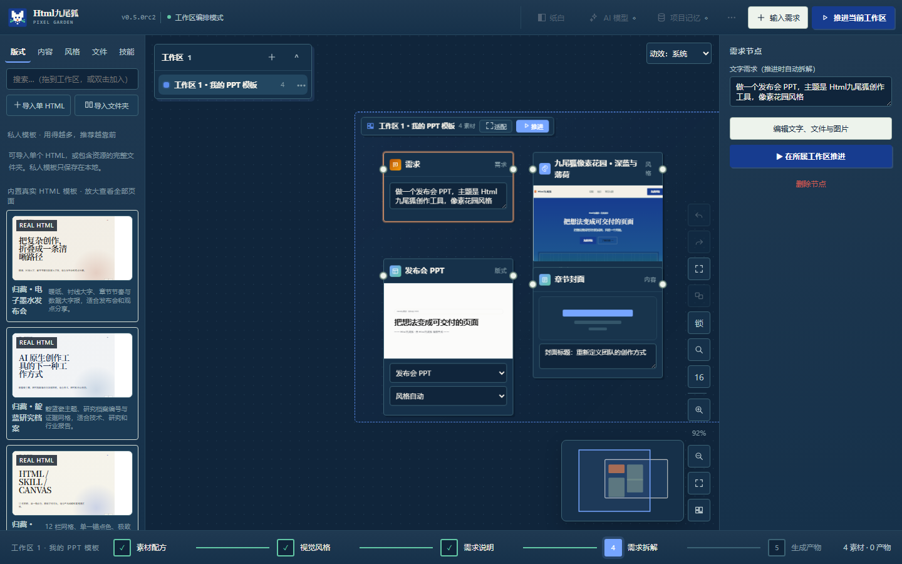<br><b>夜蓝主题</b><br>保留同一组件层级与品牌语义色。</td>
</tr>
<tr>
<td width="50%">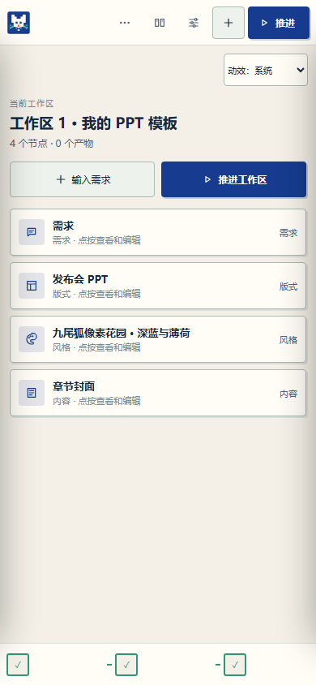<br><b>移动任务视图</b><br>以工作区动作和节点列表替代不可读的缩小画布。</td>
<td width="50%">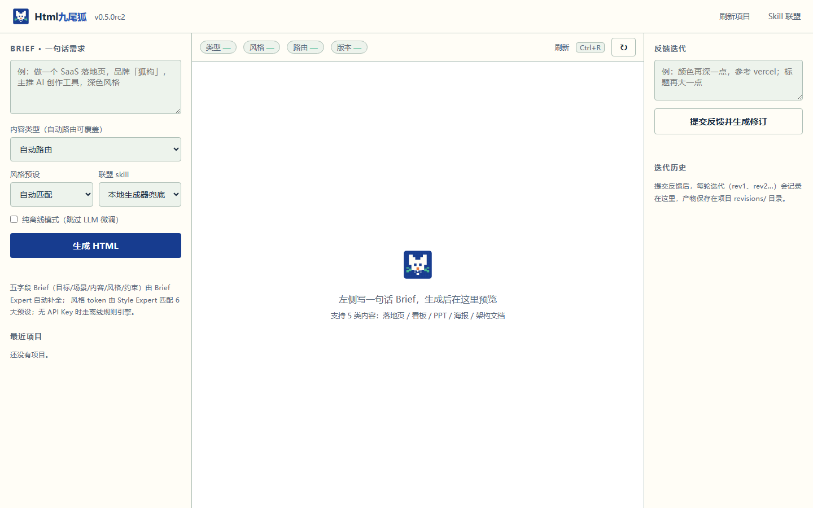<br><b>经典表单模式</b><br>快速生成入口与工作台使用同一品牌系统。</td>
</tr>
</table>

### 四项状态证据补齐

<table>
<tr>
<td width="50%">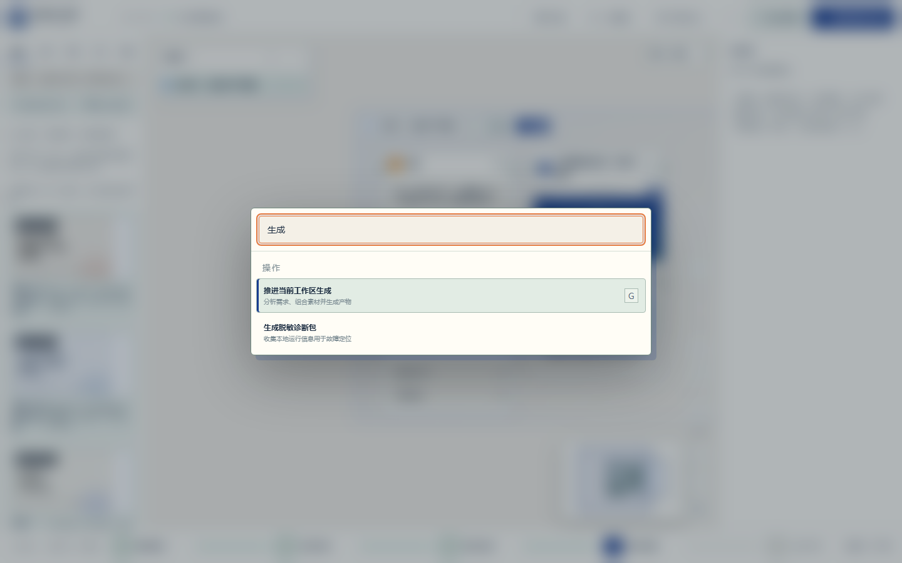<br><b>命令面板</b><br>键盘打开、输入搜索、活动项和快捷键提示。</td>
<td width="50%">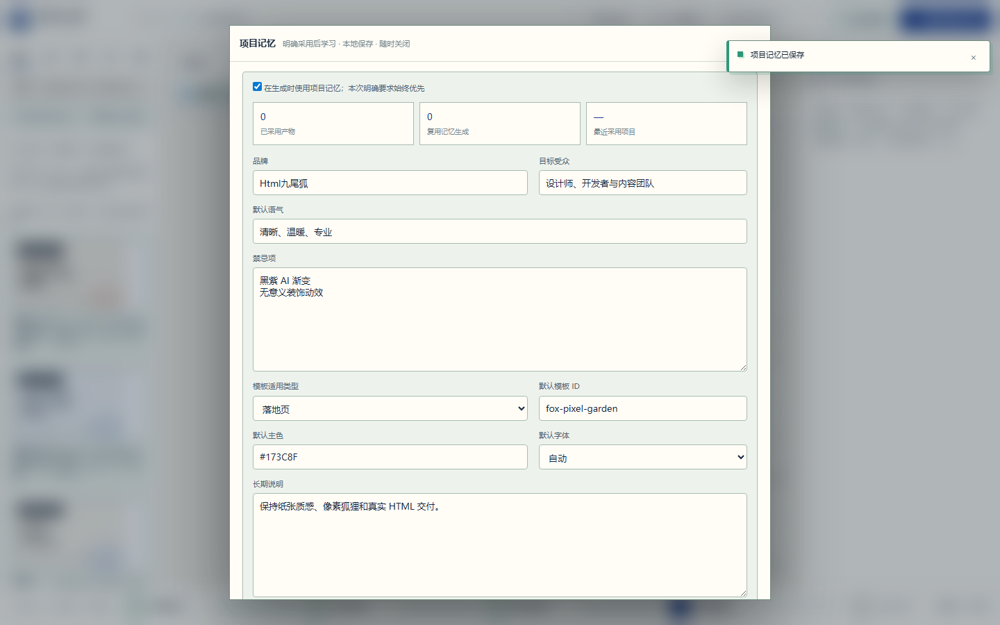<br><b>项目记忆</b><br>真实保存品牌、受众、语气、禁忌、模板与长期说明，并显示成功状态。</td>
</tr>
<tr>
<td width="50%">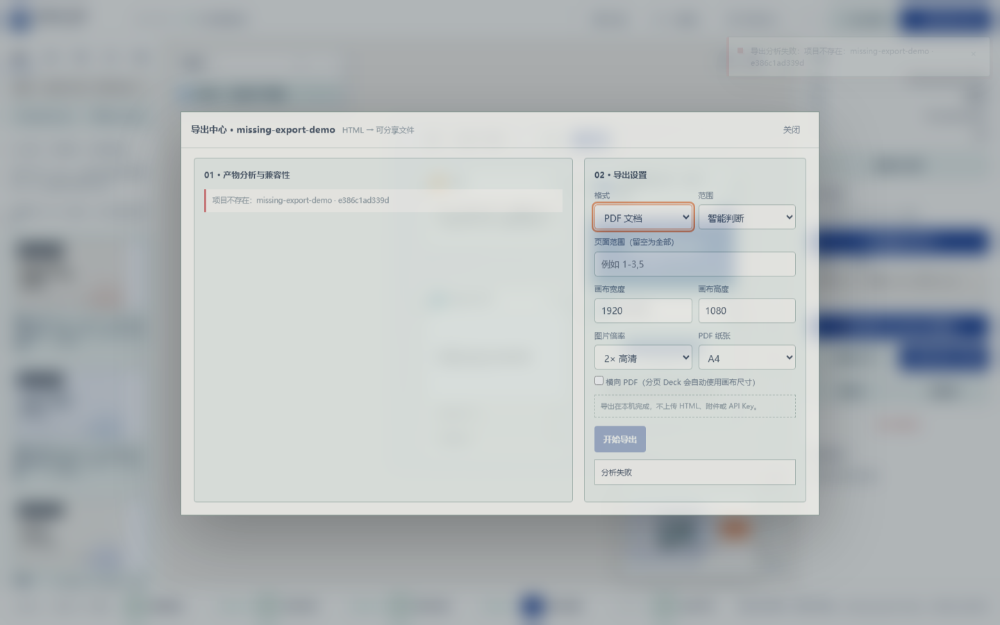<br><b>可控错误</b><br>服务端返回项目不存在，导出按钮禁用，错误面板与 Toast 同步反馈。</td>
<td width="50%">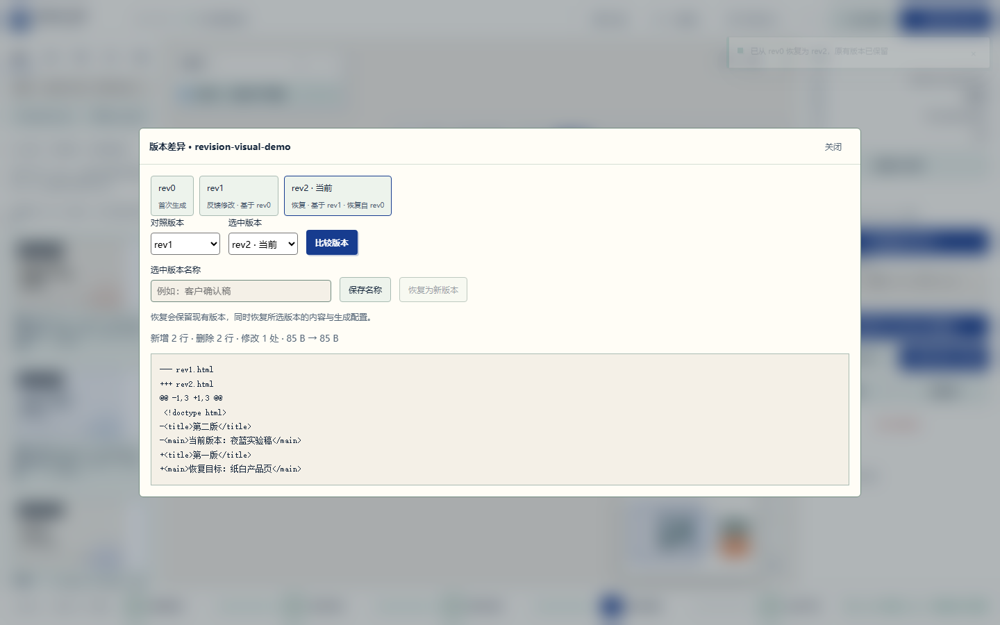<br><b>版本恢复</b><br>真实把 rev0 恢复为新的 rev2，原版本保留并显示恢复来源与成功 Toast。</td>
</tr>
</table>

RC3 截图集现包含 14 张真实页面和状态证据，完整清单见[本轮迭代记录](docs/ITERATION-RC3-VISUAL-CONVERGENCE-20260924.md)。

### v0.5.0 RC2 已发布基线（2026-09-18）

RC2 已将 Project Memory、版本历史与恢复、原生动效、100 节点验收和无障碍增量合并为可安装的应用预发布版。

| 增量 | 已完成内容 | 入口与记录 |
|---|---|---|
| 版本历史与恢复 | 每次反馈、重跑和恢复保留 HTML + 生成状态快照；支持命名、源码差异、父版本与恢复来源；恢复会生成新版本，不覆盖历史 | [RC2 迭代记录](docs/ITERATION-RC2-20260918.md) · [测试报告](docs/TEST-REPORT-RC2-20260918.md) |
| 并发、兼容与无障碍 | 过期恢复返回版本冲突；原子文件替换与失败回滚；兼容旧 HTML-only 历史；弹窗 Tab 循环、Escape 焦点恢复、390px 手机布局 | [版本 API 与边界](docs/ITERATION-RC2-20260918.md#http-v1-增量) |
| 100 节点画布验收 | 100 个节点 / 99 条连线覆盖渲染、框选、整体移动、保存和数量一致性；这是操作耗时门禁，不宣称 60fps | [实测 JSON](docs/test-evidence/motion-20260918/canvas-100-nodes.json) |
| 原生动效系统 | 系统 / 减少 / 关闭三档偏好；可取消动画、并发预算、离屏跳过、重试竞态清理、阶段提示合并；`/motion-lab` 提供六类样例 | [动效交付记录](docs/ITERATION-MOTION-20260918.md) · [动效计划](docs/MOTION-PLAN-v0.5.md) |
| DeepSeek Harness | 原生 Cordis `dsh.bundle` 注册 `htmlninefox` 技能，复用 CLI 完成生成 → 反馈 → PDF / PNG；发布 tarball、SHA-256 和 `dsh-plugin` topic | [下载插件](https://github.com/KratosLee-6/Html-ninefox/releases/tag/dsh-htmlninefox-v0.1.0-preview.1) · [安装说明](integrations/deepseek-harness/README.md) |

### 本轮真实截图

<table>
<tr>
<td width="50%">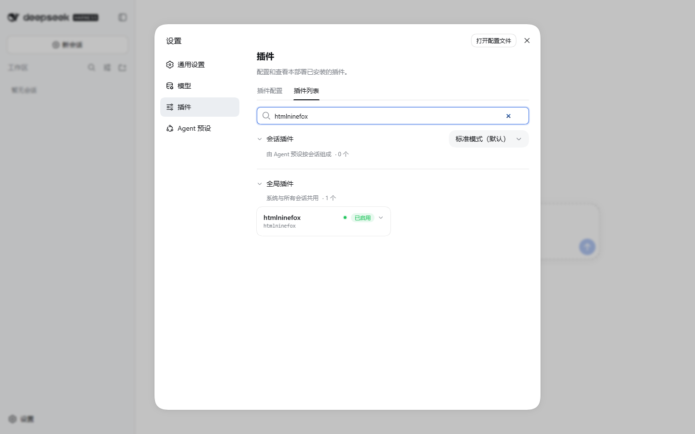<br><b>DSH 插件已启用</b><br>最终 tarball 安装进新的 Web profile；插件列表显示 htmlninefox 为全局插件并处于启用状态。</td>
<td width="50%">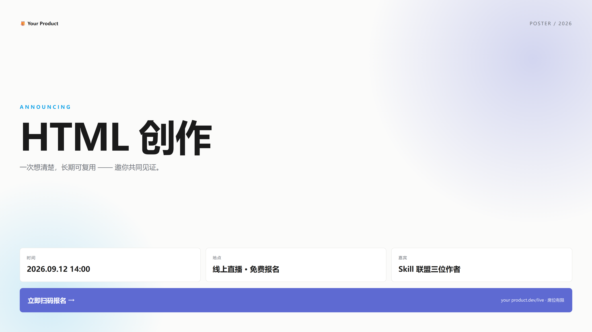<br><b>生成、修改与导出链路</b><br>离线生成中文海报，执行 dry-run 与真实反馈，再导出 PDF 和完整 PNG；兼容性报告 100 分。</td>
</tr>
<tr>
<td width="50%">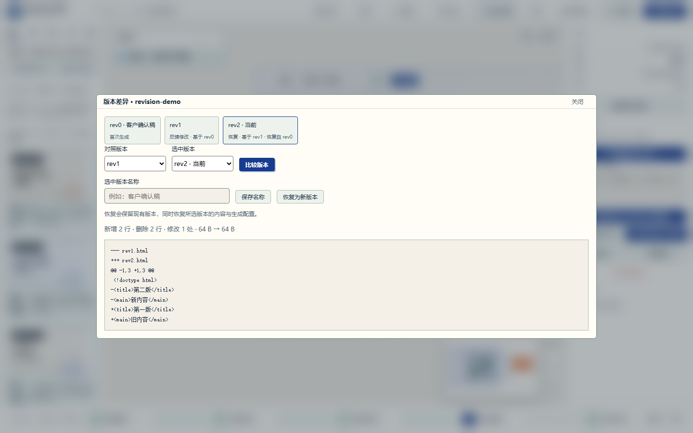<br><b>版本历史与恢复</b><br>查看父版本、恢复来源、命名与源码差异，历史版本恢复为新版本。</td>
<td width="50%">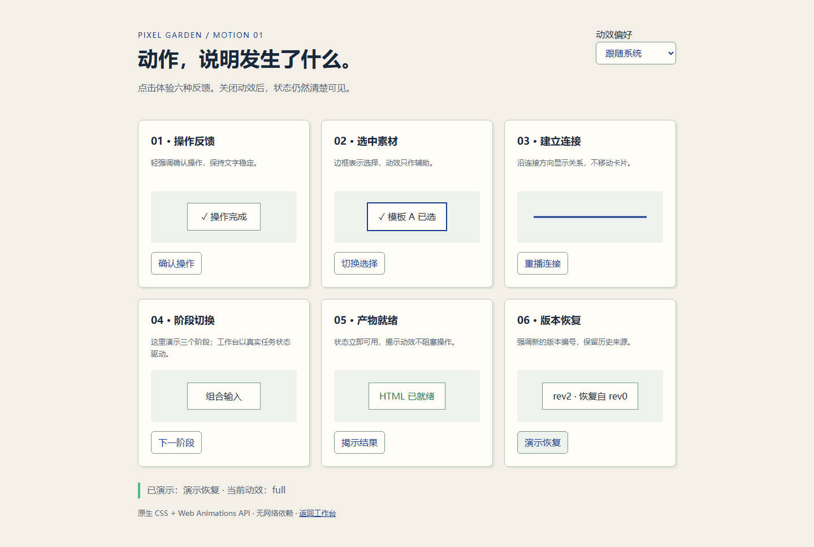<br><b>动效实验室</b><br>操作反馈、选中素材、建立连接、阶段切换、产物就绪与版本恢复六类动效。</td>
</tr>
</table>

### 最新验证结果

| 验证 | 结果 | 证据 |
|---|---:|---|
| 当前分支本地全量 Python / HTTP / Chromium | **221 passed，1 skipped，110.99 秒** | [RC3-C 迭代记录](docs/ITERATION-RC3-C-20260924.md) |
| Generation / Feedback / Restore / Export request-result 与 Adapter 契约 | **20 passed** | [同一记录](docs/ITERATION-RC3-C-20260924.md) |
| `main` GitHub CI | **以最新 Actions 为准** | [查看 main Actions](https://github.com/KratosLee-6/Html-ninefox/actions?query=branch%3Amain) |
| Chromium 生成、反馈、画布与导出验收 | **22 / 22 通过** | [RC3-C 迭代记录](docs/ITERATION-RC3-C-20260924.md) |
| DSH 插件注册、重载、卸载、tarball 独立安装 | **2 / 2 通过** | [插件测试](integrations/deepseek-harness/test/plugin.test.js) |
| 本机动效与竞态专项 | **196 passed，1 skipped** | [动效测试日志](docs/test-evidence/motion-20260918/pytest.txt) |
| 发布附件回读与 SHA-256 | **一致** | [发布记录](docs/DEEPSEEK-HARNESS-INTEGRATION.md#正式执行插件预览发布2026-09-18) |

当前限制：没有完成 Safari / WebView2 实机、跨进程并发写入与断电事务恢复，也没有用真实模型验收 DSH 对话自动选用技能。DSH 首版是技能工作流，尚未提供专用工具卡片或聊天内 HTML 预览。

## RC3 架构加固：共享 Generation 用例已完成（2026-09-24）

项目已按 [`mattpocock/skills`](https://github.com/mattpocock/skills) 的 research、domain-modeling、codebase-design、TDD 与 code-review 方法推进。RC3-A、RC3-B1、视觉收敛、RC3-B2 Generation 及 RC3-C Feedback / Restore / Export 应用用例均已完成；当前重点转向 durable Project commit、跨进程锁和崩溃恢复。

| 优先级 | 结论 | 当前状态 / 下一步 |
|---|---|---|
| P0 | 旧架构与贡献指南仍描述早期目录和门禁 | 已更新当前架构、领域词汇和真实测试命令 |
| P1 | HTTP handler 同时承担 transport 与业务编排 | Generation、Feedback、Restore 与 Export 已迁入共享 `StudioApplication`；下一步统一 Project commit |
| P1 | 多套文件写入规则并存，跨进程和断电事务未闭环 | 统一 durable write、Project commit、锁与崩溃恢复测试 |
| P2 | 工作台状态仍集中在大页面 | 按 Project、Generation、Revision、Export 生命周期拆分 |
| P2 | 多个浏览器测试重复启动本地 server | 共享 pytest fixture 已完成；本轮继续增加视觉、响应式和可访问性门禁 |

完整证据与阶段门槛见 [工程审计报告](docs/AUDIT-MATTPOCOCK-20260920.md)、[上游技能研究](docs/research/MATTPocock-SKILLS-AUDIT-20260920.md)、[RC3-C 迭代记录](docs/ITERATION-RC3-C-20260924.md)、[v0.5.0 正式版计划](docs/PLAN-v0.5.0-STABLE-20260924.md)和 [RC3 架构加固计划](docs/ITERATION-PLAN-POST-RC2-20260920.md)。动效仍沿用[动效执行方案](docs/MOTION-PLAN-v0.5.md)，并作为生命周期反馈进入前端 Module 迭代。

## v0.5.0 RC 系列核心能力

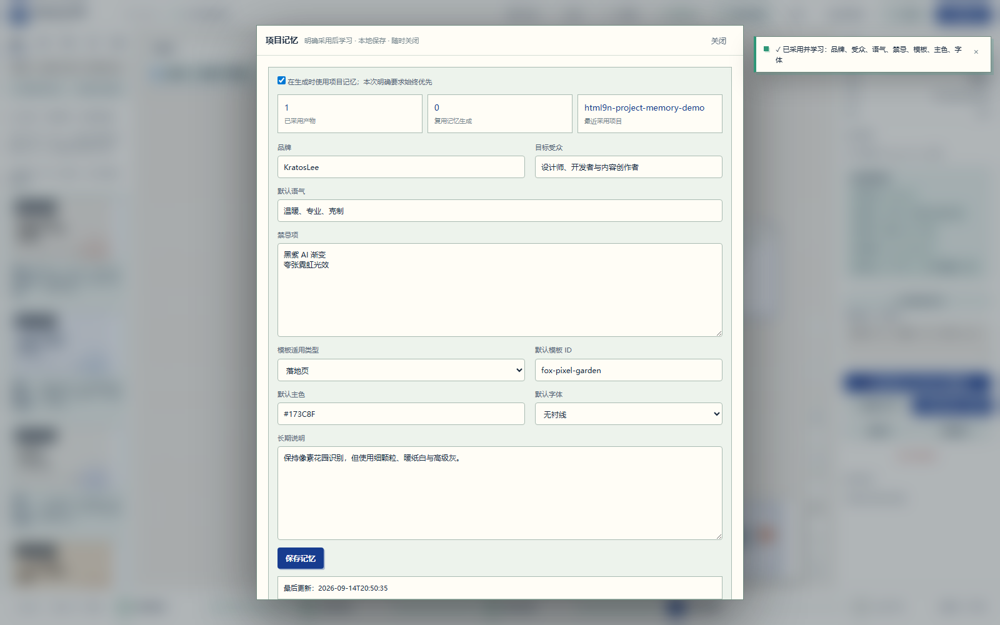

- **🧠 Project Memory**：品牌、受众、语气、禁忌、模板、主色和字体保存在本地，可查看、编辑、关闭或清空。
- **♡ 明确采用后学习**：只有在产物检查器点击“采用此版本并学习”才会进入长期记忆，测试稿和失败稿不会污染偏好。
- **🔎 可解释复用**：分析、Recipe Run 和产物检查器会显示本次复用了什么，以及哪些记忆被本次明确要求覆盖。
- **🔒 隐私边界**：不把 API Key、附件正文或完整反馈原文写入长期记忆。
- **✅ RC1 验收**：179/179 Python、API、存储、安全与 Chromium 浏览器测试通过。

> RC1 建立本地项目记忆闭环；RC2 在其上加入版本历史、恢复、100 节点门禁、键盘操作和用户可控动效。

## 工作台完整能力

- **📤 Export Center**：产物节点直接导出 PDF、逐页 PNG 或完整长图，支持页码范围、画布尺寸、1x/2x/3x 和兼容性报告。
- **✅ 可信发布链路**：版本、CLI、API、安装包、Docker 标签、测试证据和 Git 标签保持一致。
- **🎨 Pixel Garden 设计系统**：深钴蓝 `#173C8F` + 薄荷绿 `#49B894` + 暖纸白 `#F4F0E7` 统一设计令牌，5 大视觉产物一致体验。
- **🤖 真实 LLM 接入**：MiniMax-M3 / Claude / GPT-4o 三家 API，环境变量自动配置，离线规则引擎兜底。
- **🖥️ Web 工作台**：`htmlninefox workbench` 一键启动本地 Web UI，实时预览 + 智能体日志 + 模板选择。
- **🐳 Docker 镜像**：`docker run htmlninefox` 跨平台部署，多阶段构建，compose.yaml 注入环境变量。
- **真实 HTML 模板库**：6 套完整模板、34 个可单独预览和抽取的页面，不再只展示线框。
- **统一需求入口**：支持文字、TXT、Markdown、JSON、CSV、HTML 和常见图片。
- **推荐与自由组合双路径**：可以直接接受推荐，也可以在工作区拖入版式、页面、风格、文件和 Skill。
- **无限画布工作区**：支持整体拖动、重命名、独立颜色、多工作区导航、吸附和端口连线。
- **AI 模型自主配置**：支持 OpenAI-compatible、Ollama 和自定义兼容接口；API Key 只保存在本地。
- **离线可用**：没有 API Key 时继续使用确定性的规则引擎，不阻塞生成。
- **反馈迭代**：自然语言反馈转成设计 Token 修改并重渲染，保留 `rev1 / rev2 / ...` 历史。
- **跨平台使用**：Windows 便携包/安装器、Linux `.run/.tar.gz`、Python CLI、Web/PWA、Docker。

> [Export Center](docs/EXPORT-CENTER.md) 已完成 PDF / PNG 第一阶段。下一阶段提供高保真 PPTX，再推进受控范围内的可编辑 PPTX / DOCX。
- 🎨 **Multiple PPT styles via Skill Alliance** (v0.3): baoyu-slide-deck (image) · frontend-slides (HTML, no AI gradient) · beautiful-html-templates (28 stable presets)

## 看得见的真实效果

<table>
<tr>
<td width="50%"><br><b>Pixel Garden 统一设计</b><br>5 大视觉产物统一为深钴蓝 + 薄荷绿 + 暖纸白，杂志感与像素识别并存。</td>
<td width="50%"><br><b>Web 工作台</b><br>htmlninefox workbench 一键启动，实时预览 + 智能体日志 + 模板选择。</td>
</tr>
<tr>
<td width="50%"><br><b>真实 LLM 接入</b><br>MiniMax-M3 / Claude / GPT-4o 三家 API，环境变量自动配置，离线兜底保留。</td>
<td width="50%"><br><b>Docker 一键部署</b><br>docker run htmlninefox 跨平台运行，多阶段构建，环境变量注入。</td>
</tr>
</table>

### 导出中心

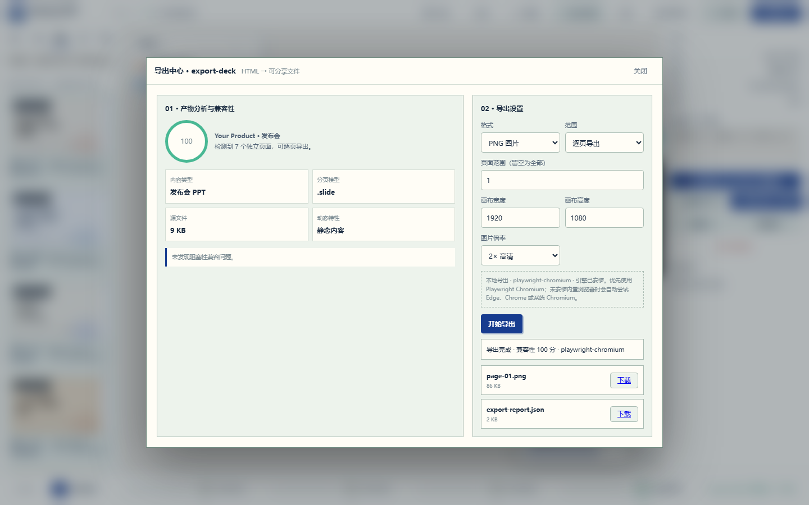

产物节点可直接选择 PDF、逐页 PNG 或完整长图；导出前显示分页识别、兼容性评分、动态内容与网络资源风险，导出后提供文件和 `export-report.json`。

### 六类真实产物

| 落地页 | 数据看板 | 发布会 PPT |
|---|---|---|
|  |  |  |

| 海报 | 架构文档 |
|---|---|
|  |  |

## 下载与安装

应用安装包请前往 [v0.5.0rc3 Release](https://github.com/KratosLee-6/Html-ninefox/releases/tag/v0.5.0rc3)。这是应用预发布版；稳定版本仍为 [v0.4.2](https://github.com/KratosLee-6/Html-ninefox/releases/tag/v0.4.2)。DeepSeek Harness 插件使用[独立预览版](https://github.com/KratosLee-6/Html-ninefox/releases/tag/dsh-htmlninefox-v0.1.0-preview.1)，不要把插件版本当成应用版本。

| 平台 | 推荐文件 | 使用方式 |
|---|---|---|
| Windows 10/11 | `HtmlNineFox-Setup-0.5.0rc3.exe` | 安装到当前用户，创建开始菜单入口 |
| Windows 10/11 | `HtmlNineFox-Windows-x64-0.5.0rc3.zip` | 解压后运行 `HtmlNineFox.exe`，免安装 |
| Linux | `HtmlNineFox-Linux-0.5.0rc3.run` | `chmod +x` 后运行，安装到当前用户目录 |
| Linux/审计 | `HtmlNineFox-Linux-0.5.0rc3.tar.gz` | 可查看完整安装内容 |
| Python 3.10+ | `htmlninefox-0.5.0rc3-py3-none-any.whl` | `python -m pip install ./htmlninefox-0.5.0rc3-py3-none-any.whl` |
| Docker | 源码构建 | `docker compose up --build`；标签 CI 验证镜像但不上传镜像仓库 |

### 快速开始

```bash
# 1. 安装（任选其一）
pip install htmlninefox
# 或下载 release 包
# 或 docker run htmlninefox

# 2. 配置 LLM（可选，离线也可用）
export MINIMAX_API_KEY="***"
# 或 export OPENAI_API_KEY="***"
# 或 export ANTHROPIC_API_KEY="***"

# 3. 启动 Web 工作台
htmlninefox workbench
# 打开 http://127.0.0.1:8620

# 4. 或 CLI 直接生成
htmlninefox expert "做一个 SaaS 落地页"
```

### 从源码运行

```bash
git clone https://github.com/KratosLee-6/Html-ninefox.git
cd Html-ninefox

# 推荐：uv
uv sync
uv run htmlninefox app

# 或传统 Python
python -m pip install -e .
htmlninefox app
```

浏览器默认打开本地工作台。也可以使用：

```bash
htmlninefox expert "做一个 AI 产品发布会 PPT"
htmlninefox expert --type landing --template fox-pixel-garden "创作工具官网"
htmlninefox feedback --project output/html9n-<时间戳> --note "标题更大，颜色更稳重"
htmlninefox restore --project output/html9n-<时间戳> --revision 0 --expected-revision 2
htmlninefox export output/html9n-<时间戳> --format png --scope long
```

完整说明：[安装指南](docs/INSTALL.md) · [多种运行方式](docs/RUNNING-OPTIONS.md) · [UI 手册](docs/UI-GUIDE.md) · [VI 手册](docs/VI.md)

## 模板、内容与视觉系统

### 真实模板作品库

- 归藏 · 电子墨水发布会：6 页
- 归藏 · 靛蓝研究档案：6 页
- 归藏 · 瑞士信号系统：6 页
- 归藏 · 牛皮纸品牌故事：6 页
- 归藏 · 沙丘作品集：5 页
- 九尾狐 · 像素花园产品页：5 页

共 **6 套 / 34 页**，均为 Html九尾狐原创演示；采用归藏式编辑设计方法启发，没有复制许可不明的第三方模板。

### v0.4 开发预览：私人模板资产库

- 在“版式”栏导入一个独立 HTML，或导入包含 CSS、JavaScript、图片和字体的完整文件夹。
- 自动识别多 HTML 页面、`data-page`、`.page` 与 `.slide`，并提取页面角色、常见颜色和字体。
- 私人模板仅保存在当前输出目录的 `.library/gallery/`，不会自动提交到 Git 仓库。
- 生成时会使用导入模板的页面结构与视觉 Token；使用次数会成为下一次推荐信号。
- 画布支持撤销/重做、Shift 框选、多选移动、组合、锁定、小地图，以及 `Ctrl+K` 搜索定位。

使用说明：[私人 HTML 模板导入](docs/PRIVATE-TEMPLATE-IMPORT.md) · [v0.4 产品迭代与竞品拆解](docs/PRODUCT-ITERATION-v0.4.md)

### 六类生成器

`deck` 发布会 PPT · `doc` 文档 · `poster` 海报 · `landing` 落地页 · `dashboard` 数据看板 · `archdoc` 架构文档。

### 十一套视觉系统

内置基础预设与 Pixel Garden、Duotone Studio、Editorial Ink、Swiss Signal、Soft Silver 等结构级视觉系统。模板差异不仅是换颜色，而是排版、间距、卡片、网格和信息节奏的整体变化。

## AI 与隐私

- AI 是增强能力，不是运行前提。
- API Key 保存到当前输出目录的 `.settings/ai.json`，不会写入项目快照、诊断包或 Git 仓库。
- 设置读取接口只返回 `api_key_set`，不返回 Key 明文。
- 文件与图片输入保存在本地 `.inputs/`；单文件默认上限 8MB。
- 未启用 AI、连接失败或没有 Key 时，自动继续使用离线规则分析。

## 测试与信任证据

`main` 最新工程基线在 **2026-09-24** 完成 RC3-C 共享应用用例及本地全量复验；`v0.5.0rc3` 在 **2026-09-18** 完成应用发布验收，历史包证据继续保留：

| 验证项 | 结果 | 证据 |
|---|---:|---|
| Python / API / 存储 / 安全 / 浏览器测试 | **221 passed, 1 skipped** | [RC3-C 迭代记录](docs/ITERATION-RC3-C-20260924.md) |
| Chromium 真实生成与交互验收 | **22 / 22 passed** | [RC3-B1 验证记录](docs/ITERATION-RC3-B1-20260921.md) |
| 版本历史、恢复与 100 节点 | **通过** | [RC2 报告](docs/TEST-REPORT-RC2-20260918.md) |
| 动效、减少动态效果、竞态与资源打包 | **通过** | [动效交付记录](docs/ITERATION-MOTION-20260918.md) |
| DSH 插件与最终 tarball 安装 | **2 / 2 通过** | [接入与发布记录](docs/DEEPSEEK-HARNESS-INTEGRATION.md) |
| RC3 发布包 | wheel 隔离安装、CSS/JS 静态资源、CLI 与工作台启动在本地验证；标签工作流重建 Windows / Linux 资产、SHA-256 并验证 Docker | [发布测试报告](docs/TEST-REPORT-v0.5.0rc3.md) |
| LLM 接入 | MiniMax-M3 / Claude / GPT-4o 环境变量自动配置 | [配置文档](docs/INSTALL.md) |
| Web 工作台 | Python 本地 HTTP 服务 + 实时预览 + 智能体日志 | [E2E 日志](docs/test-evidence/v0.4.2-chromium-e2e.txt) |
| Docker 镜像 | 多阶段构建定义 + 标签 CI 独立验证 | [构建工作流](.github/workflows/build-release-packages.yml) |

发布命令、环境与限制见：[v0.5.0rc3 测试报告](docs/TEST-REPORT-v0.5.0rc3.md)。旧版环境记录见：[v0.4.2-environment.txt](docs/test-evidence/v0.4.2-environment.txt)。

```bash
python -m pytest tests -q -p no:cacheprovider
python e2e_verify.py
```

## 产物结构

```text
output/html9n-<时间戳>/
├── output.html
├── brief.json / brief.md
├── style.md
├── assets.json
├── .foxstate.json
├── revisions/
└── feedback.md
```

`.foxstate.json` 会记录模板、页面区块、附件、Skill 和选择模式，确保后续反馈迭代不是重新猜测。

## 当前状态与路线

`v0.5.0rc3` 是当前应用预发布版，`v0.4.2` 仍是稳定版；`main` 已完成 RC3-B1、视觉收敛以及 Generation / Feedback / Restore / Export 共享应用 Interface。下一步推进 durable Project commit、跨进程锁、崩溃恢复，以及按 Project / Generation / Revision / Export 生命周期拆分浏览器 Module；这些门禁稳定后发布 `v0.5.0` 正式版。

查看完整路线：[ROADMAP](docs/ROADMAP.md) · 查看变更：[CHANGELOG](CHANGELOG.md)

## 贡献与致谢

欢迎提交 Issue、模板、视觉系统、测试和 Skill 联盟适配。设计方法受到归藏、花叔 Design 和 Archify 等开源社区工作的启发；详细来源和许可审查见 [DESIGN-SOURCES](docs/DESIGN-SOURCES.md)。

### Skill Alliance 致谢（v0.3-v0.4）

Html九尾狐 v0.3-v0.4 的 PPT 生成模块参考了以下两位创作者的开源 Skill 作品，诚挚致谢：

- 🎨 **[宝玉 (JimLiu)](https://github.com/JimLiu)** — author of [baoyu-skills](https://github.com/JimLiu/baoyu-skills) (especially [baoyu-slide-deck](https://github.com/JimLiu/baoyu-skills/tree/main/skills/baoyu-slide-deck)). The "AI 画图生成每页 PPT · 17 套风格" image-based PPT approach inspired Html九尾狐 v0.3's `ppt_image` intent.

- 🎨 **[张咋啦 (zarazhangrui)](https://github.com/zarazhangrui)** — author of [frontend-slides](https://github.com/zarazhangrui/frontend-slides), [beautiful-html-templates](https://github.com/zarazhangrui/beautiful-html-templates), [beautiful-feishu-whiteboard](https://github.com/zarazhangrui/beautiful-feishu-whiteboard). The "避开 AI 紫渐变" + "28 套稳定出片" philosophy deeply shaped Html九尾狐 v0.3-v0.4's template library design.

### 设计系统致谢（v0.4）

- 🎨 **Pixel Garden 设计系统** — 深钴蓝 `#173C8F` + 薄荷绿 `#49B894` + 暖纸白 `#F4F0E7` 统一设计令牌，灵感来自电子杂志 × 电子墨水美学。

## 许可证

[MIT License](LICENSE) © 2026 **KratosLee · Html九尾狐项目组**
