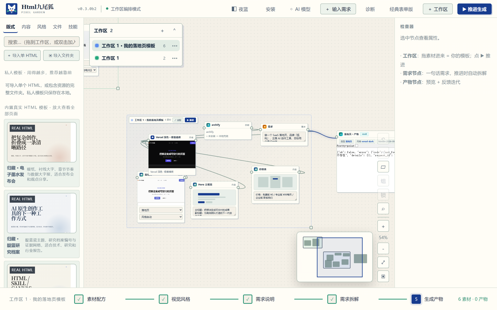
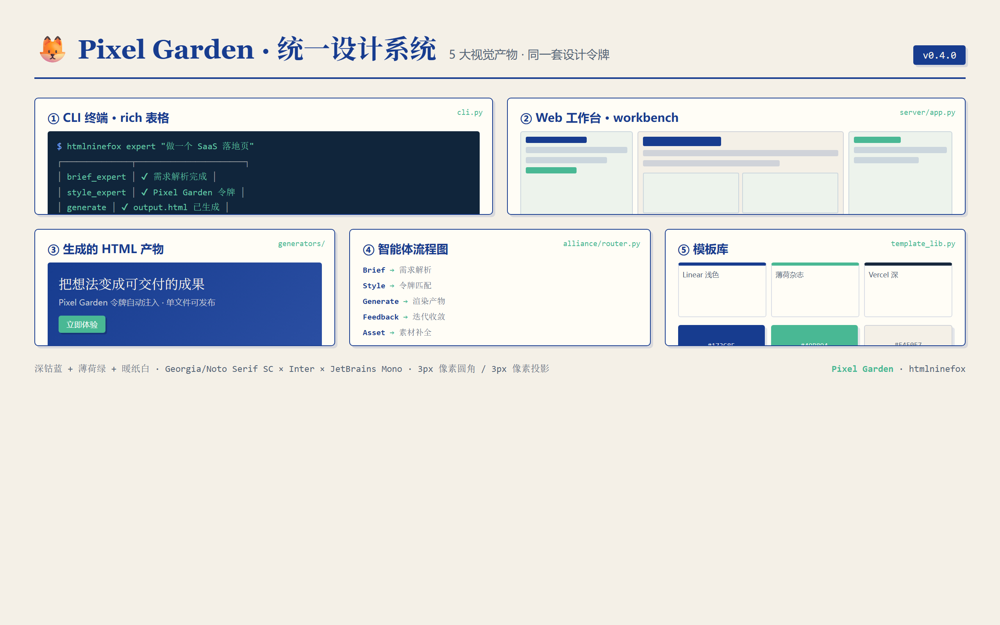
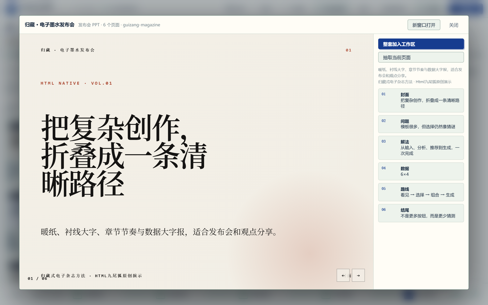
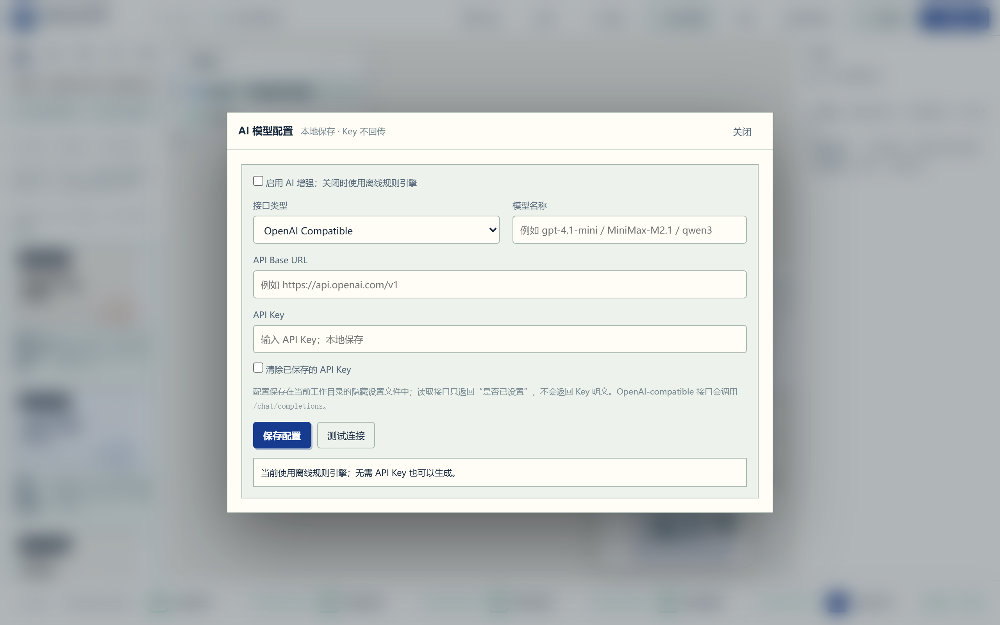
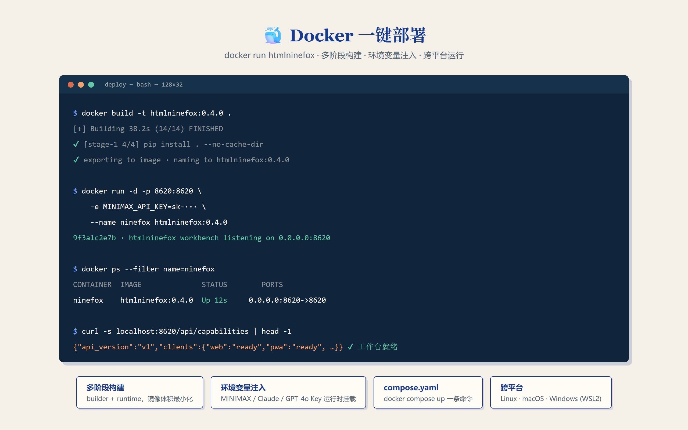

<div align="center">
  
  <h1>Html九尾狐 · HTML 创作工作台</h1>
  <p><strong>把文字、文件、图片和散落的 HTML 模板放进一张无限画布，经过分析、推荐、自由组合与反馈迭代，生成真正可交付的单文件 HTML。</strong></p>
  <p>个人开源项目 by <a href="https://github.com/KratosLee-6">KratosLee</a> · 默认中文 · 离线规则引擎可用 · AI 可选增强</p>
  <p><strong>简体中文</strong> · <a href="README.en.md">English</a></p>
</div>

<div align="center">

[](https://github.com/KratosLee-6/Html-ninefox/releases/tag/v0.4.0)
[](https://github.com/KratosLee-6/Html-ninefox/actions/workflows/build-release-packages.yml)
[](https://github.com/KratosLee-6/Html-ninefox/actions/workflows/test.yml)
[](docs/test-evidence/v0.3.0b2-pytest.txt)
[](docs/test-evidence/v0.3.0b2-chromium-e2e.txt)
[](pyproject.toml)
[](LICENSE)

</div>



## 它解决什么问题

很多 HTML、设计模板、参考文件和 AI Skill 散落在不同目录里。传统生成工具又常常只给出模板名字或线框，让人必须“猜”最终效果。

Html九尾狐把创作路径收束成一条可视化流程：

```text
文字 / 文件 / 图片 / HTML
          ↓
      AI 或离线规则分析
          ↓
  推荐内容类型 + 真实模板 + 页面组合
          ↓
A. 采用推荐直接生成
B. 进入无限画布，自定义组合版式 / 内容 / 风格 / 文件 / Skill
          ↓
      生成单文件 HTML
          ↓
  用自然语言反馈，按版本继续迭代
```

## v0.4.0 核心能力

- **🎨 Pixel Garden 设计系统**：深钴蓝 `#173C8F` + 薄荷绿 `#49B894` + 暖纸白 `#F4F0E7` 统一设计令牌，5 大视觉产物一致体验。
- **🤖 真实 LLM 接入**：MiniMax-M3 / Claude / GPT-4o 三家 API，环境变量自动配置，离线规则引擎兜底。
- **🖥️ Web 工作台**：`htmlninefox workbench` 一键启动本地 Web UI，实时预览 + 智能体日志 + 模板选择。
- **🐳 Docker 镜像**：`docker run htmlninefox` 跨平台部署，多阶段构建，compose.yaml 注入环境变量。
- **真实 HTML 模板库**：6 套完整模板、34 个可单独预览和抽取的页面，不再只展示线框。
- **统一需求入口**：支持文字、TXT、Markdown、JSON、CSV、HTML 和常见图片。
- **推荐与自由组合双路径**：可以直接接受推荐，也可以在工作区拖入版式、页面、风格、文件和 Skill。
- **无限画布工作区**：支持整体拖动、重命名、独立颜色、多工作区导航、吸附和端口连线。
- **AI 模型自主配置**：支持 OpenAI-compatible、Ollama 和自定义兼容接口；API Key 只保存在本地。
- **离线可用**：没有 API Key 时继续使用确定性的规则引擎，不阻塞生成。
- **反馈迭代**：自然语言反馈转成设计 Token 修改并重渲染，保留 `rev1 / rev2 / ...` 历史。
- **跨平台使用**：Windows 便携包/安装器、Linux `.run/.tar.gz`、Python CLI、Web/PWA、Docker。
- 🎨 **Multiple PPT styles via Skill Alliance** (v0.3): baoyu-slide-deck (image) · frontend-slides (HTML, no AI gradient) · beautiful-html-templates (28 stable presets)

## 看得见的真实效果

<table>
<tr>
<td width="50%"><br><b>Pixel Garden 统一设计</b><br>5 大视觉产物统一为深钴蓝 + 薄荷绿 + 暖纸白，杂志感与像素识别并存。</td>
<td width="50%"><br><b>Web 工作台</b><br>htmlninefox workbench 一键启动，实时预览 + 智能体日志 + 模板选择。</td>
</tr>
<tr>
<td width="50%"><br><b>真实 LLM 接入</b><br>MiniMax-M3 / Claude / GPT-4o 三家 API，环境变量自动配置，离线兜底保留。</td>
<td width="50%"><br><b>Docker 一键部署</b><br>docker run htmlninefox 跨平台运行，多阶段构建，环境变量注入。</td>
</tr>
</table>

### 六类真实产物

| 落地页 | 数据看板 | 发布会 PPT |
|---|---|---|
|  |  |  |

| 海报 | 架构文档 |
|---|---|
|  |  |

## 下载与安装

前往 [v0.4.0 Release](https://github.com/KratosLee-6/Html-ninefox/releases/tag/v0.4.0) 下载当前版本。

| 平台 | 推荐文件 | 使用方式 |
|---|---|---|
| Windows 10/11 | `HtmlNineFox-Setup-0.4.0.exe` | 左侧安装，适合普通用户 |
| Windows 10/11 | `HtmlNineFox-Windows-x64-0.4.0.zip` | 解压后 `HtmlNineFox.exe`，免安装 |
| Linux | `HtmlNineFox-Linux-0.4.0.run` | `chmod +x` 后运行，安装到当前用户目录 |
| Linux/审计 | `HtmlNineFox-Linux-0.4.0.tar.gz` | 可查看完整安装内容 |
| Python 3.10+ | `htmlninefox-0.4.0-py3-none-any.whl` | 使用 `pip install` 安装 |
| Docker | `htmlninefox:v0.4.0` | `docker run -p 8620:8620 -e MINIMAX_API_KEY=xxx htmlninefox` |

### 快速开始

```bash
# 1. 安装（任选其一）
pip install htmlninefox
# 或下载 release 包
# 或 docker run htmlninefox

# 2. 配置 LLM（可选，离线也可用）
export MINIMAX_API_KEY="***"
# 或 export OPENAI_API_KEY="***"
# 或 export ANTHROPIC_API_KEY="***"

# 3. 启动 Web 工作台
htmlninefox workbench
# 打开 http://127.0.0.1:8620

# 4. 或 CLI 直接生成
htmlninefox brief "做一个 SaaS 落地页"
```

### 从源码运行

```bash
git clone https://github.com/KratosLee-6/Html-ninefox.git
cd Html-ninefox

# 推荐：uv
uv sync
uv run htmlninefox app

# 或传统 Python
python -m pip install -e .
htmlninefox app
```

浏览器默认打开本地工作台。也可以使用：

```bash
htmlninefox expert "做一个 AI 产品发布会 PPT"
htmlninefox expert --type landing --template fox-pixel-garden "创作工具官网"
htmlninefox feedback --project output/html9n-<时间戳> --note "标题更大，颜色更稳重"
```

完整说明：[安装指南](docs/INSTALL.md) · [多种运行方式](docs/RUNNING-OPTIONS.md) · [UI 手册](docs/UI-GUIDE.md) · [VI 手册](docs/VI.md)

## 模板、内容与视觉系统

### 真实模板作品库

- 归藏 · 电子墨水发布会：6 页
- 归藏 · 靛蓝研究档案：6 页
- 归藏 · 瑞士信号系统：6 页
- 归藏 · 牛皮纸品牌故事：6 页
- 归藏 · 沙丘作品集：5 页
- 九尾狐 · 像素花园产品页：5 页

共 **6 套 / 34 页**，均为 Html九尾狐原创演示；采用归藏式编辑设计方法启发，没有复制许可不明的第三方模板。

### v0.4 开发预览：私人模板资产库

- 在“版式”栏导入一个独立 HTML，或导入包含 CSS、JavaScript、图片和字体的完整文件夹。
- 自动识别多 HTML 页面、`data-page`、`.page` 与 `.slide`，并提取页面角色、常见颜色和字体。
- 私人模板仅保存在当前输出目录的 `.library/gallery/`，不会自动提交到 Git 仓库。
- 生成时会使用导入模板的页面结构与视觉 Token；使用次数会成为下一次推荐信号。
- 画布支持撤销/重做、Shift 框选、多选移动、组合、锁定、小地图，以及 `Ctrl+K` 搜索定位。

使用说明：[私人 HTML 模板导入](docs/PRIVATE-TEMPLATE-IMPORT.md) · [v0.4 产品迭代与竞品拆解](docs/PRODUCT-ITERATION-v0.4.md)

### 六类生成器

`deck` 发布会 PPT · `doc` 文档 · `poster` 海报 · `landing` 落地页 · `dashboard` 数据看板 · `archdoc` 架构文档。

### 十一套视觉系统

内置基础预设与 Pixel Garden、Duotone Studio、Editorial Ink、Swiss Signal、Soft Silver 等结构级视觉系统。模板差异不仅是换颜色，而是排版、间距、卡片、网格和信息节奏的整体变化。

## AI 与隐私

- AI 是增强能力，不是运行前提。
- API Key 保存到当前输出目录的 `.settings/ai.json`，不会写入项目快照、诊断包或 Git 仓库。
- 设置读取接口只返回 `api_key_set`，不返回 Key 明文。
- 文件与图片输入保存在本地 `.inputs/`；单文件默认上限 8MB。
- 未启用 AI、连接失败或没有 Key 时，自动继续使用离线规则分析。

## 测试与信任证据

本版本在 **2026-09-05** 完成以下验证：

| 验证项 | 结果 | 证据 |
|---|---:|---|
| Python / API / 存储 / 安全 / 浏览器测试 | **146 passed** | [pytest 原始日志](docs/test-evidence/v0.4.0-pytest.txt) |
| Chromium 真实生成与交互验收 | **20 / 20 passed** | [E2E 原始日志](docs/test-evidence/v0.4.0-chromium-e2e.txt) |
| 生成器 | Landing / Dashboard / Deck / Poster / Archdoc 均成功 | [测试报告](docs/TEST-REPORT-v0.4.0.md) |
| 反馈迭代 | `rev1` Token 修改与 `rev2` 预设切换成功 | [E2E 日志](docs/test-evidence/v0.4.0-chromium-e2e.txt) |
| 工作台 | 拖动、重命名、颜色、多工作区、双主题、无 JS 错误 | [E2E 日志](docs/test-evidence/v0.4.0-chromium-e2e.txt) |
| 发布包 | Windows 安装器 / 便携包、Linux、wheel、Docker 均生成 SHA256 | [校验值](docs/test-evidence/v0.4.0-release-sha256.txt) |
| LLM 接入 | MiniMax-M3 / Claude / GPT-4o 环境变量自动配置 | [配置文档](docs/INSTALL.md) |
| Web 工作台 | FastAPI 服务端 + 实时预览 + 智能体日志 | [E2E 日志](docs/test-evidence/v0.4.0-chromium-e2e.txt) |
| Docker 镜像 | 多阶段构建 + compose.yaml + .dockerignore | [构建日志](docs/test-evidence/v0.4.0-docker-build.txt) |

运行环境记录见：[v0.4.0-environment.txt](docs/test-evidence/v0.4.0-environment.txt)。

```bash
python -m pytest tests -q -p no:cacheprovider
python e2e_verify.py
```

## 产物结构

```text
output/html9n-<时间戳>/
├── output.html
├── brief.json / brief.md
├── style.md
├── assets.json
├── .foxstate.json
├── revisions/
└── feedback.md
```

`.foxstate.json` 会记录模板、页面区块、附件、Skill 和选择模式，确保后续反馈迭代不是重新猜测。

## 当前状态与路线

`v0.4.0` 是正式版：Windows、Linux、Python CLI、Web/PWA 和 Docker 均已可用。Pixel Garden 设计系统统一了 5 大视觉产物；真实 LLM 接入（MiniMax-M3 / Claude / GPT-4o）让 AI 生成质量大幅提升；Web 工作台让非技术用户也能轻松使用。

查看完整路线：[ROADMAP](docs/ROADMAP.md) · 查看变更：[CHANGELOG](CHANGELOG.md)

## 贡献与致谢

欢迎提交 Issue、模板、视觉系统、测试和 Skill 联盟适配。设计方法受到归藏、花叔 Design 和 Archify 等开源社区工作的启发；详细来源和许可审查见 [DESIGN-SOURCES](docs/DESIGN-SOURCES.md)。

### Skill Alliance 致谢（v0.3-v0.4）

Html九尾狐 v0.3-v0.4 的 PPT 生成模块参考了以下两位创作者的开源 Skill 作品，诚挚致谢：

- 🎨 **[宝玉 (JimLiu)](https://github.com/JimLiu)** — author of [baoyu-skills](https://github.com/JimLiu/baoyu-skills) (especially [baoyu-slide-deck](https://github.com/JimLiu/baoyu-skills/tree/main/skills/baoyu-slide-deck)). The "AI 画图生成每页 PPT · 17 套风格" image-based PPT approach inspired Html九尾狐 v0.3's `ppt_image` intent.

- 🎨 **[张咋啦 (zarazhangrui)](https://github.com/zarazhangrui)** — author of [frontend-slides](https://github.com/zarazhangrui/frontend-slides), [beautiful-html-templates](https://github.com/zarazhangrui/beautiful-html-templates), [beautiful-feishu-whiteboard](https://github.com/zarazhangrui/beautiful-feishu-whiteboard). The "避开 AI 紫渐变" + "28 套稳定出片" philosophy deeply shaped Html九尾狐 v0.3-v0.4's template library design.

### 设计系统致谢（v0.4）

- 🎨 **Pixel Garden 设计系统** — 深钴蓝 `#173C8F` + 薄荷绿 `#49B894` + 暖纸白 `#F4F0E7` 统一设计令牌，灵感来自电子杂志 × 电子墨水美学。

## 许可证

[MIT License](LICENSE) © 2026 **KratosLee · Html九尾狐项目组**
