<div align="center">
  
  <h1>Html九尾狐 · HTML 创作工作台</h1>
  <p><strong>把文字、文件、图片和散落的 HTML 模板放进一张无限画布，经过分析、推荐、自由组合与反馈迭代，生成真正可交付的单文件 HTML。</strong></p>
  <p>个人开源项目 by <a href="https://github.com/KratosLee-6">KratosLee</a> · 默认中文 · 离线规则引擎可用 · AI 可选增强</p>
  <p><strong>简体中文</strong> · <a href="README.en.md">English</a></p>
</div>

<div align="center">

[](https://github.com/KratosLee-6/Html-ninefox/releases/tag/v0.6.3)
[](https://github.com/KratosLee-6/Html-ninefox/releases/tag/dsh-htmlninefox-v0.1.0-preview.1)
[](https://github.com/KratosLee-6/Html-ninefox/actions/workflows/build-release-packages.yml)
[](https://github.com/KratosLee-6/Html-ninefox/actions/workflows/test.yml)
[](docs/TEST-REPORT-v0.6.0.md)
[](docs/TEST-REPORT-v0.6.0.md)
[](pyproject.toml)
[](LICENSE)

</div>


## 50 秒看完 Html九尾狐怎么干活

[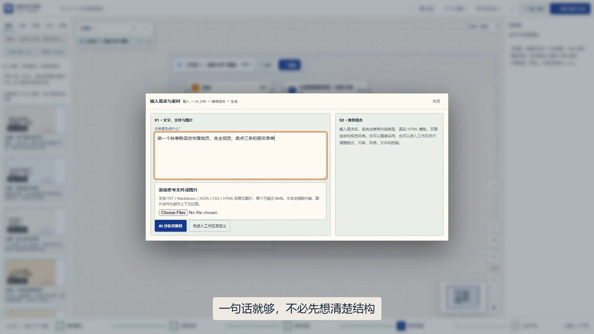](https://raw.githubusercontent.com/KratosLee-6/Html-ninefox/main/assets/promo/htmlninefox-brand-demo-50s-16x9.mp4)

**中文版** 1920×1080 · 50s · 带配乐 · [**English cut · 53s**](https://raw.githubusercontent.com/KratosLee-6/Html-ninefox/main/assets/promo/htmlninefox-brand-demo-53s-16x9-en.mp4) · [34s 静帧速览版](assets/promo/htmlninefox-brand-film-34s-16x9.mp4) · [34s English](assets/promo/htmlninefox-brand-film-34s-16x9-en.mp4) · [全部文件](assets/promo)

> **这不是动画，是录屏**：光标真的移动、27 个字真的一个个被敲进去、节点真的一个个长出来、导出中心真的被点开。片子由 [`scripts/record_demo_film.py`](scripts/record_demo_film.py) 驱动 **v0.6.0 的真实运行服务**录下，全部画面来自真实操作，字幕里的数字也是产品当场报出来的——置信度 67%、需求分析 8ms、保存交付 40ms、兼容性 100 分、「未发现阻塞性兼容问题」。没有一帧是画的，也没有一帧是生成的。
>
> 唯一由 MiniMax-H3 生成的是**开场的 3.5 秒抽象氛围**（暖纸、方格、钴蓝与薄荷光），它不含任何文字。界面演示**刻意不用**文生视频模型：模型会把中文渲染成乱码、按钮位置随机、连线毫无逻辑，那样的画面恰好与「可正常演示」相反。

### 它演示的完整主线

| 时间 | 真实发生的事 |
|---|---|
| 0–3.5s | H3 抽象氛围开场 |
| 3.5–12s | 光标点开「输入需求」，**逐字打出**一句真实需求 |
| 12–19s | 「AI 分析并推荐」返回**置信度 67%** 与推荐模板（实时渲染的预览） |
| 19–28s | 「采用推荐并生成」→ 节点与连线**逐个长出**，底部实时计时 8ms → 40ms |
| 28–38s | 六个真实内容区块落到画布，点开产物节点看 `rev0` |
| 38–50s | 导出中心：**兼容性 100**、11 KB 单文件、「未发现阻塞性兼容问题」 |

## 它解决什么问题

很多 HTML、设计模板、参考文件和 AI Skill 散落在不同目录里。传统生成工具又常常只给出模板名字或线框，让人必须“猜”最终效果。

Html九尾狐把创作路径收束成一条可视化流程：

```text
文字 / 文件 / 图片 / HTML
          ↓
      AI 或离线规则分析
          ↓
  推荐内容类型 + 真实模板 + 页面组合
          ↓
A. 采用推荐直接生成
B. 进入无限画布，自定义组合版式 / 内容 / 风格 / 文件 / Skill
          ↓
      生成单文件 HTML
          ↓
  导出 PDF / 逐页 PNG / 长图 + 兼容性报告
          ↓
  用自然语言反馈，按版本继续迭代
```

## 当前版本与最新进展（v0.6.3 已发布）

当前应用包版本为 `0.6.3`，发布标签 `v0.6.3`。**v0.6.3 是修复 v0.6.2 缺陷的补丁版本**：

- **v0.6.2 的设计吸收抓取是坏的**。升级到 v0.6.2 后，抓取 100% 失败，每一次请求都抛
  `TypeError`。原因有三处：`conn.request()` 把 headers 传进了 `body` 位、
  `do_open` 缺 urllib 必传的 `context` 形参、以及 `conn.host = host` 让 TLS 的连接
  目标退回 DNS 解析。
- **为什么没被拦住**：那 6 条门禁**全是「拒绝型」测试**，没有一条让抓取成功返回过
  body——在这样的套件里，「正确拒绝」和「彻底坏了」信号完全相同。实测把实现改回
  有漏洞的版本，6 条门禁**仍然全绿**。
- **本版全部修复**，并把门禁从 6 条扩到 11 条，新增**成功路径**与 **TLS 端到端**覆盖，
  随后用**变异测试**验证：故意用五种方式破坏实现，**5/5 全部被门禁捕获**。

> v0.6.2 的 SSRF 连接级 IP 绑定修复本身是对的，只是实现有缺陷导致功能不可用。
> v0.6.1（幻灯片编辑器竞态修复 + 真实操作录屏）与 v0.6.0（设计吸收 + 可编辑 PPTX
> 两条主线）的内容不受影响，内容见各自的[发布说明](docs/RELEASE-NOTES-v0.6.0.md)。
> **建议从 v0.6.1 或 v0.6.0 直接升级到 v0.6.3**，跳过 v0.6.2。

| 轨道 | 当前状态 | 查看 |
|---|---|---|
| 应用 Release | `v0.6.3` 已发布（2026-10-04） | [发布页](https://github.com/KratosLee-6/Html-ninefox/releases/tag/v0.6.3) · [上一版 v0.6.2](https://github.com/KratosLee-6/Html-ninefox/releases/tag/v0.6.2) |
| 发布验证 | 全量测试 `414 passed, 1 skipped`；**变异测试 5/5 捕获**；发布元数据一致性门禁通过 | [v0.6.3 发布说明](docs/RELEASE-NOTES-v0.6.3.md) · [设计文档](docs/DESIGN-v0.6.2-ssrf-pinning.md) |
| DeepSeek Harness 插件 | `0.1.0-preview.1`，独立于应用版本 | [插件预览版](https://github.com/KratosLee-6/Html-ninefox/releases/tag/dsh-htmlninefox-v0.1.0-preview.1) |


### 功能 ↔ 截图对照

#### 工作台与画布（v0.6.0 实拍，6 张）

以下 6 张拍摄自 `v0.6.0` 当前代码（顶栏版本徽标为 `v0.6.0`），包含本轮设计收敛后的字号、字重、间距与画布适配：

<table>
<tr>
<td width="50%">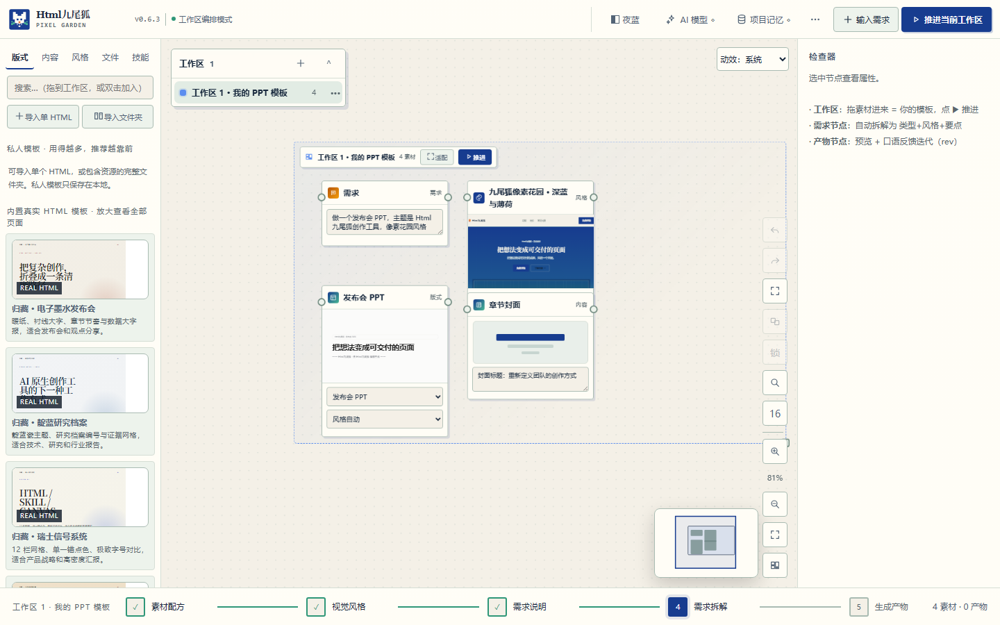<br><b>Pixel Paper 桌面工作台</b><br>三栏层级：素材库 · 无限画布工作区 · 检查器。</td>
<td width="50%">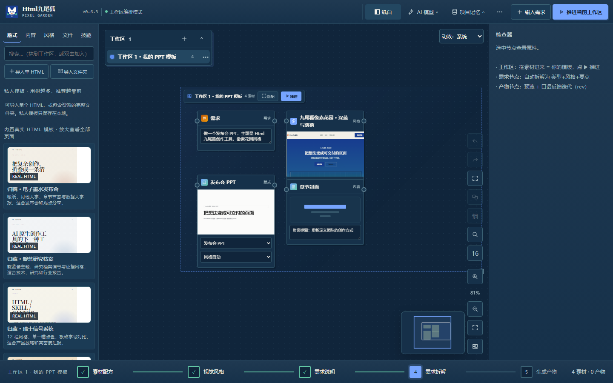<br><b>夜蓝主题桌面工作台</b><br>同一组件层级的完整暗色主题；主按钮与弱化文字均已提到 WCAG AA 以上。</td>
</tr>
<tr>
<td width="50%"><br><b>多工作区管理</b><br>工作区导航卡按真实几何参与画布避让，首屏缩放 81%，不再把内容缩成一团。</td>
<td width="50%">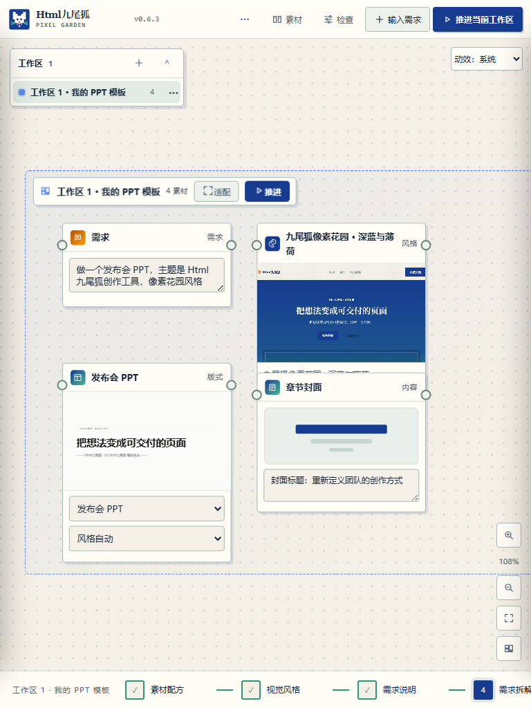<br><b>平板 768 布局</b><br>侧栏折叠为顶栏抽屉，画布语义缩放。</td>
</tr>
<tr>
<td width="50%">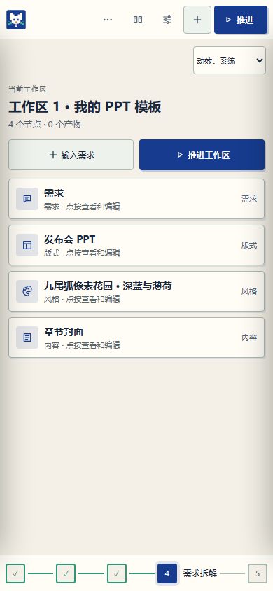<br><b>移动任务视图</b><br>以工作区动作和节点卡片替代不可读的缩小画布；进度条只显示当前与失败步骤。</td>
<td width="50%"><br><b>侧栏 REAL HTML 模板库</b><br>模板名与描述上下堆叠、各夹 2 行，同屏比收敛前多露出一张卡。</td>
</tr>
</table>

#### 输入与检查器

<table>
<tr>
<td width="50%">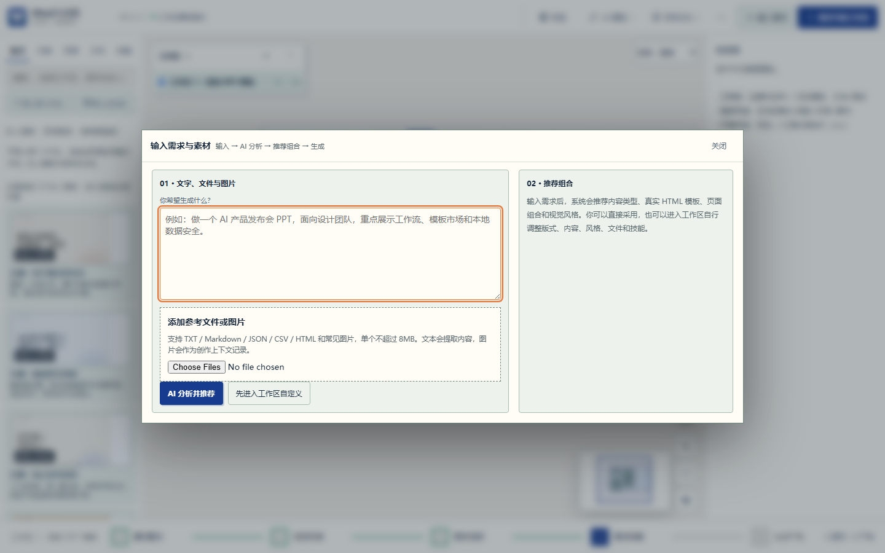<br><b>统一需求入口</b><br>文字、文件、图片走同一个入口，AI 分析后推荐组合。</td>
<td width="50%">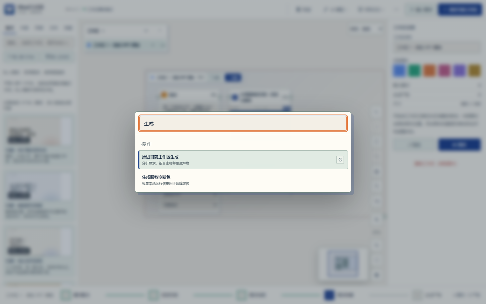<br><b>命令面板</b><br>Ctrl+K 键盘打开、输关键词直达，每个动作都带快捷键提示。</td>
</tr>
<tr>
<td width="50%">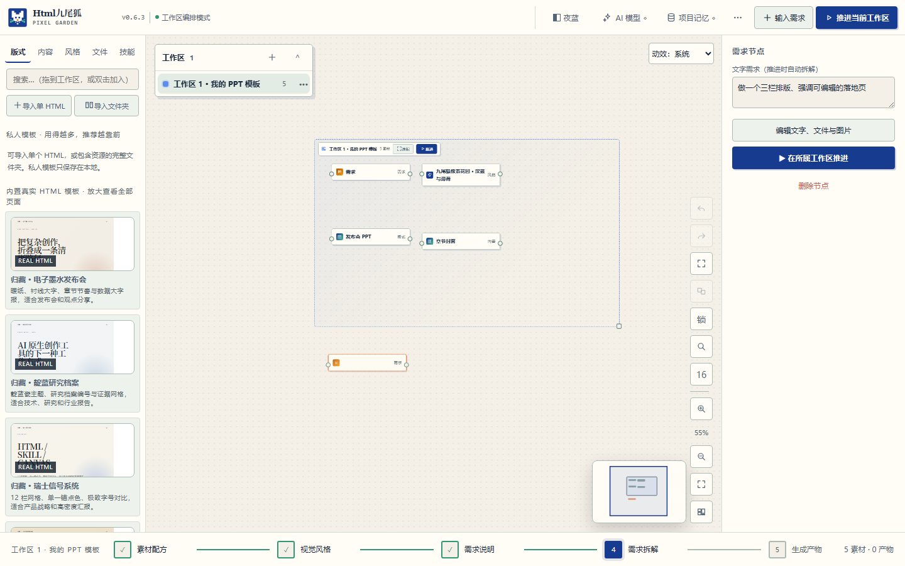<br><b>需求节点检查器</b><br>选中即编辑文字与附件，一键向所属工作区推进。</td>
<td width="50%">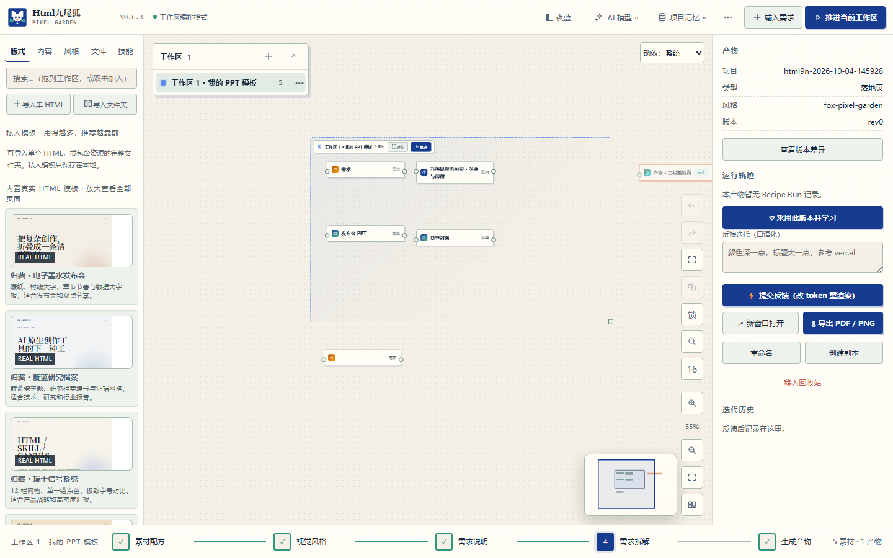<br><b>产物节点检查器</b><br>版本徽标、运行轨迹、采用学习、口语反馈与导出入口。</td>
</tr>
</table>

**Project Memory、命令与版本**

<table>
<tr>
<td width="50%"><br><b>项目记忆</b><br>品牌、受众、语气、禁忌、模板与长期说明本地保存，下次生成直接复用。</td>
<td width="50%"><br><b>版本历史与恢复</b><br>反馈、重跑、恢复都保留快照；恢复生成新版本，历史不覆盖。</td>
</tr>
<tr>
<td width="50%">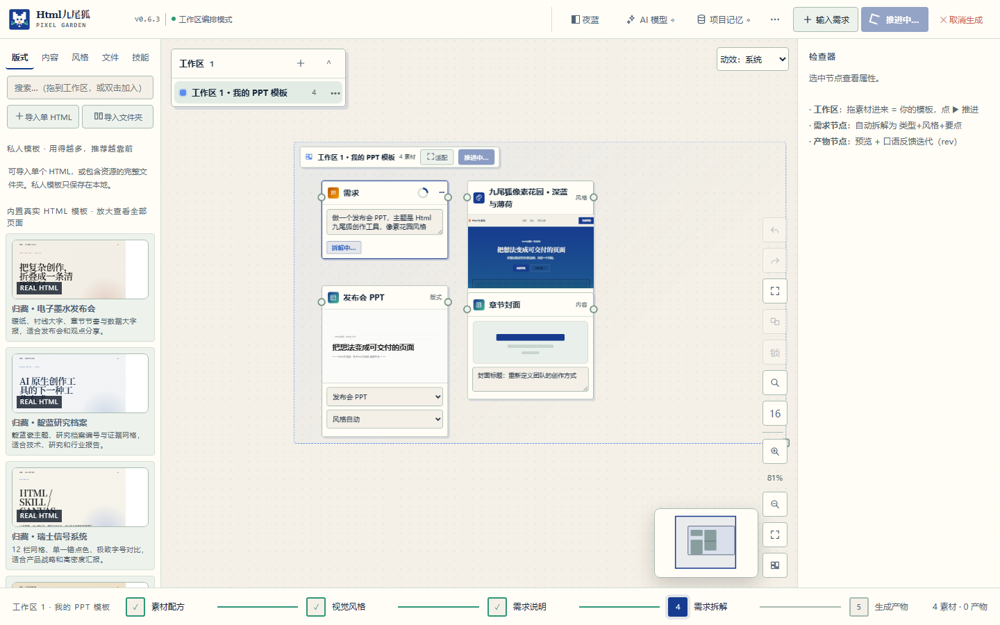<br><b>取消生成</b><br>等待期可取消：排队任务真取消，执行中诚实转为“停止等待”。</td>
<td width="50%">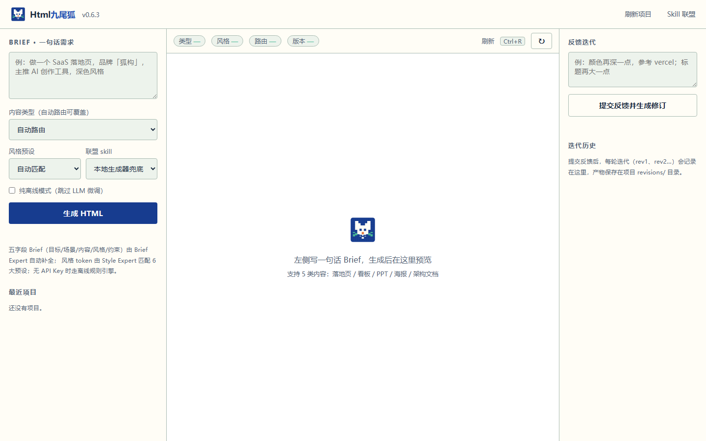<br><b>经典表单模式</b><br>一句话 Brief 直接生成，和工作台同一套品牌系统。</td>
</tr>
</table>

**导出中心（真实导出全流程）**

<table>
<tr>
<td width="50%"><br><b>导出分析就绪</b><br>兼容性评分、分页模型、动态特性与本地引擎状态；deck 产物额外放开 PPTX。</td>
<td width="50%">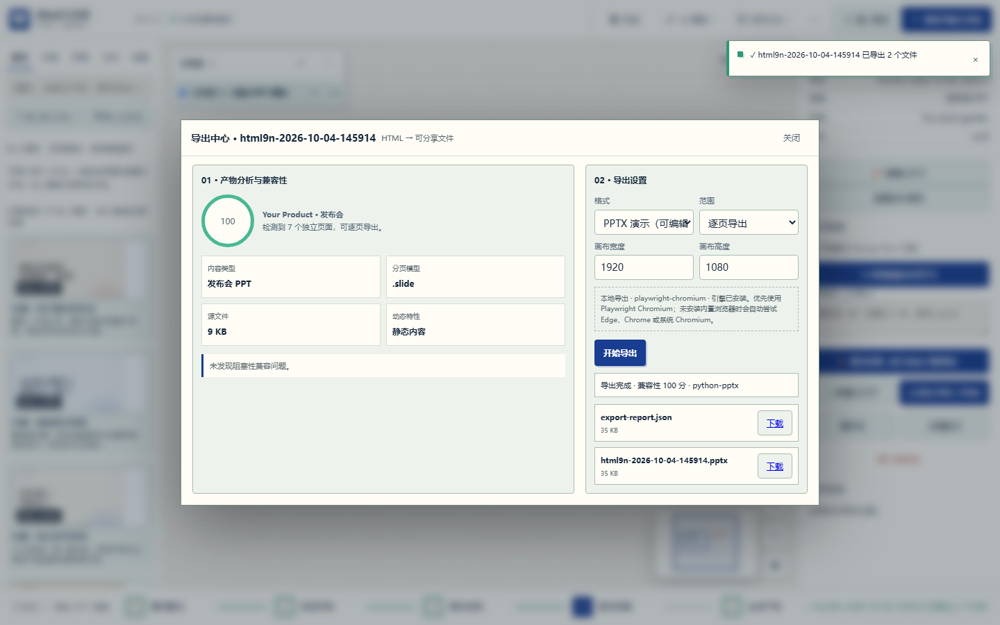<br><b>PPTX 导出结果</b><br>导出完成给出 pptx 与报告两个下载项，报告列出可编辑元素与降级清单。</td>
</tr>
</table>

#### 全部截图清单

| 目录 | 张数 | 内容 |
|---|---:|---|
| `assets/screenshots/v0.6.3/` | **23** | 当前版本实拍：工作台与画布 7 张、输入与检查器 4 张、Project Memory / 版本 / 取消 / 经典模式 4 张、设计吸收 3 张、幻灯片编辑与 PPTX 导出 3 张、移动端素材库 1 张 |
| `assets/screenshots/v0.5.0/` | 24 | v0.5.0 完整实拍集（含 6 张真实产物输出图） |
| `assets/screenshots/v0.4.0/` | 5 | Pixel Garden、LLM、Docker、Export Center 的历史记录 |

> v0.6.0 的 23 张全部由可复跑的门禁产出（`tests/test_v060_visual_evidence_states.py` 与
> `tests/test_v061_visual_evidence_states.py`），不是手工截图；清单与重采命令见[截图说明](assets/screenshots/README.md)。
> 仍引用 `v0.5.0/` 的只有**六类生成器产物**——它们由生成器实跑产出而非 UI 截图，产物结构在 v0.6.0 未变。

## v0.5.0 稳定版核心能力（历史）


- **🧠 Project Memory**：品牌、受众、语气、禁忌、模板、主色和字体保存在本地，可查看、编辑、关闭或清空。
- **♡ 明确采用后学习**：只有在产物检查器点击“采用此版本并学习”才会进入长期记忆，测试稿和失败稿不会污染偏好；分析、Recipe Run 和检查器会显示本次复用了什么（可解释复用）。
- **🛡 崩溃可恢复的 Project 提交**：统一 durable 原语 + 提交 journal，进程被 kill / 断电后自动回滚到上一个一致版本；跨进程文件锁让 CLI 与服务并发操作同一项目返回稳定 `project_busy`。
- **🧩 浏览器生命周期 Module + 取消生成**：Project / Generation / Revision / Export 拆分为独立 Module；每工作区单飞生成，等待期可取消——排队任务真取消，执行中诚实转为“停止等待”。
- **⏳ 版本历史与恢复**：反馈、重跑和恢复都保留 HTML + 生成状态快照；恢复生成新版本、不覆盖历史，支持命名与行级差异。
- **📤 Export Center**：产物节点直接导出 PDF、逐页 PNG 或完整长图，含兼容性评分与 `export-report.json`。
- **🔒 隐私边界**：API Key、附件正文与完整反馈原文不写入长期记忆或诊断包。

## 设计吸收流水线（v0.6 新增）

<table>
<tr>
<td width="50%"><br><b>素材审核台 · 待审核</b><br>许可三档徽标、来源徽标、令牌色板、骨架大纲与吸收指标面板。</td>
<td width="50%"><br><b>已采纳 · 六层入库</b><br>生成风格预设 / 导入组件 / 吸收动效，指标同步更新。</td>
</tr>
<tr>
<td width="50%">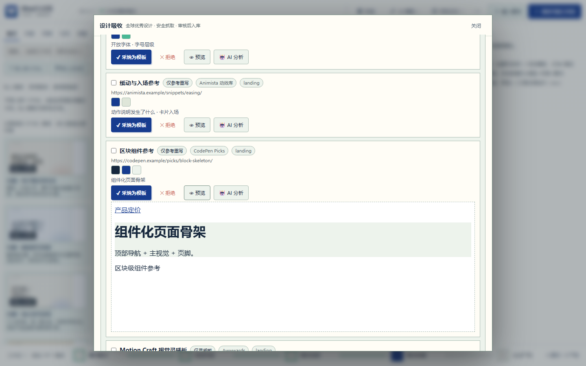<br><b>CSP 沙箱预览</b><br>候选页面在无脚本沙箱内渲染，候选脚本永不执行。</td>
<td width="50%">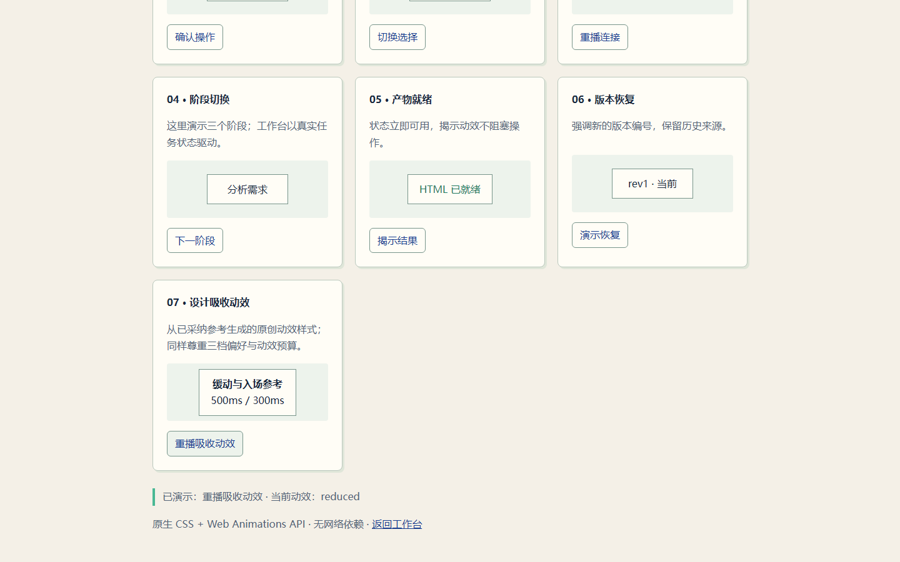<br><b>动效实验室</b><br>吸收到的原创动效经预算钳制，并尊重三档减少动效偏好。</td>
</tr>
</table>

把全世界的优秀设计变成自己的素材——模板、风格、组件、装饰、动效、内容六个层面，三条吸收通道：

- **✋ 手动导入**：粘贴单个/批量 URL（≤10 条），或导入 ZIP 模板包，全部进入审核台
- **🕸 预设源抓取**：内置 12 个设计源（Land-book、Lapa.ninja、Landingfolio、Awwwards、Codrops、Animista、Google Fonts…），按画廊/组件/动效/字体四类适配，安全抓取（拒私网/重绑定/限速）
- **🤖 AI 分析**：候选自动生成设计描述、标签、布局说明与内容配方（复用你的 AI 设置，无 Key 不影响其他功能）

所有素材经**审核台**人工确认后入库（沙箱预览 + 许可三档治理：开放可入库 / 仅参考重写 / 仅灵感板），审核台支持批量采用 / 拒绝与按来源筛选，吸收指标面板记录候选与入库情况；风格进面板、组件可拖拽参与生成、动效进 motion-lab——且全部尊重动效偏好与预算。六个层面（模板、风格、组件、装饰、动效、内容）都走同一条「吸收 → 审核 → 入库 → 使用」通路。

## 可编辑 PPTX（v0.6 新增）

<table>
<tr>
<td width="50%"><br><b>工作台内幻灯片编辑</b><br>按页列出全部可编辑文本节点，保存即生成新版本。</td>
<td width="50%"><br><b>导出中心 · PPTX</b><br>deck 产物放开 PPTX 格式，导出完成给出 pptx 与报告两个下载项。</td>
</tr>
</table>

- **📄 标准 .pptx 导出**：deck 产物经 python-pptx 导出为符合标准的 `.pptx`，在 PowerPoint / WPS 中文本框真正可编辑；无法映射的能力在降级报告中如实列出（[报告实录](assets/screenshots/v0.6.3/pptx-export-report.png)）。
- **🖥️ 工作台内幻灯片编辑**：产物检查器里打开结构化幻灯片对话框即可改写标题与要点，通过 `PUT /slides` 带 `expected_revision` 写回，版本冲突时明确提示而不是静默覆盖。
- **🔁 编辑闭环**：改完写回再导出，之前的编辑会保留在导出的 PPTX 中。

## 工作台完整能力

- **🖥️ Web 工作台**：`htmlninefox app` 一键启动本地 Web UI，实时预览 + 智能体日志 + 模板选择。
- **🤖 真实 LLM 接入**：MiniMax-M3 / Claude / GPT-4o 三家 API，环境变量自动配置，离线规则引擎兜底。
- **🤝 Skill 联盟**：baoyu-slide-deck（AI 画图 PPT）· frontend-slides（无 AI 紫渐变）· beautiful-html-templates（28 套稳定模板）。
- **真实 HTML 模板库**：6 套完整模板、34 个可单独预览和抽取的页面，不再只展示线框。
- **统一需求入口**：支持文字、TXT、Markdown、JSON、CSV、HTML 和常见图片。
- **推荐与自由组合双路径**：可以直接接受推荐，也可以在工作区拖入版式、页面、风格、文件和 Skill。
- **无限画布工作区**：支持整体拖动、重命名、独立颜色、多工作区导航、吸附和端口连线。
- **AI 模型自主配置**：支持 OpenAI-compatible、Ollama 和自定义兼容接口；API Key 只保存在本地。
- **离线可用**：没有 API Key 时继续使用确定性的规则引擎，不阻塞生成。
- **反馈迭代**：自然语言反馈转成设计 Token 修改并重渲染，保留 `rev1 / rev2 / ...` 历史。
- **🎨 Pixel Garden 设计系统**：深钴蓝 `#173C8F` + 薄荷绿 `#49B894` + 暖纸白 `#F4F0E7` 统一设计令牌，5 大视觉产物一致体验。
- **🐳 Docker 镜像**：`docker run htmlninefox` 跨平台部署，多阶段构建，compose.yaml 注入环境变量。
- **跨平台使用**：Windows 便携包/安装器、Linux `.run/.tar.gz`、Python CLI、Web/PWA、Docker。

> [Export Center](docs/EXPORT-CENTER.md) 支持四种真实导出格式：`PDF`、逐页 `PNG`、完整长图 `PNG`，以及 v0.6 补齐的 `.pptx`。前三者产出真实文件与 `export-report.json`；`.pptx` 经 python-pptx 受控映射，文本框在 PowerPoint / WPS 中真正可编辑，无法映射的能力在降级报告中如实列出。DOCX 语义导出已出列至 v0.6.x。

## 看得见的真实效果

> 以下 4 张拍摄自 `v0.4.0`（2026-09-08），是 Pixel Garden 设计语言定型的历史记录。这些界面（模板预览、AI 模型配置、Docker 部署）**功能仍然存在**，但版式已随 v0.5 / v0.6 的设计收敛变化，当前列表观感以 v0.6.0 实拍为准。

<table>
<tr>
<td width="50%"><br><b>Pixel Garden 统一设计</b><br>5 大视觉产物统一为深钴蓝 + 薄荷绿 + 暖纸白，杂志感与像素识别并存。</td>
<td width="50%"><br><b>模板预览对话框</b><br>真实 HTML 模板逐页预览，整套加入工作区或抽取当前页。</td>
</tr>
<tr>
<td width="50%"><br><b>AI 模型配置</b><br>OpenAI-compatible 接口 + API Key 本地保存、可测连接；无 Key 时离线规则兜底。</td>
<td width="50%"><br><b>Docker 一键部署</b><br>docker run htmlninefox 跨平台运行，多阶段构建，环境变量注入。</td>
</tr>
</table>

### 六类真实产物

以下产物图由 `v0.5.0` 发布版的 e2e 验收流程真实生成（六类生成器的产物结构在 v0.6.0 未变；这 6 张由生成器实跑产出而非 UI 截图，因此仍是 v0.5.0 版式）：

| 落地页 | 数据看板 | 发布会 PPT |
|---|---|---|
|  |  |  |

| 翻页交互 | 海报 | 架构文档 |
|---|---|---|
|  |  |  |

## 版本历史

RC3-A～E 按 [`mattpocock/skills`](https://github.com/mattpocock/skills) 的 research、domain-modeling、codebase-design、TDD 与 code-review 方法完成架构加固，并以 `v0.5.0` 稳定版收口；v0.6 在其上交付设计吸收流水线与可编辑 PPTX。

| 版本 | 日期 | 交付 | 记录 |
|---|---|---|---|
| **v0.6.0** | 2026-10-01 | 设计吸收流水线（多 URL / ZIP 导入、12 个内置设计源、三档许可、CSP 沙箱审核台、AI 设计分析、吸收指标）；可编辑 PPTX 导出 + 工作台内幻灯片编辑器；发布前设计收口（字号 7 档 / 字重 4 档 / 间距尺度 token、首屏画布缩放 0.33→0.80、对比度达 AA）；修 Windows 便携包启动即崩，并把产物验证加到内容级；门禁 `387 passed, 1 skipped`、Chromium / WebKit 各 `22/22` | [Release](https://github.com/KratosLee-6/Html-ninefox/releases/tag/v0.6.0) · [发布说明](docs/RELEASE-NOTES-v0.6.0.md) · [门禁证据](docs/test-evidence/v0.6.0-s17-20260929/README.md) |
| **v0.5.0 稳定版** | 2026-09-25 | RC3 收口，发布 Windows / Linux / wheel / Docker 附件与 SHA-256 | [Release](https://github.com/KratosLee-6/Html-ninefox/releases/tag/v0.5.0) · [测试报告](docs/TEST-REPORT-v0.5.0.md) |
| RC3-E | 2026-09-25 | 浏览器生命周期 Module 拆分、生成取消、导出竞态守卫 | [迭代记录](docs/ITERATION-RC3-E-20260925.md) |
| RC3-D | 2026-09-25 | 崩溃可恢复 Project 提交（journal 回滚）、跨进程文件锁、生成原子发布 | [迭代记录](docs/ITERATION-RC3-D-20260925.md) |
| RC3-B2 / C | 2026-09-24 | 共享 Generation / Feedback / Restore / Export 应用用例，CLI Restore | [RC3-C 记录](docs/ITERATION-RC3-C-20260924.md) |
| RC3 视觉收敛 | 2026-09-24 | 顶栏双主动作、四档响应式、语义缩放、组件状态统一、经典模式回归 Pixel Garden | [视觉收敛记录](docs/ITERATION-RC3-VISUAL-CONVERGENCE-20260924.md) |
| v0.5.0rc2 | 2026-09-18 | 版本历史与恢复、原生动效三档偏好、100 节点验收、无障碍、DSH 插件预览 | [RC2 报告](docs/TEST-REPORT-RC2-20260918.md) |
| v0.5.0rc1 | 2026-09-14 | Project Memory、命令面板、Recipe Run、交互系统 | [RC1 说明](docs/RELEASE-NOTES-v0.5.0rc1.md) |
| v0.4.2 稳定版 | 2026-09-08 | Export Center（PDF / PNG + 兼容性报告） | [发布说明](docs/RELEASE-NOTES-v0.4.2.md) |

历史版本的真实证据截图：

<table>
<tr>
<td width="50%"><br><b>DSH 插件已启用（rc2）</b><br>最终 tarball 安装进新的 Web profile；插件列表显示 htmlninefox 为全局插件并处于启用状态。</td>
<td width="50%"><br><b>生成、修改与导出链路（rc2）</b><br>离线生成中文海报，执行 dry-run 与真实反馈，再导出 PDF 和完整 PNG；兼容性报告 100 分。</td>
</tr>
<tr>
<td width="50%"><br><b>版本历史与恢复（rc2）</b><br>查看父版本、恢复来源、命名与源码差异，历史版本恢复为新版本。</td>
<td width="50%"><br><b>动效实验室（rc2）</b><br>操作反馈、选中素材、建立连接、阶段切换、产物就绪与版本恢复六类动效。</td>
</tr>
</table>

## 下载与安装

v0.6.3 已于 2026-10-04 发布，安装包随 [v0.6.3 Release](https://github.com/KratosLee-6/Html-ninefox/releases/tag/v0.6.3) 提供。v0.6.0 / v0.6.1 用户可直接升级，项目 schema 与数据目录不变。DeepSeek Harness 插件使用[独立预览版](https://github.com/KratosLee-6/Html-ninefox/releases/tag/dsh-htmlninefox-v0.1.0-preview.1)，不要把插件版本当成应用版本。

包体命名规则保持不变，版本号随发布版本推进。下列文件名按 `v0.6.3` 列出，与 Release 附件逐一对应：

| 平台 | 推荐文件 | 使用方式 |
|---|---|---|
| Windows 10/11 | `HtmlNineFox-Setup-0.6.3.exe` | 安装到当前用户，创建开始菜单入口 |
| Windows 10/11 | `HtmlNineFox-Windows-x64-0.6.3.zip` | 解压后运行 `HtmlNineFox.exe`，免安装 |
| Linux | `HtmlNineFox-Linux-0.6.3.run` | `chmod +x` 后运行，安装到当前用户目录 |
| Linux/审计 | `HtmlNineFox-Linux-0.6.3.tar.gz` | 可查看完整安装内容 |
| macOS 14+（Apple Silicon） | `HtmlNineFox-macOS-arm64-0.6.3.zip` | 解压后右键 HtmlNineFox.app →「打开」绕过 Gatekeeper（未做公证） |
| Python 3.10+ | `htmlninefox-0.6.0-py3-none-any.whl` | `python -m pip install ./htmlninefox-0.6.0-py3-none-any.whl` |
| Docker | 源码构建 | `docker compose up --build`；标签 CI 验证镜像但不上传镜像仓库 |

> **已验证范围**：Windows 便携包已在本机真实启动验证（`/api/health` 回报 `0.6.0 / windows-portable`，首页与六项静态资源正常，进程干净退出）。Linux 与 macOS 产物在 CI 中**只验证了构建成功与 SHA-256，未实跑**——本机是 Windows，无法在此验证。安装器（`Setup.exe`）同样只验证了构建，未实跑安装流程。

### 快速开始

```bash
# 1. 安装（任选其一）
pip install htmlninefox
# 或下载 release 包
# 或 docker run htmlninefox

# 2. 配置 LLM（可选，离线也可用）
export MINIMAX_API_KEY="***"
# 或 export OPENAI_API_KEY="***"
# 或 export ANTHROPIC_API_KEY="***"

# 3. 启动 Web 工作台
htmlninefox app
# 打开 http://127.0.0.1:8620

# 4. 或 CLI 直接生成
htmlninefox expert "做一个 SaaS 落地页"
```

### 从源码运行

```bash
git clone https://github.com/KratosLee-6/Html-ninefox.git
cd Html-ninefox

# 推荐：uv
uv sync
uv run htmlninefox app

# 或传统 Python
python -m pip install -e .
htmlninefox app
```

浏览器默认打开本地工作台。也可以使用：

```bash
htmlninefox expert "做一个 AI 产品发布会 PPT"
htmlninefox expert --type landing --template fox-pixel-garden "创作工具官网"
htmlninefox feedback --project output/html9n-<时间戳> --note "标题更大，颜色更稳重"
htmlninefox restore --project output/html9n-<时间戳> --revision 0 --expected-revision 2
htmlninefox export output/html9n-<时间戳> --format png --scope long
```

完整说明：[安装指南](docs/INSTALL.md) · [多种运行方式](docs/RUNNING-OPTIONS.md) · [UI 手册](docs/UI-GUIDE.md) · [VI 手册](docs/VI.md)

## 模板、内容与视觉系统

### 真实模板作品库

- 归藏 · 电子墨水发布会：6 页
- 归藏 · 靛蓝研究档案：6 页
- 归藏 · 瑞士信号系统：6 页
- 归藏 · 牛皮纸品牌故事：6 页
- 归藏 · 沙丘作品集：5 页
- 九尾狐 · 像素花园产品页：5 页

共 **6 套 / 34 页**，均为 Html九尾狐原创演示；采用归藏式编辑设计方法启发，没有复制许可不明的第三方模板。

### v0.4 开发预览：私人模板资产库

- 在“版式”栏导入一个独立 HTML，或导入包含 CSS、JavaScript、图片和字体的完整文件夹。
- 自动识别多 HTML 页面、`data-page`、`.page` 与 `.slide`，并提取页面角色、常见颜色和字体。
- 私人模板仅保存在当前输出目录的 `.library/gallery/`，不会自动提交到 Git 仓库。
- 生成时会使用导入模板的页面结构与视觉 Token；使用次数会成为下一次推荐信号。
- 画布支持撤销/重做、Shift 框选、多选移动、组合、锁定、小地图，以及 `Ctrl+K` 搜索定位。

使用说明：[私人 HTML 模板导入](docs/PRIVATE-TEMPLATE-IMPORT.md) · [v0.4 产品迭代与竞品拆解](docs/PRODUCT-ITERATION-v0.4.md)

### 六类生成器

`deck` 发布会 PPT · `doc` 文档 · `poster` 海报 · `landing` 落地页 · `dashboard` 数据看板 · `archdoc` 架构文档。

### 十一套视觉系统

内置基础预设与 Pixel Garden、Duotone Studio、Editorial Ink、Swiss Signal、Soft Silver 等结构级视觉系统。模板差异不仅是换颜色，而是排版、间距、卡片、网格和信息节奏的整体变化。

## AI 与隐私

- AI 是增强能力，不是运行前提。
- API Key 保存到当前输出目录的 `.settings/ai.json`，不会写入项目快照、诊断包或 Git 仓库。
- 设置读取接口只返回 `api_key_set`，不返回 Key 明文。
- 文件与图片输入保存在本地 `.inputs/`；单文件默认上限 8MB。
- 未启用 AI、连接失败或没有 Key 时，自动继续使用离线规则分析。

## 测试与信任证据

v0.6.0 的全部门禁已在 2026-09-29 复验通过：

| 验证项 | 结果 | 证据 |
|---|---:|---|
| Python + 浏览器测试套件 | **387 passed, 1 skipped**（v0.5.0 基线 303，本轮新增 84 条） | [v0.6.0 门禁证据](docs/test-evidence/v0.6.0-s17-20260929/README.md) |
| —— 设计体检 / 版式层级 / 动效行为 | 6 + 8 + 6 条 | [发布说明 · 验证](docs/RELEASE-NOTES-v0.6.0.md#验证) |
| —— 生成质量 | 50 条（板块划分顺序、内容质量、最终效果、端到端产物自足） | [同上](docs/RELEASE-NOTES-v0.6.0.md#验证) |
| —— 动作派发表 / 写回协议 / 冻结入口 | 4 + 2 + 5 条 | [同上](docs/RELEASE-NOTES-v0.6.0.md#验证) |
| JavaScript 语法（13 个 static JS + inline 检查） | **全部通过** | [同一证据](docs/test-evidence/v0.6.0-s17-20260929/README.md) |
| Chromium 验收（bundled Chromium） | **22 / 22** | [同一证据](docs/test-evidence/v0.6.0-s17-20260929/README.md) |
| WebKit（Safari 引擎）验收 | **22 / 22** | [同一证据](docs/test-evidence/v0.6.0-s17-20260929/README.md) |
| 打包产物实跑 | Windows / Linux / macOS / Docker 四个 job 全绿；**Windows 便携包真实启动通过** | [发布说明 · 验证](docs/RELEASE-NOTES-v0.6.0.md#验证) |
| 发布元数据一致性（`check_release_version.py`） | **一致** | [同一证据](docs/test-evidence/v0.6.0-s17-20260929/README.md) |
| DSH 插件与最终 tarball 安装 | **2 / 2 通过** | [接入与发布记录](docs/DEEPSEEK-HARNESS-INTEGRATION.md) |
| 版本历史、恢复与 100 节点 | **通过**（含在 pytest 套件内） | [RC2 报告](docs/TEST-REPORT-RC2-20260918.md) |
| 动效、减少动态效果、竞态与资源打包 | **通过** | [动效交付记录](docs/ITERATION-MOTION-20260918.md) |
| Docker 镜像 | 标签 CI 独立 job 构建并验证 | [构建工作流](.github/workflows/build-release-packages.yml) |
| LLM 接入 | MiniMax-M3 / Claude / GPT-4o 环境变量自动配置 | [配置文档](docs/INSTALL.md) |

> **本轮门禁的做法**：每一条新门禁都做过反向验证——把对应修复去掉，测试必须变红；否则视为无效门禁并重写。这条纪律是必要的，因为本轮被拦下的多数缺陷形态一致：**服务端能力实现齐备，界面却没有可达入口，也没有任何测试点击过它**。打包流水线也据此改成了「构建后必须真实执行产物」，否则一个启动即崩的包能一路带着全绿的四个 job 进入 Release。

v0.5.0 稳定版的发布证据保留在 [v0.5.0 测试报告](docs/TEST-REPORT-v0.5.0.md)（含发布附件与 SHA-256、Windows 便携包真机烟测），更早的证据见 [v0.5.0rc3 测试报告](docs/TEST-REPORT-v0.5.0rc3.md)与 [v0.4.2-environment.txt](docs/test-evidence/v0.4.2-environment.txt)。

```bash
python -m pytest tests -q -p no:cacheprovider
python e2e_verify.py
```

## 产物结构

```text
output/html9n-<时间戳>/
├── output.html
├── brief.json / brief.md
├── style.md
├── assets.json
├── .foxstate.json
├── revisions/
└── feedback.md
```

`.foxstate.json` 会记录模板、页面区块、附件、Skill 和选择模式，确保后续反馈迭代不是重新猜测。

## 当前状态与路线

当前仓库版本为 `v0.6.3`（已于 2026-10-04 发布）：**纯安全补丁**，关闭设计吸收出站抓取的 SSRF TOCTOU 窗口——socket 现连到已校验的地址，TLS 的 SNI 与证书校验仍用真实主机名。门禁 `409 passed / 1 skipped`，新增 6 条走真实 socket 的用例并做过反向验证。`v0.6.1` 是上一稳定版（幻灯片编辑器竞态修复 + 真实操作录屏），`v0.6.0` 交付设计吸收与可编辑 PPTX 两条主线。下一阶段按 [ROADMAP-v0.6.1-v0.7](docs/ROADMAP-v0.6.1-v0.7.md) 推进：网页反向拆解。

查看完整路线：[ROADMAP](docs/ROADMAP.md) · 查看变更：[CHANGELOG](CHANGELOG.md)

## 贡献与致谢

欢迎提交 Issue、模板、视觉系统、测试和 Skill 联盟适配。设计方法受到归藏、花叔 Design 和 Archify 等开源社区工作的启发；详细来源和许可审查见 [DESIGN-SOURCES](docs/DESIGN-SOURCES.md)。

### Skill Alliance 致谢（v0.3-v0.4）

Html九尾狐 v0.3-v0.4 的 PPT 生成模块参考了以下两位创作者的开源 Skill 作品，诚挚致谢：

- 🎨 **[宝玉 (JimLiu)](https://github.com/JimLiu)** — author of [baoyu-skills](https://github.com/JimLiu/baoyu-skills) (especially [baoyu-slide-deck](https://github.com/JimLiu/baoyu-skills/tree/main/skills/baoyu-slide-deck)). The "AI 画图生成每页 PPT · 17 套风格" image-based PPT approach inspired Html九尾狐 v0.3's `ppt_image` intent.

- 🎨 **[张咋啦 (zarazhangrui)](https://github.com/zarazhangrui)** — author of [frontend-slides](https://github.com/zarazhangrui/frontend-slides), [beautiful-html-templates](https://github.com/zarazhangrui/beautiful-html-templates), [beautiful-feishu-whiteboard](https://github.com/zarazhangrui/beautiful-feishu-whiteboard). The "避开 AI 紫渐变" + "28 套稳定出片" philosophy deeply shaped Html九尾狐 v0.3-v0.4's template library design.

### PPT 编辑工具致敬（v0.6）

v0.6 的可编辑 PPT 能力建立在两位前辈的工作之上，诚挚致谢：

- 🪄 **[Univer](https://github.com/dream-num/univer)（dream-num）** — Apache-2.0 的浏览器端 Office 套件引擎（Sheets / Docs / Slides / Canvas 一体）。v0.6 的工作台内幻灯片可视化编辑（近 1:1 PowerPoint 观感、PPT/PPTX 导入导出）基于 Univer Slides 构建，bundle 本地化保持离线优先。
- 📄 **[python-pptx](https://github.com/scanny/python-pptx)（Steve Canny）** — MIT 许可的 PowerPoint 文件库。v0.6 的服务端 .pptx 文件桥用它实现受控映射，让导出的 PPT 在 PowerPoint / WPS 中真正文本可编辑。

### 设计系统致谢（v0.4）

- 🎨 **Pixel Garden 设计系统** — 深钴蓝 `#173C8F` + 薄荷绿 `#49B894` + 暖纸白 `#F4F0E7` 统一设计令牌，灵感来自电子杂志 × 电子墨水美学。

## 许可证

[MIT License](LICENSE) © 2026 **KratosLee · Html九尾狐项目组**
