<div align="center">
  
  <h1>Html九尾狐 · HTML 创作工作台</h1>
  <p><strong>把文字、文件、图片和散落的 HTML 模板放进一张无限画布，经过分析、推荐、自由组合与反馈迭代，生成真正可交付的单文件 HTML。</strong></p>
  <p>个人开源项目 by <a href="https://github.com/KratosLee-6">KratosLee</a> · 默认中文 · 离线规则引擎可用 · AI 可选增强</p>
  <p><strong>简体中文</strong> · <a href="README.en.md">English</a></p>
</div>

<div align="center">

[](https://github.com/KratosLee-6/Html-ninefox/releases/tag/v0.7.0)
[](https://github.com/KratosLee-6/Html-ninefox/releases/tag/dsh-htmlninefox-v0.1.0-preview.1)
[](https://github.com/KratosLee-6/Html-ninefox/actions/workflows/build-release-packages.yml)
[](https://github.com/KratosLee-6/Html-ninefox/actions/workflows/test.yml)
[](docs/RELEASE-NOTES-v0.7.0.md)
[](docs/RELEASE-NOTES-v0.7.0.md)
[](pyproject.toml)
[](LICENSE)

</div>


> 当前应用包版本为 `0.7.0`（2026-10-07 发布）· 完整功能与架构见下。

---

## ▶ 视频

> GitHub 不直接内联播放仓库里的 mp4：解说版在 **Release 页在线播放**，录屏版是原文件直链。

- **[解说版 · 75 秒（v0.7.0 Release 页）](https://github.com/KratosLee-6/Html-ninefox/releases/tag/v0.7.0)** — 人声解说 + 发布会式动画 + 真实操作录屏：贴入 example.com → 审核台 → 采纳 → 拆块生成 → 页面自己的正文出现在成品里。由 [huashu-art-motion](https://github.com/alchaincyf/huashu-art-motion) 引擎的 t2 发布会语法驱动，工程在 `film/v070-huashu/`（随仓库外的工作区维护）。
- [真实录屏版 · 73 秒（原文件）](https://raw.githubusercontent.com/KratosLee-6/Html-ninefox/main/assets/promo/htmlninefox-demo-v070-16x9.mp4) — 无解说，光标逐帧真实操作，片头/片尾为品牌帧。

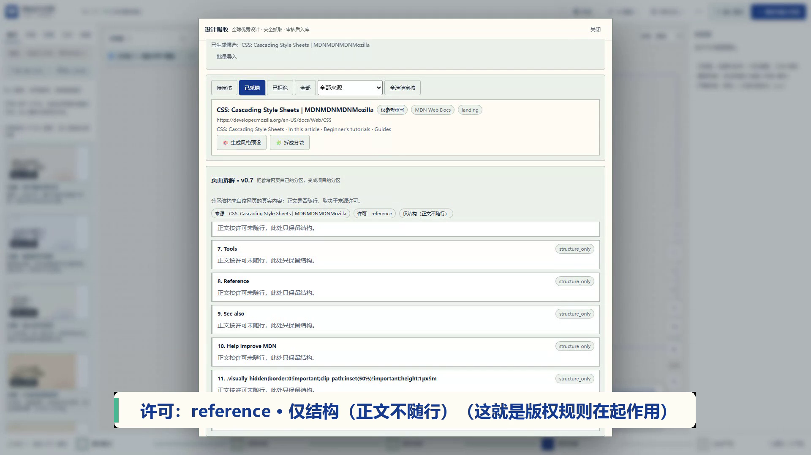

## 🆕 v0.7.0 · 网页反向拆解（最新功能）

**把一个真实网页的分区，变成一个结构可编辑的项目。**

<table>
<tr>
<td width="50%">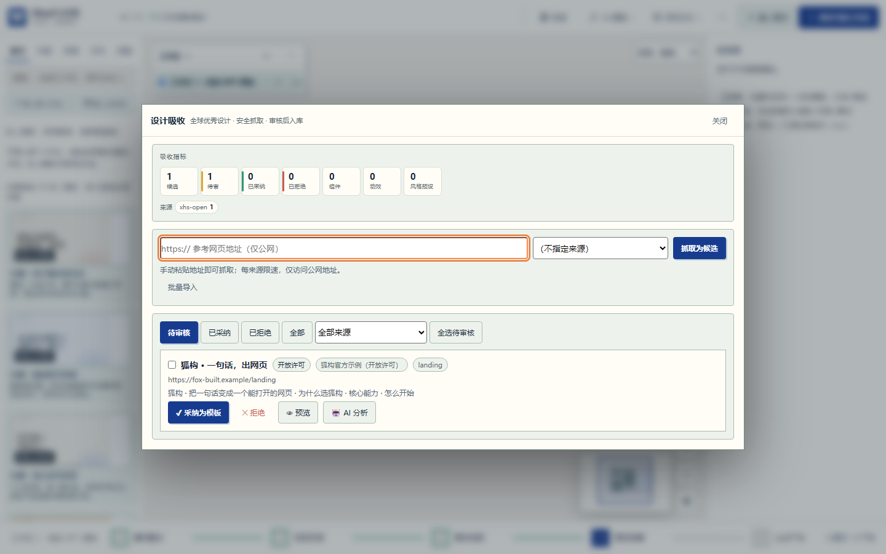<br><b>贴一个公开网址 → 落进审核台</b><br>候选带许可标签；开放许可正文随行，仅参考只借结构。</td>
<td width="50%">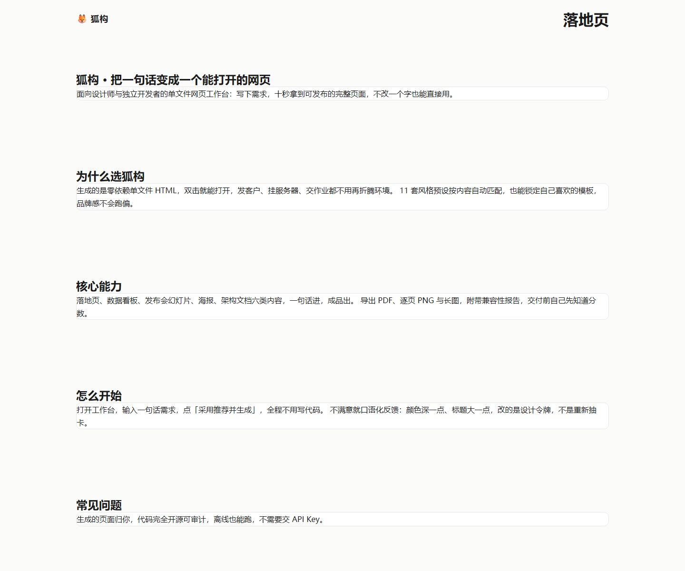<br><b>拆下来的分区 → 出现在成品里</b><br>六个内容类型全部消费分块通道。</td>
</tr>
</table>

- `POST /api/intake/page-blocks` 把已采纳候选的分区切成生成通道认识的分块（嵌套小节也拆得开），**端点只读不写回**——携带正文必须由用户决定。
- 版权按字段：`open` 才随行原文；`reference` / `inspiration-only` 只带结构与顺序，生成回落自带文案。
- 门禁：Windows 本地 `596 passed / 2 skipped`，Linux CI `597 passed / 1 skipped`；16 个变异脚本全部 CAUGHT；浏览器 22/22；真实链路 15/15。
- 详见 [v0.7.0 发布说明](docs/RELEASE-NOTES-v0.7.0.md) · [设计文档](docs/DESIGN-v0.7-page-decomposition.md)。

## 🏗 整体架构

架构图由 [Archify](https://github.com/tt-a1i/archify) 生成（交互式 HTML 随仓库提供：[docs/architecture-v070.html](docs/architecture-v070.html)，下载后本地打开可探索节点、路径与图例）：

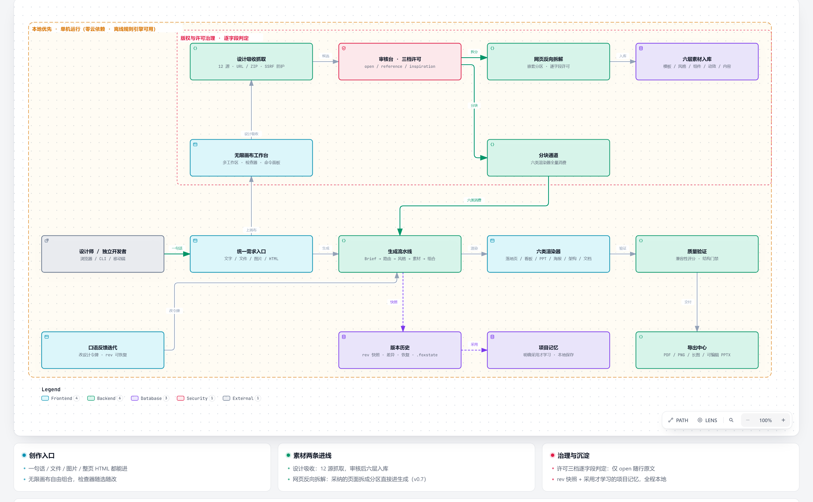

**重要后端模块**

| 模块 | 职责 |
|---|---|
| `intake.py` | 设计吸收：SSRF 防护抓取（连接级 IP 绑定）、来源注册、候选审核、风格预设、页面分块（`page_blocks_from_candidate`） |
| `pipeline.py` | 生成流水线：Brief → 路由 → 风格 → 素材 → 组合 → 生成 → 验证，`.foxstate.json` 状态落盘，反馈迭代确定性重渲染 |
| `rules.py` + `generators/` | 离线规则引擎与六个渲染器（landing/dashboard/deck/poster/archdoc/doc），分块通道全量消费 |
| `server/app.py` | 零依赖本地服务：工作台 API（intake / 生成 / 反馈 / 版本 / 导出 / 幻灯片编辑） |
| `exporting.py` + `pptx_export.py` | PDF / 逐页 PNG / 长图 + 兼容性报告；python-pptx 受控映射出可编辑 PPTX |
| `revisions.py` + `project_memory.py` | 版本历史快照与恢复；明确采用后才学习的本地偏好记忆 |

架构全文见 [docs/ARCHITECTURE.md](docs/ARCHITECTURE.md)。

## 🧩 功能板块

### 🖼 无限画布工作台

文字、文件、图片、HTML 模板放上画布，自由组合、推进生成；三栏层级 + 夜蓝双主题，桌面 / 平板 / 手机各有一套可读布局。

<table>
<tr>
<td width="50%">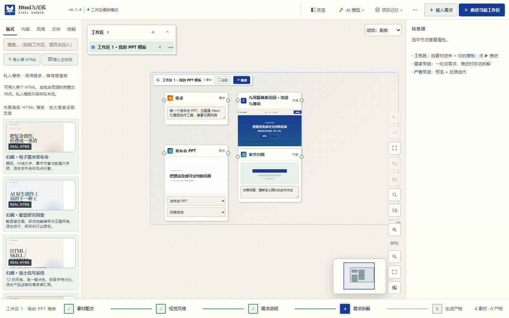<br><b>Pixel Paper 桌面工作台（Web 端）</b><br>素材库 · 无限画布工作区 · 检查器。</td>
<td width="50%">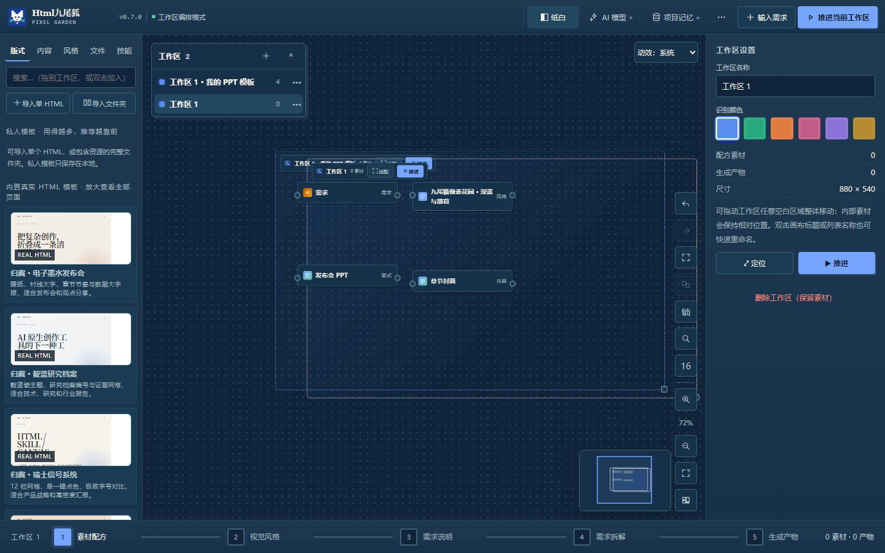<br><b>夜蓝主题（Web 端）</b><br>同一层级的完整暗色主题，对比度达 WCAG AA。</td>
</tr>
<tr>
<td width="50%"><br><b>多工作区管理</b><br>导航卡并存，检查器直接改名与配色。</td>
<td width="50%">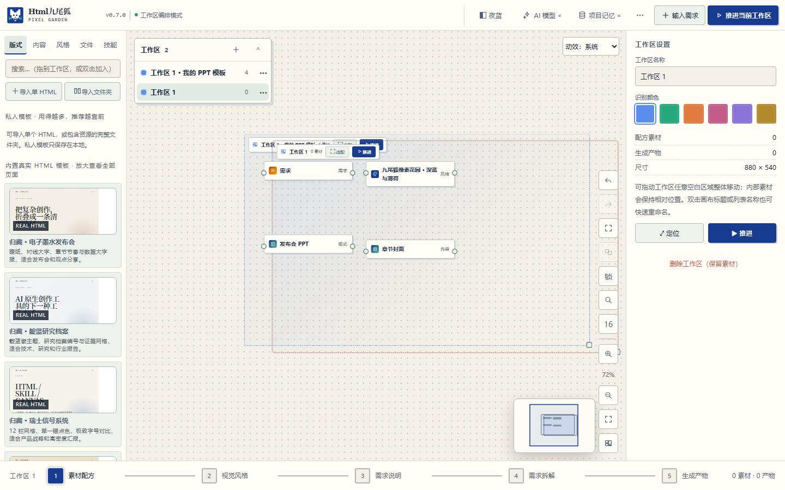<br><b>REAL HTML 模板库</b><br>采纳的网页与模板卡，直接可复用。</td>
</tr>
<tr>
<td width="50%">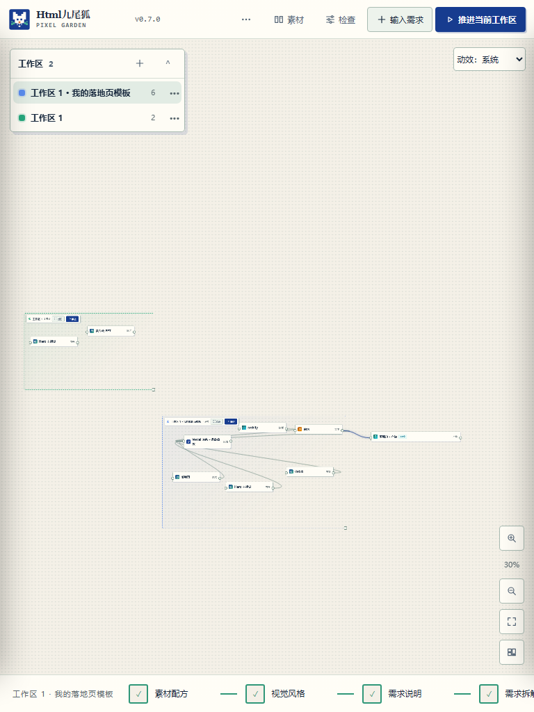<br><b>平板 768 布局</b><br>侧栏折叠为顶栏抽屉，画布语义缩放。</td>
<td width="50%">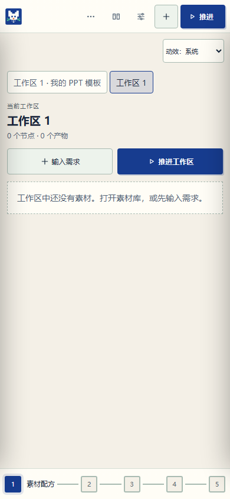<br><b>移动 390 任务视图</b><br>工作区动作与节点卡片替代缩小画布，进度只留关键步骤。</td>
</tr>
</table>

### 🕸 设计吸收

12 个内置源 + URL、ZIP 抓取（SSRF 防护：拒私网、防重绑定、限速），候选先落审核台人工确认；许可三档是代码里强制的，不是标签。

<table>
<tr>
<td width="50%">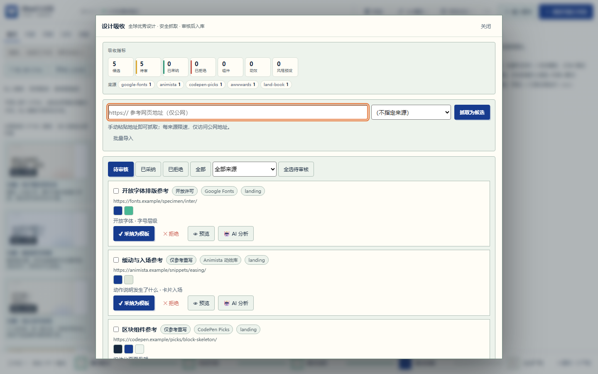<br><b>素材审核台 · 待审核</b><br>许可徽标、令牌色板、骨架大纲与吸收指标。</td>
<td width="50%">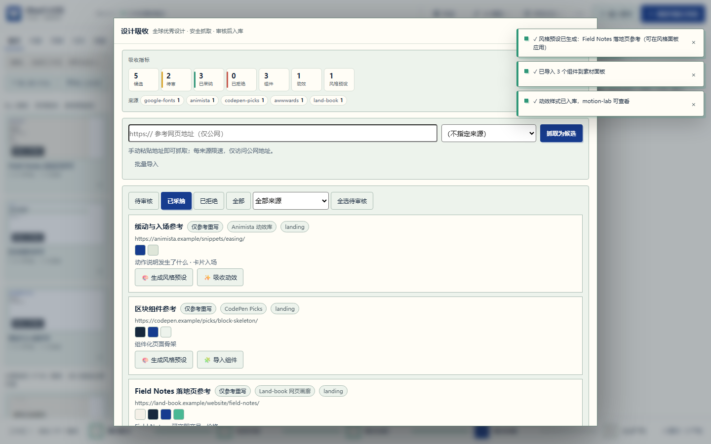<br><b>已采纳 · 六层入库</b><br>风格预设 / 组件 / 动效 / 内容，吸收指标同步更新。</td>
</tr>
</table>

### 🔎 网页反向拆解（v0.7 新增）

见上方「v0.7.0 最新功能」。真实链路验收脚本随仓库发布：[scripts/verify_page_blocks_chain.py](scripts/verify_page_blocks_chain.py)。

### 📊 可编辑 PPTX

deck 产物导出标准 .pptx，PowerPoint / WPS 里文本框真正可编辑；工作台内逐页改写，写回带版本冲突保护。

<table>
<tr>
<td width="50%">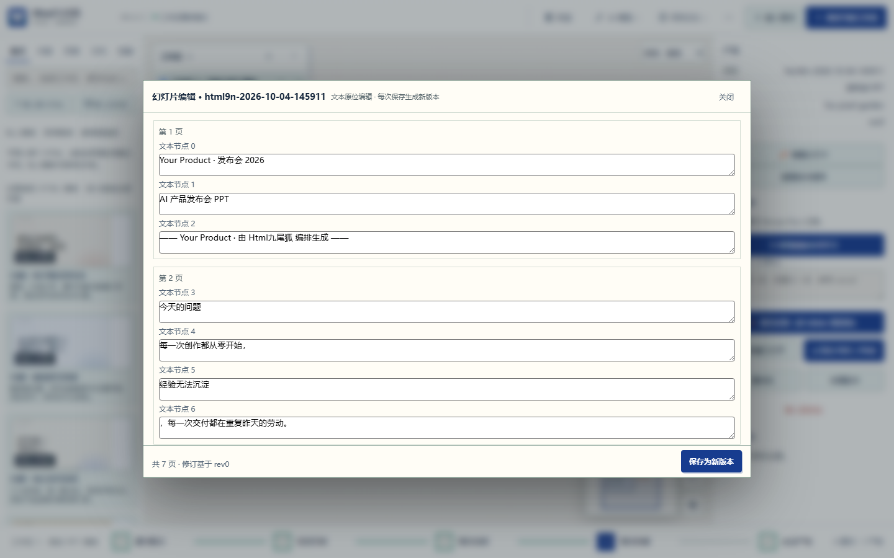<br><b>工作台内幻灯片编辑</b><br>逐页列出可编辑文本节点，保存即新版本。</td>
<td width="50%">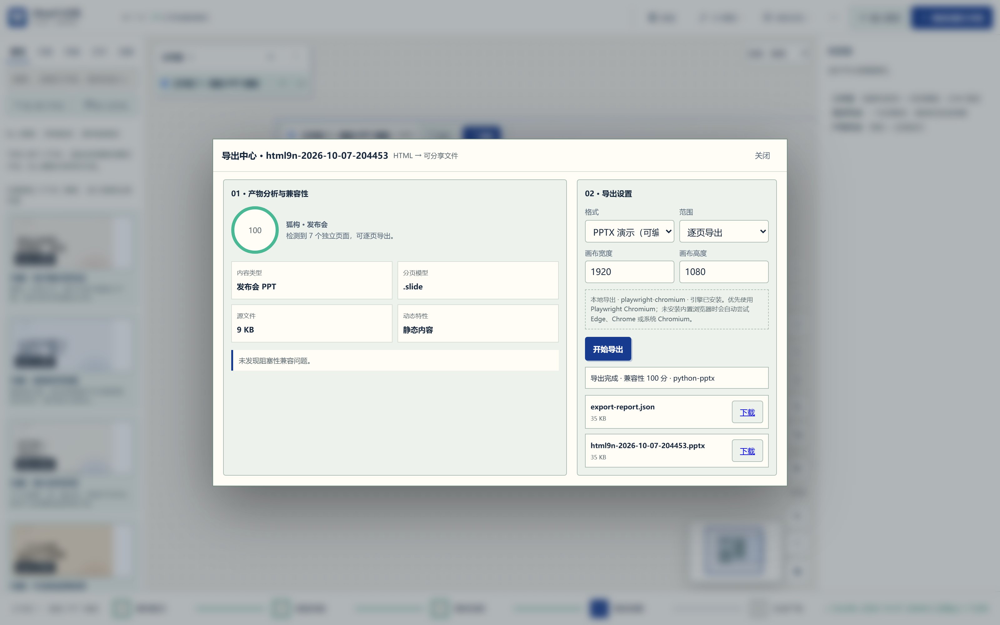<br><b>导出中心 · PPTX 真实导出</b><br>兼容性 100 分 · 7 页 · 24 个可编辑元素 · 0 降级；报告与 pptx 双下载项（本图来自真实导出）。</td>
</tr>
</table>

### 📤 导出中心

PDF / 逐页 PNG / 完整长图三种真实导出 + 兼容性评分报告；deck 产物额外放开 PPTX。

<table>
<tr>
<td width="50%">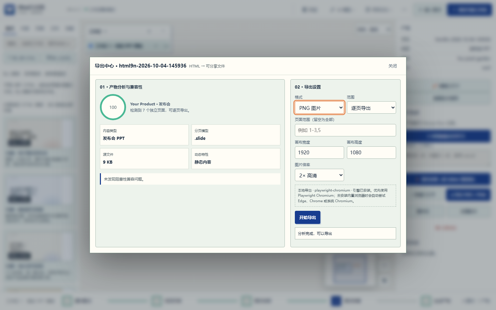<br><b>导出分析就绪</b><br>兼容性评分、分页模型、动态特性与本地引擎状态。</td>
<td width="50%">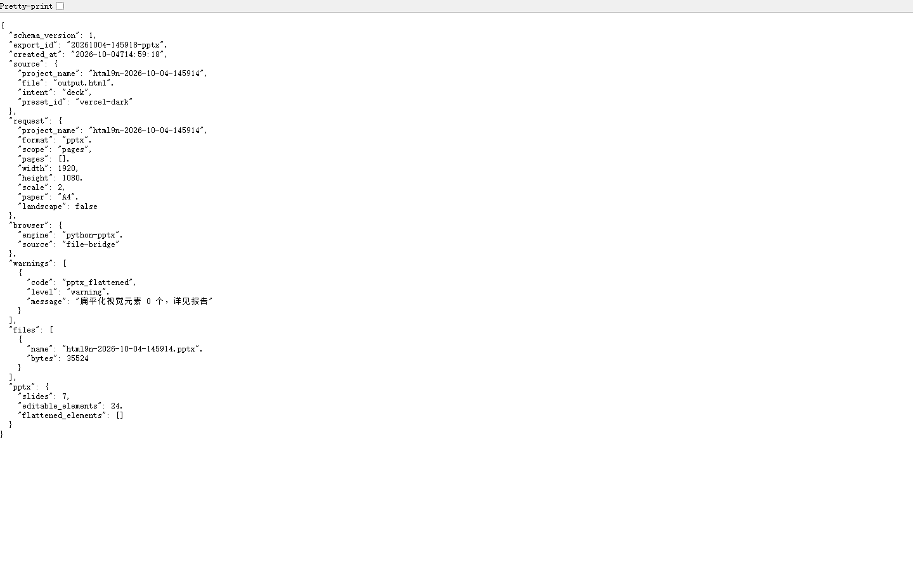<br><b>PPTX 导出报告</b><br>可编辑元素与降级清单如实列出。</td>
</tr>
</table>

### 🧠 项目记忆 + 版本历史

明确点击「采用此版本并学习」才进入长期记忆，测试稿不污染偏好；反馈、重跑、恢复全留快照，恢复生成新版本、不覆盖历史。

<table>
<tr>
<td width="50%">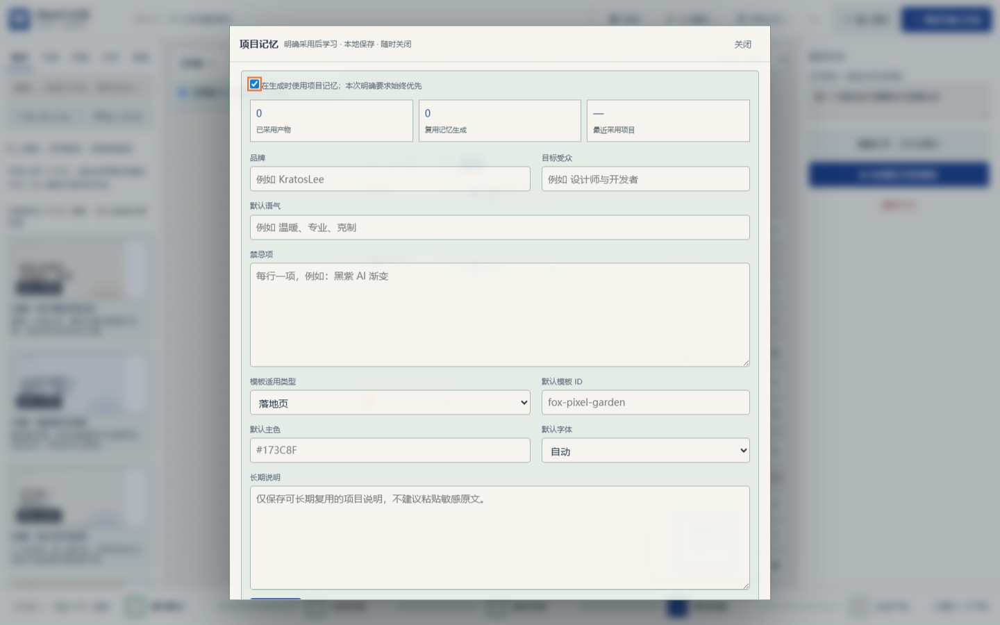<br><b>项目记忆</b><br>品牌、受众、语气、禁忌、模板本地保存复用。</td>
<td width="50%">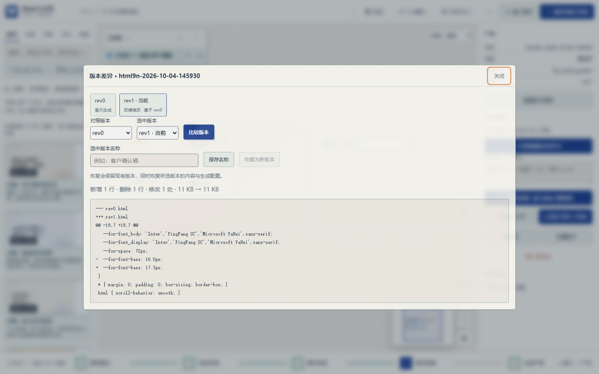<br><b>版本历史与恢复</b><br>命名、行级差异，恢复不覆盖历史。</td>
</tr>
</table>

各板块的完整图文对照（含命令面板、输入入口、经典模式等 23 张实拍）见 [docs/HOMEPAGE-ARCHIVE.md](docs/HOMEPAGE-ARCHIVE.md)。

## 🧰 能力清单

| 能力 | 说明 |
|---|---|
| ✅ 六类内容一句话生成 | 落地页 / 数据看板 / 发布会 PPT / 海报 / 架构文档 / 文档；离线规则引擎兜底，不需要 API Key |
| ✅ 真实 LLM 接入 | MiniMax-M3 / Claude / GPT-4o 与 OpenAI 兼容接口，环境变量自动配置 |
| ✅ 设计吸收 + 网页反向拆解 | 12 个内置源安全抓取；采纳的网页拆成分区直接进生成，许可三档逐字段判定 |
| ✅ 口语化反馈迭代 | 「颜色深一点、标题大一点」改的是设计令牌；`rev1 / rev2 / …` 历史可恢复 |
| ✅ 可编辑 PPTX + 多格式导出 | 标准 .pptx 真可编辑；PDF / 逐页 PNG / 长图 + 兼容性评分报告 |
| ✅ 项目记忆 | 明确采用才学习：品牌、受众、语气、模板本地复用，可查看、关闭、清空 |
| ✅ 命令面板与多端布局 | Ctrl+K 直达；桌面 / 平板 / 移动各有一套可读排版 |
| ✅ 隐私边界 | API Key、附件正文、反馈原文不写入记忆与诊断包；导出在本机完成不上传 |
| ✅ 全平台交付 | Windows 安装版 / 便携版、Linux .run、macOS Apple Silicon、pip wheel、Docker |

## 🚀 快速开始

```bash
pip install htmlninefox          # 或下载 Release 包 / docker compose up --build
htmlninefox app                  # 打开 http://127.0.0.1:8620
htmlninefox expert "做一个 SaaS 落地页"   # CLI 直接生成
```

Windows / Linux / macOS 安装包与 wheel 见 [**v0.7.0 Release**](https://github.com/KratosLee-6/Html-ninefox/releases/tag/v0.7.0)（全部附 SHA-256）。离线可用，API Key 可选。

## 📜 版本迭代

| 版本 | 日期 | 一句话 |
|---|---|---|
| **v0.7.0** | 2026-10-07 | **网页反向拆解**：页面分区 → 项目分区，六类全消费；发布前实测修复三个「全绿但坏了」 |
| v0.6.4 | 2026-10-06 | 门禁收口：发布物字节级回读；配色与 blocks 两个真缺陷 |
| v0.6.0 | 2026-10-01 | 设计吸收流水线 + 可编辑 PPTX 两条主线 |
| v0.5.0 | 2026-09-25 | RC3 收口，全平台安装包 |

完整逐版记录：[CHANGELOG](CHANGELOG.md) · 各版发布说明见 [docs/](docs/)。

---

## 🙏 致敬与感谢

本项目的部分能力建立在以下开源工作之上——按许可要求与礼节，一并致谢（详细来源与许可审查见 [DESIGN-SOURCES](docs/DESIGN-SOURCES.md)）：

| 来源 | 许可 | 用在哪里 |
|---|---|---|
| [Univer](https://github.com/dream-num/univer)（dream-num） | Apache-2.0 | v0.6 起的工作台内幻灯片可视化编辑基于 Univer Slides 构建 |
| [python-pptx](https://github.com/scanny/python-pptx)（Steve Canny） | MIT | .pptx 导出的服务端受控映射，文本框在 PowerPoint / WPS 里真正可编辑 |
| [huashu-art-motion](https://github.com/alchaincyf/huashu-art-motion)（花叔） | MIT | v0.7.0 解说视频的 t2 发布会动画引擎（`film/v070-huashu/`） |
| [Archify](https://github.com/tt-a1i/archify)（tt-a1i） | MIT | README 架构图由 Archify 生成（交互版随仓库发布） |
| [op7418/guizang-product-video-skill](https://github.com/op7418/guizang-product-video-skill) | AGPL-3.0（仅借鉴方法论；SFX 为其原创合成并附使用声明） | 宣传片工程方法论；`film/sfx` 音效来源 |
| [宝玉 baoyu-slide-deck](https://github.com/JimLiu/baoyu-skills)（JimLiu） | MIT | v0.3 PPT 生成模块「AI 画图每页 PPT」的方法参考 |
| [张咋啦 frontend-slides / beautiful-html-templates](https://github.com/zarazhangrui)（zarazhangrui） | MIT | 模板库「避开 AI 紫渐变、稳定出片」的设计哲学来源 |
| [edge-tts](https://github.com/rany2/edge-tts) | 自定义（非标准许可） | 解说视频的人声合成 |
| 归藏 · 花叔 Design · Archify 等社区工作 | — | 设计方法与审美启发（逐项来源见 [DESIGN-SOURCES](docs/DESIGN-SOURCES.md)） |

早期版本的完整致敬长文（含引用原文）保留在 [docs/HOMEPAGE-ARCHIVE.md](docs/HOMEPAGE-ARCHIVE.md#致敬与感谢)。

[MIT License](LICENSE) © 2026 **KratosLee · Html九尾狐项目组**
