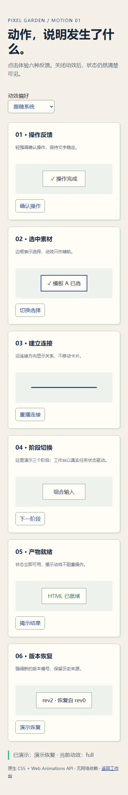

# 动效第一轮交付记录 · 2026-09-18

开发基线：`0.5.0rc1`。本次作为 RC2 开发增量提交，包含此前的版本历史闭环；没有创建新发布标签或宣称已交付新的安装器。

## 使用入口

启动工作台后，在画布右上角选择「动效：系统 / 减少动效 / 关闭动效」。偏好保存在当前浏览器，默认跟随系统；修改后立即生效。

打开工作台地址下的 `/motion-lab`，体验操作反馈、选中素材、建立连接、阶段切换、产物就绪、版本恢复六类样例。样页不生成项目或写入版本数据。源码位置：`htmlninefox/server/static/motion-lab.html`。

## 本轮变化

- 新增原生 CSS / Web Animations API 动效层 `FoxMotion`，共享 140 / 180 / 220ms 时长及缓动。
- 统一可取消动画、CSS 动画超时清理、元素删除清理、隐藏页面停播；装饰动画最多同时作用于 8 个目标，离屏目标不播放。
- 减少 / 关闭模式覆盖工作台的按钮、文字闪烁、Toast、抽屉、进度环和节点动效，保留业务状态与文字。
- 弹窗短暂淡入；快速打开再关闭时，过期的焦点回调不会把焦点拉回隐藏弹窗。
- 节点入场更轻，落位去除放大回弹；节点 / 相机仍由画布管理坐标。
- 生成结果在预览 iframe 加载后尝试揭示，视觉反馈不延迟业务保存或操作。
- 失败清理和成功动画清理均可取消；立即重试、节点 DOM 重建、删除节点不会误删新进度。
- 生成 / 局部重跑的百分比更新固定状态区，只在阶段变化时新增提示；同时可见 Toast 限制为 4 条。
- 动效偏好放在画布右上角，不扩大原有 HUD；手机端主栅格收缩，顶栏可横向滚动，避免画布被撑宽。
- 新资源随 wheel 打包，由本地 HTTP 提供；Service Worker 更新缓存。CI 增加动效模块、交互模块和 Service Worker 的语法检查，内联检查覆盖样页。

## 测试证据

| 验收 | 结果 | 日志 |
| --- | --- | --- |
| 全量 pytest，含真实 Chromium | **196 passed, 1 skipped，93.03 秒** | [pytest](test-evidence/motion-20260918/pytest.txt) |
| 端到端生成 / 反馈 / 画布 / 导出 | **22/22 通过** | [端到端日志](test-evidence/motion-20260918/e2e.txt) |
| wheel 资源与禁止外网请求的样页操作 | **通过** | [安装包冒烟](test-evidence/motion-20260918/package-smoke.txt) |
| JavaScript 与版本一致性 | **通过** | [检查日志](test-evidence/motion-20260918/checks.txt) |

跳过的是旧有新增版本模块的符号链接越界测试，本机未获创建符号链接权限，需在支持该能力的 CI 环境执行。动效专项 4 项均实际运行，通过系统减少动态效果、偏好持久化、重试竞态、节点替换 / 删除、100 次弹窗开关、取消与并发预算、提示合并、样页及手机宽度检查。

### GitHub 交付核验

- 仓库：`KratosLee-6/Html-ninefox`，分支：`main`。
- 已推送代码提交：[20b5666](https://github.com/KratosLee-6/Html-ninefox/commit/20b5666b8711ea8a55bb50a03cdcb82428f54cf4)。
- [GitHub Actions Test #35348061868](https://github.com/KratosLee-6/Html-ninefox/actions/runs/35348061868)：**success**，总耗时 2 分 13 秒。
- Linux 全量结果：**197 passed，65.68 秒**，本机跳过的符号链接测试在 CI 中通过；Chromium 端到端 **22/22 通过**。
- 本段为通过 CI 后的文档追记，不改变已验证的源代码。

构建说明：系统 Python 缺少 setuptools，第一次无隔离构建失败；随后使用 pip 标准隔离构建成功。冒烟测试从构建出的 wheel 解包导入，确认不误用源码目录，且禁止外网请求后样页操作正常。这不等于 Windows 安装器或 Safari 实机验收。

### 样页截图




## 复验

```powershell
python scripts/check_inline_js.py
node --check htmlninefox/server/static/motion-system.js
node --check htmlninefox/server/static/interaction-system.js
node --check htmlninefox/server/static/canvas-engine.js
node --check htmlninefox/server/static/canvas-productivity.js
node --check htmlninefox/server/static/workbench-features.js
node --check htmlninefox/server/static/sw.js
python scripts/check_release_version.py
$env:HTMLNINEFOX_TEST_EVIDENCE_DIR = 'docs/test-evidence/motion-20260918'
python -m pytest tests -q --basetemp .codex_tmp/pytest-motion-recheck -p no:cacheprovider
python -m pip wheel . --no-deps --wheel-dir .codex_tmp/motion-wheel-recheck
```

## 下轮任务

1. Anime.js 与原生实现的生成流程时间线对照试验，并补第三方源码许可核验。
2. 将输入关系强调、版本恢复强调接入真实流程，保持取消视觉与取消任务分别处理。
3. 100 节点真实指针操作的帧间隔、长任务与 iframe 负载测试；本轮操作耗时测试不作为 60fps 证明。
4. Safari / WebView2 实机和已安装 PWA 更新缓存的离线验收。

本次未引入第三方动效库，当前资源评估状态见 [动效计划](MOTION-PLAN-v0.5.md)。
