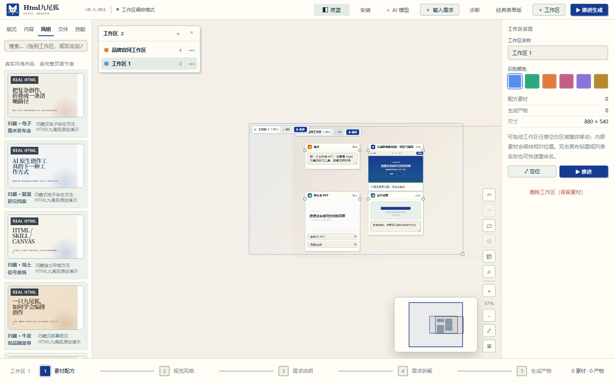
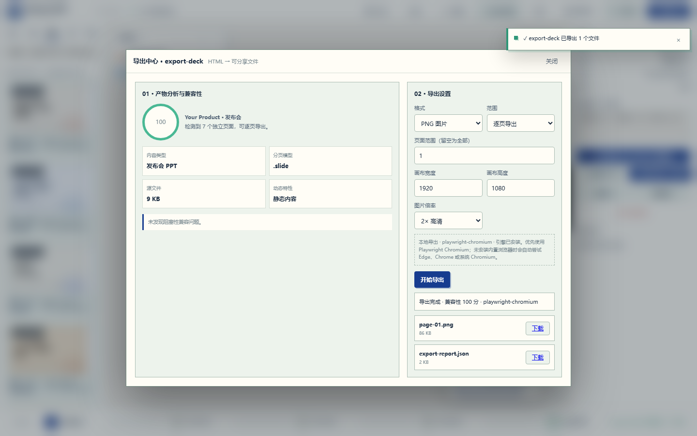

# Html九尾狐 v0.5.0 Beta 1 · 流畅画布

> 发布状态：开发预览 / Development Preview  
> 日期：2026-09-08  
> 作者：KratosLee · Html九尾狐项目组

## 中文

v0.5.0 Beta 1 聚焦无限画布最核心的操作质量：节点拖动、对齐吸附、端口对接、缩放与自动适配。目标不是增加更多按钮，而是让已有工作台真正稳定、顺手、可预期。

### 本次改进

- 节点自由拖动，停止拖动过程中的强制网格跳动。
- 参考线磁吸增加捕获/释放滞回，接近边界时不再来回抖动。
- 端口按真实渲染位置计算，缩放和平移后连线仍保持对准。
- 连接目标扩大有效捕获范围，并用滞回保持高亮稳定。
- 快速松开鼠标时处理最后一帧坐标，减少节点和连线回跳。
- 自动适配避开工作区导航器，并保持至少 30% 的可读缩放。
- 保留 `Alt + 拖动` 临时停用吸附，方便精细排布。

### 验收证据

- 画布专项真实浏览器验收：14/14。
- 覆盖卡片正文拖动、工作区标题拖动、缩放吸附、端口连线、真实 HTML 预览、生成自动连线、反馈迭代、自动适配、持久化和 JavaScript 错误检查。
- Python 全量测试：163/163。
- Chromium 产品验收：22/22；画布专项验收：14/14。
- JavaScript 独立文件与页面内联脚本语法检查全部通过。

### 下一步

v0.5.0 Beta 2 将建设 Recipe Run：展示 `分析 → 组合 → 生成 → 验证 → 交付` 每个阶段的状态、耗时、模型和输入输出，并支持失败步骤局部重跑。

## English

v0.5.0 Beta 1 focuses on the quality of the infinite-canvas fundamentals: node dragging, alignment snapping, port connections, zooming, and fit-to-content. The goal is not more controls; it is a workbench that feels stable, responsive, and predictable.

### Improvements

- Fluid node dragging without continuous grid rounding.
- Acquisition/release hysteresis for alignment guides and connection targets.
- Rendered port geometry converted into world coordinates for accurate links after zoom and pan.
- Final-pointer processing to prevent fast drag and connection releases from jumping backward.
- Fit-to-content that preserves navigator space and keeps content readable at a 30% minimum zoom.
- `Alt + drag` temporarily disables snapping for precise placement.

### Evidence

- 14/14 real-browser canvas acceptance checks pass.
- Coverage includes card and workspace dragging, snapping, port connections, real HTML preview, generated links, feedback iteration, fit-to-content, persistence, and JavaScript error monitoring.
- Python test suite: 163/163.
- Chromium product acceptance: 22/22; focused canvas acceptance: 14/14.
- Standalone and inline JavaScript syntax checks pass.

### Next

v0.5.0 Beta 2 will introduce Recipe Run observability for `Analyze → Compose → Generate → Verify → Deliver`, including stage status, timing, model and input/output context, plus partial reruns for failed stages.