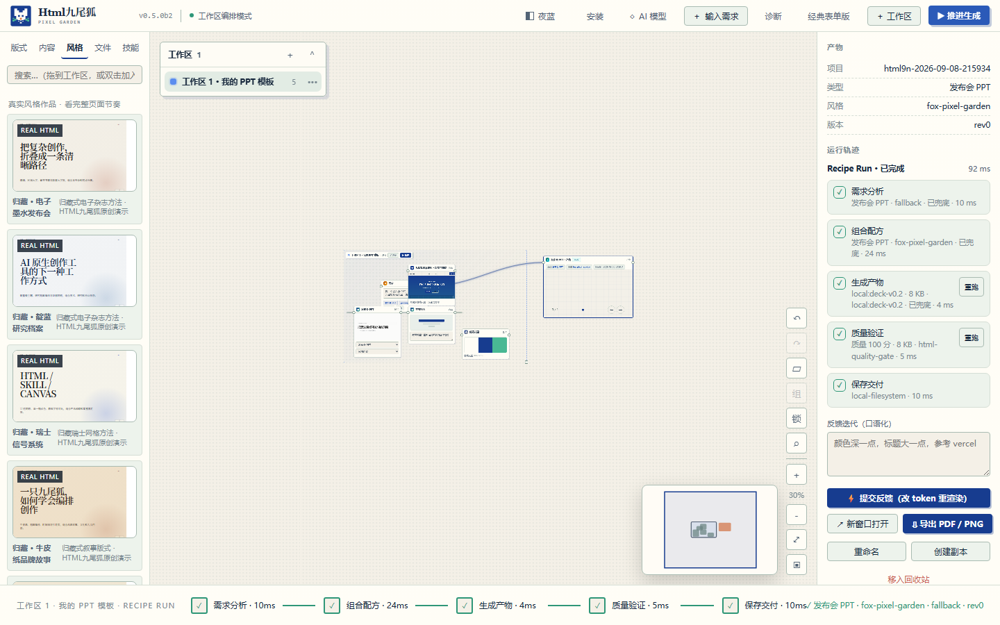

# Html九尾狐 v0.5.0 Beta 2 · Recipe Run

> 发布状态：开发预览 / Development Preview  
> 日期：2026-09-08  
> 作者：KratosLee · Html九尾狐项目组

## 中文

v0.5.0 Beta 2 把“一次生成”从黑盒请求升级为可以理解、检查和恢复的 Recipe Run。工作台现在会记录需求分析、组合配方、生成产物、质量验证和保存交付五个阶段，并把真实运行状态展示在当前工作区和产物检查器中。

### 核心能力

- 五阶段运行轨迹：`Analyze → Compose → Generate → Verify → Deliver`。
- 每阶段记录状态、耗时、模型或生成器、兜底情况和脱敏输入输出摘要。
- HTML 质量门禁检查结构、viewport、产物体积并生成质量分数。
- 项目新增 `recipe-run.json`，运行记录跟随项目持久化。
- Generate 与 Verify 支持局部重跑，不必重新执行全部流程。
- 重跑记录父运行 ID，上游阶段显示为“复用上次结果”。
- 工作区底部状态条显示当前任务的真实阶段，而不再只是静态创作清单。
- 修复 Windows 高频轮询任务文件时可能卡在 `starting` 的读写竞争。

### 视觉证据

### 验收范围

- Recipe Run 后端专项测试、异步任务状态、项目持久化和局部重跑 API。
- 真实 Chromium 推进生成、五阶段检查器、质量验证局部重跑、画布持久化和 JavaScript 错误监控。
- Python 全量测试：166/166。
- Chromium 产品验收：22/22；画布与 Recipe Run 专项：17/17。
- JavaScript 独立文件、页面内联脚本和 Python 模块语法检查全部通过。

### 下一步

v0.5.0 RC 将进入 Project Memory、产物版本差异、100 节点性能和无障碍发布门禁。

## English

v0.5.0 Beta 2 turns generation from a black-box request into an observable and recoverable Recipe Run. The workbench records Analyze, Compose, Generate, Verify, and Deliver, then exposes the real execution state in the active workspace and output inspector.

### Highlights

- Five-stage `Analyze → Compose → Generate → Verify → Deliver` trace.
- Per-stage status, timing, model or generator, fallback usage, and privacy-conscious input/output summaries.
- HTML quality gate for document structure, viewport metadata, output size, and a quality score.
- Persistent `recipe-run.json` evidence stored with every project.
- Partial Generate and Verify reruns without repeating the full workflow.
- Parent run links and explicit reused-stage status.
- A workspace timeline driven by the real task state instead of a static checklist.
- A Windows job-state locking fix for high-frequency polling.

### Verification

- Python test suite: 166/166.
- Chromium product acceptance: 22/22; focused canvas and Recipe Run acceptance: 17/17.
- Standalone JavaScript, inline JavaScript, and Python module syntax checks pass.

### Next

v0.5.0 RC will focus on Project Memory, artifact diffs, 100-node performance, and accessibility release gates.