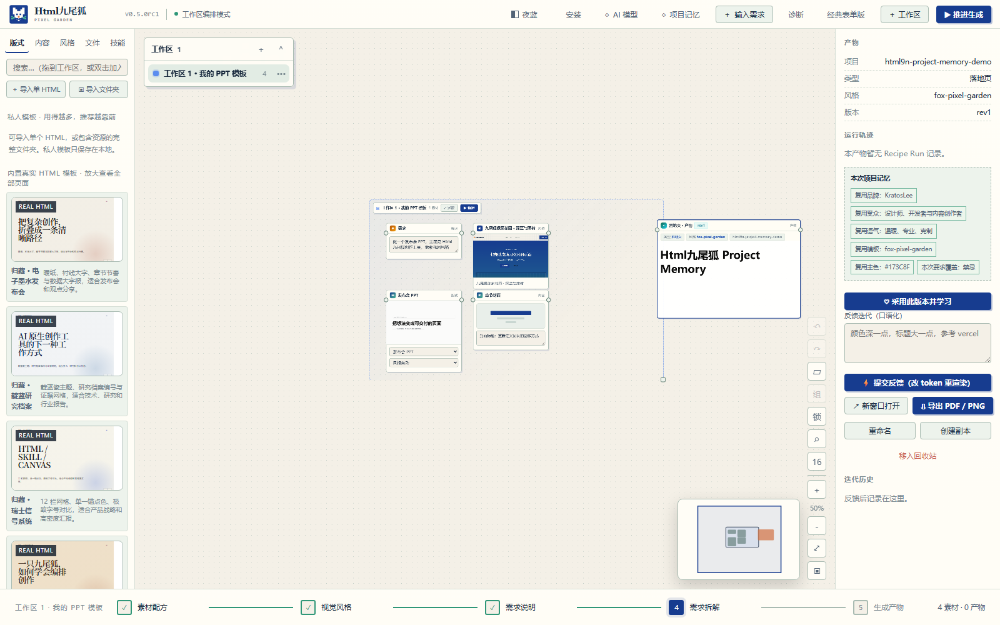
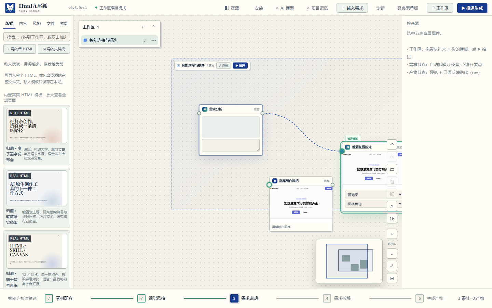
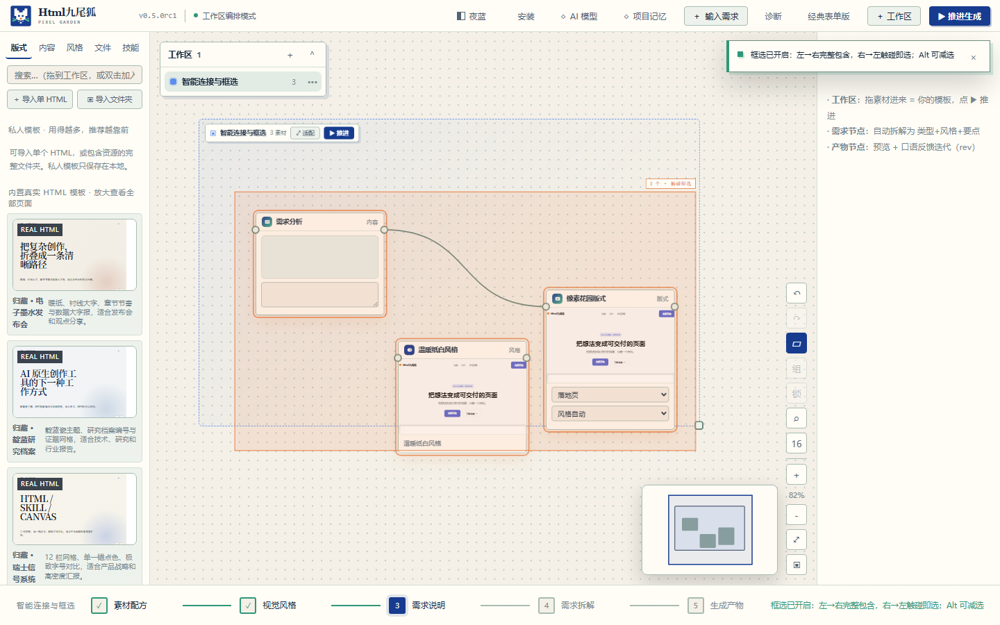

# Html九尾狐 v0.5.0 RC1 · Project Memory

> 版本：0.5.0rc1
> 日期：2026-09-14
> 署名：KratosLee · Html九尾狐项目组

## 中文说明

v0.5.0 RC1 建立了“越用越懂你”的本地复利闭环。系统不会自动把每次生成都当成正确答案；只有用户在产物检查器明确点击“采用此版本并学习”，该项目的品牌、受众、语气、禁忌、模板、主色、字体和已确认设计决策才会进入 Project Memory。

### 新增能力

- **Project Memory 本地存储**：保存在输出目录的隐藏设置中，可查看、编辑、关闭和清空。
- **Adoption Signal**：同一项目重复采用不会重复计数，失败稿和测试稿不会自动污染偏好。
- **显式需求优先**：本次需求中明确选择的品牌、受众、语气、禁忌、模板、颜色和字体始终覆盖长期记忆。
- **可解释复用**：分析结果、Recipe Run Analyze/Compose 阶段和产物检查器展示实际复用项与覆盖项。
- **隐私边界**：长期记忆不保存 API Key、附件正文或完整反馈原文，只保存受控字段和设计决策摘要。
- **HTTP API**：新增 GET/PUT/DELETE /api/memory 与 POST /api/projects/{name}/adopt。
- **智能连线**：输入端口提供 48px 捕获与 76px 释放滞回，也可直接拖到目标卡片；精确端口优先于整卡候选。
- **双向框选**：左→右完整包含、右→左触碰即选，Alt 支持减选，并实时显示模式与命中数量。
- **自适应曲线**：连接路径依据节点距离动态调整弯曲程度，缩放和平移后保持准确。

### 可见证据

### 验收结果

- Python、API、存储、安全、导出与 Chromium 浏览器测试：**179/179 passed**。
- 项目记忆专项：手动保存、清空、采用提取、重复采用、显式覆盖、关闭模式、HTTP 生成闭环和浏览器采用闭环全部通过。
- 内联 JavaScript 与独立前端脚本语法检查通过。
- 版本元数据统一为 0.5.0rc1。

### RC1 边界

RC1 先交付单机、本地、可解释的结构化记忆。常用素材语义检索、多人记忆隔离、100 节点性能、产物差异与完整无障碍发布门禁进入 RC2。

---

## English

v0.5.0 RC1 introduces a local compounding loop through Project Memory. The system does not learn from every generation automatically. Memory changes only after the user explicitly adopts an artifact, preventing failed drafts and experiments from polluting long-term preferences.

### Highlights

- Local, editable, disableable, and clearable Project Memory.
- Explicit adoption signals with idempotent project adoption.
- Current explicit requirements always override memory.
- Explainable reuse in analysis, Recipe Run Analyze/Compose stages, and the artifact inspector.
- Privacy-safe persistence excluding API keys, attachment bodies, and full private feedback text.
- New memory management and project adoption HTTP APIs.
- Smart linking with 48px acquisition, 76px release hysteresis, whole-card drops, and exact-port priority.
- Directional marquee selection with live previews: containment left-to-right, intersection right-to-left, and Alt subtraction.
- Adaptive Bézier paths that stay visually smooth and geometrically aligned through zoom and pan.

### Visual Evidence

### Verification

- **179/179** Python, API, storage, security, export, and Chromium browser tests pass.
- Dedicated Project Memory unit, HTTP, generation, and browser adoption flows pass.
- Inline and standalone JavaScript syntax checks pass.
- Release metadata is aligned to 0.5.0rc1.

RC2 will focus on reusable asset retrieval, 100-node performance, artifact diffs, and complete accessibility gates.
