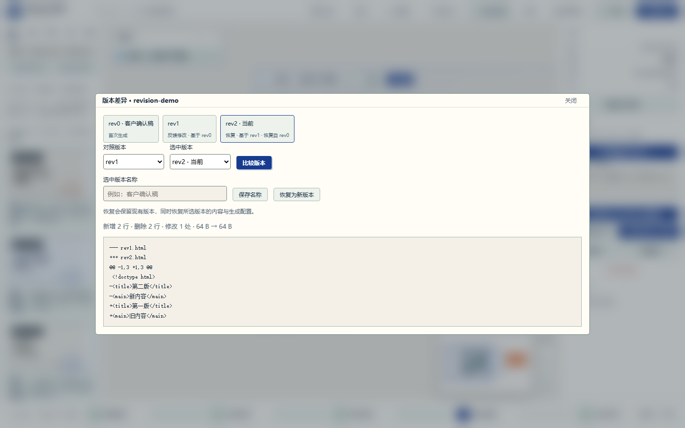
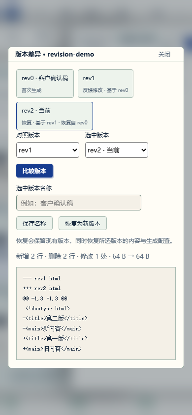

# RC2 本地增量测试报告

日期：2026-09-18。环境：Windows、Python 3.13、Playwright Chromium。本报告记录 RC2 功能开发阶段；该增量随后提升为应用版本 `0.5.0rc2`，最终发布门禁见 [发布测试报告](TEST-REPORT-v0.5.0rc2.md)。

## 结果

| 验收项 | 结果 | 证据 |
| --- | --- | --- |
| 全量 Python / HTTP / 存储 / 生成 / 导出 / Chromium | **192 passed, 1 skipped，87.52 秒** | [完整日志](test-evidence/rc2-20260918/pytest.txt) |
| 内联 JavaScript | 2 个代码块通过语法检查 | `python scripts/check_inline_js.py` |
| 独立前端脚本 | canvas-productivity、canvas-engine、workbench-features、sw 均通过 | `node --check` |
| 开发阶段发布元数据 | 当时的 `v0.5.0rc1` 一致；发布前已提升至 `v0.5.0rc2` | `python scripts/check_release_version.py` |
| 100 节点 / 99 连线 | 渲染、框选、移动与保存门禁通过 | [实测数据](test-evidence/rc2-20260918/canvas-100-nodes.json) |
| 桌面 / 手机版本管理 | 命名、恢复、转义、焦点与 390px 布局通过 | [浏览器验收](test-evidence/rc2-20260918/browser-evidence.txt) |

跳过项：本机不允许创建符号链接，`test_external_revision_symlink_is_rejected` 未执行。代码仍检查版本路径必须位于项目目录内；此项需要在允许符号链接的 CI 环境复验。

## 关键验证

- 首次生成保存 `rev0` 的 HTML 与生成配置。
- 修改 → 命名 → 恢复为新版本 → 再次反馈，使用恢复后的配置，已有历史文件保留。
- 重跑生成创建新版本；质量验证失败时保留当前产物和状态；仅验证不新增版本。
- 两个恢复请求携带相同当前版本号，仅一个成功，另一个返回版本冲突。
- 模拟状态文件写入失败时，当前 HTML 与状态回到原值，不残留新的历史条目。
- 老项目当前稿在下次编辑时补齐配置快照；更早的纯 HTML 历史明确标为不可完整恢复。
- CRLF 文件在恢复后保持原始字节；版本名称中的 HTML 被转义。
- 弹窗 Tab / Shift+Tab 循环、Escape 关闭与焦点返回；手机宽度无横向溢出。

## 性能口径

100 个便笺节点与 99 条连线，覆盖初次渲染、绘制连线、框选、整体位移、持久化与节点数量一致性。门槛分别为 3000 / 1500 / 500 / 2000ms。JSON 保留实测值；这些是脚本操作耗时，不能视为 60fps 证明，也不代表 100 个动态 iframe 的性能。

## 真实浏览器截图

截图来自自动化测试项目 `revision-demo`，使用测试内容演示恢复关系。





## 复验命令

```powershell
python scripts/check_inline_js.py
node --check htmlninefox/server/static/canvas-productivity.js
node --check htmlninefox/server/static/canvas-engine.js
node --check htmlninefox/server/static/workbench-features.js
node --check htmlninefox/server/static/sw.js
python scripts/check_release_version.py
$env:HTMLNINEFOX_TEST_EVIDENCE_DIR = 'docs/test-evidence/rc2-20260918'
python -m pytest tests -q --basetemp .codex_tmp/pytest-rc2-recheck -p no:cacheprovider
```

每次复验使用新的临时目录名，避免 Windows 对旧测试目录的删除权限或占用影响结果。本轮未进行 macOS / iOS Safari、安装包、持续使用或断电恢复验收。后续顺序见 [迭代记录](ITERATION-RC2-20260918.md)。
